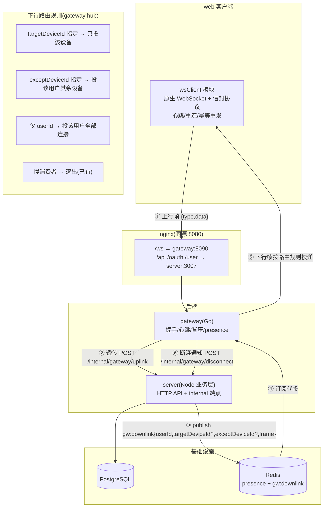

# 设计文档：web 端实时路径全面切换到 Go gateway（连接层替换）

> 日期：2026-09-15。分支：`feat/perf-monitoring`。
> 决策记录：① 过渡策略 = web 先行直切 `/ws`，无灰度（服务未上线）；② server 侧 Socket.io **保留停用**（代码在，`server.ts` 不再挂载）；③ iOS 暂不接入，本轮只做 web。

---

## 1. 目标

- web 端所有实时流量（消息、已读、@提醒、好友通知、通话信令）从 Socket.io 切到 gateway（原生 WebSocket `/ws`）。
- server 业务层（HTTP API / OAuth / 落库）**不动**；Socket.io 服务端停挂但不删代码，保留回滚能力。
- gateway 补齐与 socket.io 等价的业务帧面，成为唯一实时接入层。

## 2. 现状盘点（gap 已核对源码）

**gateway 已具备**（管道能力完整）：JWT cookie 握手（`ws/server.go:51-96`）、presence 镜像（`presence/presence.go`）、背压+慢消费者逐出（`conn.go:37-44`、`hub.go:110-118`）、双心跳（`conn.go:81-140`）、上行透传 `message.send`（`conn.go:99-115`）、下行 backplane（`backplane/backplane.go`）、Prometheus 指标、优雅关闭。

**gap 清单**（本轮要补的）：

| # | gap | 现状证据 |
|---|---|---|
| G1 | 上行只支持 `message.send`，缺 `read.report` 与 `call:*` 信令 | `server/src/routes/internal.ts:50-52` 明确拒绝其他类型 |
| G2 | 下行只有 `receiveMessage`/`mention`，缺 `read.sync`、`receiveFriendReq`、`call:*` 下行 | HTTP 路由驱动的推送仍走 socket.io（`push.ts:23-25`） |
| G3 | downlink 帧只有 userId 路由，缺 deviceId 级投递与"排除本设备"语义 | `backplane.go:23-26`；`call:rejoin` 需投属主设备、`read.sync` 需排除本端（`socket.ts:227-229`、`354-355`） |
| G4 | gateway 断连后 server 无感知（socket.io 的 `disconnect` 事件没了） | `socket.ts:375-410` 的 grace 重连/指标逻辑依赖 disconnect |
| G5 | web 无任何 `/ws` 客户端代码 | `web/src` 搜 `/ws|ws://` 零匹配 |
| G6 | 帧信封契约未固化，Node 侧兼容两种形态 | `internal.ts:54-57` 注释"协议未定稿" |
| G7 | `CheckOrigin` 放行一切 | `ws/server.go:44-46` |

## 3. 总体设计（目标态数据流）



**核心原则**：gateway 继续"只懂连接不懂业务"——所有业务语义（落库/幂等/已读单调推进/通话状态机）仍在 server；gateway 只负责帧的搬运与路由。

## 4. 分模块设计

### 4.1 帧信封契约定稿（G6）

客户端 ⇄ 服务端统一信封，**只保留形态①**，删除 `internal.ts` 的兼容形态②：

```json
{ "type": "message.send", "data": { ... } }   // 上行
{ "type": "receiveMessage", "data": { ... } } // 下行
```

- 类型定义放 `server/src/contracts/ws.ts`（zod schema），生成/手写 TS 类型供 web 复用（与现有 `contracts/` 目录风格一致）；Go 侧保持"只解 `type` 字段"（`conn.go:31-33`），不解析 data，无需 Go 类型。
- 帧类型全集（对齐 socket.io 现有事件）：

| 方向 | 帧 type | 语义 | server 处理 |
|---|---|---|---|
| ↑ | `message.send` | 可靠上行发消息 | 已有（internal.ts） |
| ↑ | `read.report` | 已读上报 | 新增：迁移 `socket.ts:211-235` 逻辑 |
| ↑ | `call:start/accept/reject/end/rejoin/ice` | 通话信令 | 新增：迁移 `socket.ts:268-371` 逻辑（含忙线裁决、grace） |
| ↑ | `heartbeat` | 应用层心跳 | gateway 本地处理（已有） |
| ↓ | `receiveMessage` / `mention` | 新消息/@ | 已有 |
| ↓ | `read.sync` | 同用户其他端已读同步（排除本设备） | 新增 publish |
| ↓ | `receiveFriendReq` | 好友请求通知 | 新增 publish |
| ↓ | `call:start/accept/reject/end/handled/peer-reconnecting/rejoin/ice/busy` | 信令下行 | 新增 publish |
| ↓ | `message.ack` / `message.error` | 上行响应（点对点回投发送方） | 已有（upstream 响应路径） |

### 4.2 downlink 帧扩展（G3）

`gw:downlink` 载荷从 `{userId, frame}` 扩展为 `{userId, frame, targetDeviceId?, exceptDeviceId?}`：

- `hub.RouteToUser` 增加过滤逻辑：`targetDeviceId` 命中才投；`exceptDeviceId` 跳过该设备；两者互斥，校验在 server 侧做。
- 使用场景：`call:rejoin` 用 `targetDeviceId`（属主设备，对应 `socket.ts:354-355`）；`read.sync`、`call:handled` 用 `exceptDeviceId`（对应 `socket.ts:227-229`、`300-302`）。

### 4.3 server 侧改动

1. **停挂 socket.io**：`server.ts` 不再调用 `initSocket`（代码与依赖保留）。`realtime/presence.ts` **继续使用**——它是 Redis 键结构 + `filterOnline` 的实现，被 `internal.ts` 扇出依赖，与 socket.io 无关。
2. **`realtime/push.ts` 改造**：`emitToUser` 从 `io.to(room).emit` 改为 `publish gw:downlink`；`persistAndBroadcastMessage` 的扇出同理改走 downlink（socket.io adapter 不再用）。保留原函数供回滚。
3. **`internal.ts` 扩展**（G1/G4）：
   - 新增 `read.report` 分支：迁移 `socket.ts:211-235`（zod 校验 → 成员校验 → 单调推进 → publish `read.sync`（exceptDeviceId=本设备））。
   - 新增 `call:*` 分支：迁移 `socket.ts:268-371` 全部信令逻辑（忙线裁决、grace 重连定时器都在 server，无需改状态机，只换入口）。
   - 新增 `POST /gateway/disconnect`：接收 gateway 断连通知，执行原 `disconnect` 事件里的业务（call grace 处理 `socket.ts:375-410`、在线指标）。gateway 侧在 `conn.close()` 时调用（带重试，容忍失败）。
4. **指标**：`server_ws_connections`/`online_users` 原由 socket.io 事件驱动；停挂后由 gateway 的 connect/disconnect 通知驱动（随 G4 一起做），或先停更、以 gateway 侧 `gateway_connections` 为准——**取后者（YAGNI）**：停更 server 侧连接指标，不新增通知端点之外的埋点。

### 4.4 gateway 侧改动

1. **断连通知**（G4）：`conn.close()` 里补一次 fire-and-forget 的 `POST /internal/gateway/disconnect`（复用 upstream client，超时 3s，失败仅告警）。
2. **downlink 路由过滤**（G3，见 4.2）。
3. **Origin 白名单**（G7）：`CheckOrigin` 按 `CLIENT_ORIGINS` 配置校验（与 server `socket.ts:81-86` 同款白名单，走同一 env）。
4. **优雅关闭 close code**：shutdown 时向存量连接发 1012 Service Restart 引导重连（配合客户端重连）。
5. **不做**：上行协议保持 HTTP 透传（现运行良好，YAGNI）；iOS 握手 header token 通道不做（iOS 未接入）。

### 4.5 web 侧改动（G5）

新增 `web/src/ws/` 模块（原生 WebSocket，不引第三方库）：

- `wsClient.ts`：连接管理（`/ws`，同源 cookie 自动携带）、指数退避重连、25s `heartbeat` 帧、信封编解码、下行事件分发到 store。
- 可靠上行：发 `message.send` 带 `clientMsgId`，等 `message.ack`，超时（沿用 `perf/README.md` 的 5s 口径）按同 `clientMsgId` 重发（服务端幂等已有 `ON CONFLICT DO NOTHING`）。
- 断线期间消息补拉：重连成功后走既有 HTTP `/api/sync`（现有机制，不改）。
- store 切换：`chatStore.ts`（socket.io-client → wsClient，事件名映射）、`callStore.ts`（`call:*` 信令）、`friendStore.ts`（`receiveFriendReq`）。socket.io-client 依赖保留不删（回滚用）。
- 通话 grace 语义：断线即触发 server 侧 disconnect 通知 → 既有 grace 窗口逻辑生效，客户端重连后走 `call:rejoin`（协议不变，仅传输层变化）。

### 4.6 环境接线

- **prod**：nginx 已有 `/ws → gateway:8090`（README、架构图 0 已画），无改动。
- **dev**：确认 web dev（vite 5173）到 `/ws` 的路径——vite proxy 加 `/ws` → `http://localhost:8090`（ws 代理），或直连 `ws://localhost:8090/ws`（需 nginx/网关放行 5173 origin，与 CLIENT_ORIGINS 白名单联动）。

### 4.7 架构图修订（`docs/架构/系统架构图.md`）

1. 修图 2：`auth/jwt.go` 改为"HS256 共享密钥验签"，删除"取公钥 JWKS"边。
2. 图 0：补 `gateway → server` 上行透传边；server 描述去掉 Socket.io、Redis 描述去掉"Socket.io适配器"。
3. 图 3：`stChat/stCall` 改为"原生 WS /ws → gateway"。
4. 图 6.1：补 Go 路径时序图（发消息 + 扇出 + ack）。
5. 图 4 iOS 标注"实时接入待办（本轮不做）"。

## 5. 明确不做（YAGNI）

- iOS 接入（下轮）；双栈灰度；上行改 gRPC；server socket.io 代码删除；deviceId 级的 presence 广播（已由 meta 支持，够用）。

## 6. 验收标准

1. web 全部实时功能（发消息/收消息/已读/@/好友通知/通话信令）经 `/ws` 走通，socket.io 停挂下功能无损。
2. `curl /ws` 无 token 被 401；跨 origin 被白名单拒绝。
3. gateway 断连 → server 收到 disconnect 通知 → grace 重连场景（刷新页面重连通话）行为与旧路径一致。
4. `read.sync` 不出现在操作端、`call:rejoin` 精确到达属主设备。
5. server/gateway 各自完工门禁通过（`pnpm typecheck && pnpm test`；`go build ./... && go test ./...`）。
6. 架构图修订完成并同步。

## 7. 风险与对策

| 风险 | 对策 |
|---|---|
| 信令时序（grace 定时器、epoch）在传输层更换后行为漂移 | 复用 server 状态机不动，仅换入口；手测 + 集成测试覆盖 rejoin 路径 |
| 客户端重连导致消息重复/丢失 | clientMsgId 幂等（已有）+ `/sync` 补拉（已有），联调重点验证 |
| downlink 路由过滤（target/except）有并发踢线竞态 | hub 路由在锁内快照 targets（已有模式），过滤在快照上做 |
| socket.io 停挂后 HTTP 路由驱动的推送漏改（某处仍 `io.to().emit`） | push.ts 收口后全仓搜 `ioRef/io.to` 断言零残留（保留函数除外） |

## 8. 审批后流程

批准后进入 Phase 2：写 `docs/plans/2026-09-15-<feature>-plan.md`（任务级拆分，每任务 TDD：先写失败测试→实现→绿→提交），再按任务逐个执行。
