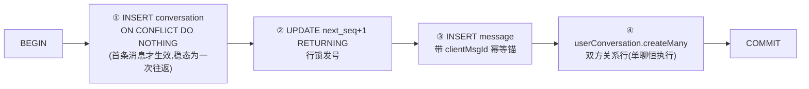
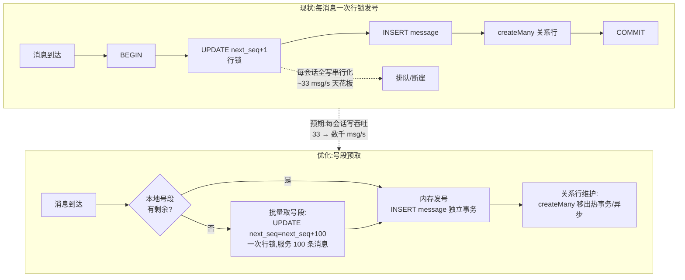

# DB 层性能瓶颈深度分析与优化方案

> 分支 `feat/perf-monitoring`。本文基于 26-9-14 纯 Node 压测基线（`docs/监测设施/测试报告/26-9-14/`）的实测数据，
> 定位 DB 层是实时消息吞吐的**第一瓶颈**，给出证据链、根因分层、优化方案与验证方法。
> 结论速读：**DB 单条查询并不慢（p50≈3ms），慢的是"排队"——同会话发号行锁把每条消息事务串行化，
> 加上 Prisma 连接池默认值偏小，在 1500~2000 msg/s 之间触发断崖式饱和。**

---

## 一、现象：实测证据链（全部来自真实压测数据）

### 1.1 吞吐饱和曲线：断崖式，无中间态

固定 100 连接、每连接消息速率(RATE)递增扫描（`26-9-14/data/tp_r10~r30.json`）：

| 目标吞吐 | 发送/ack | 失败率 | RTT p50 / p99 | 服务内处理 p50 / p99 |
|---|---|---|---|---|
| 1000 msg/s (r10) | 19800/19800 | **0%** | 35 / 62ms | 30 / 78ms |
| 1500 msg/s (r15) | 30000/30000 | **0%** | 32 / 58ms | 33 / 79ms |
| **2000 msg/s (r20)** | 39803/36771 | **7.6%** | 1460 / 2041ms | **1275 / 2475ms** |
| 2500 msg/s (r25) | 49735/30959 | 37.7% | 2027 / 2058ms | — |
| 3000 msg/s (r30) | 60198/22593 | **62.5%** | 2027 / 2096ms | — |

三个关键观察：
1. **拐点锐利**：1500 完全健康 → 2000 直接 7.6% 失败 + RTT 从 58ms 跳到 2041ms。没有"渐进变慢"的中间态，是排队系统典型的**断崖饱和**。
2. **DB 单次查询全程健康**：`db_query_duration_seconds` p50 始终 ≈3ms、p99 ≤10ms（过载时也只是 3.5→9.9ms）。**不是"SQL 慢"**。
3. **服务内处理时延暴涨**：健康态 p50=30ms → 饱和态 p50=1275~1667ms。这 1.2~1.6s 不是执行时间，是**排队等待时间**（等在行锁/连接池上）。

### 1.2 事件循环与运行时全程健康（排除 Node 运行时嫌疑）

最重负载下 `nodejs_eventloop_lag` p99 ≤18ms、GC 停顿 p99 ≈5ms。**排队不在 Node 侧，在 DB 侧。**

### 1.3 查询侧的一个独立问题

HTTP 压测（`26-9-14/data/http_bench.json`）：`GET /user/messages` 仅 **73 rps**、p50=268ms/p99=484ms。
EXPLAIN 显示 PG 端执行仅 20ms（5220 行，走索引），端到端却 268ms——差在**无 limit 全量返回 + 大响应体序列化/传输**（压测大会话已有 5220 条消息）。

---

## 二、根因分层：四个因素叠加，其中一个是结构性的

### 根因 A（结构性·主因）：会话发号行锁把"每会话写"串行化

`persistMessage` 的事务内，每条消息都必须执行一次行锁发号（`server/src/services/message.ts:42-47`）：

```ts
// 会话内发号:行锁下自增并返回,保证同会话并发写也拿到严格递增且连续的 seq。
const bumped = await tx.$queryRaw<Array<{ next_seq: bigint }>>`
  UPDATE conversations SET next_seq = next_seq + 1
  WHERE id = ${input.conversationId}
  RETURNING next_seq
`;
```

**`UPDATE ... RETURNING` 对同一会话行加行锁**：同一会话的所有写事务（发号 + 落库 + 关系行维护）串行执行。
单会话写吞吐上限 = 1s ÷ 单事务耗时。事务耗时还包括同事务内的 `INSERT message` 与 `userConversation.createMany`（`message.ts:66-72`），因此锁持有时间 ≈ 整个事务（健康态 ~30ms）。

### 根因 B（资源性）：Prisma 连接池默认值偏小

`server/src/database/prisma.ts:13-17` 创建 PrismaClient 时**未显式配置连接池**，走 Prisma 默认值
`connection_limit = num_physical_cpus × 2 + 1`（本机约 20 个）。2000 msg/s 下并发在途事务 ≈ 2000×0.03 = 60+，
超过池大小后新事务在应用侧排队等连接——与"服务内 p50 从 30ms 爆到 1275ms"的观测吻合。

### 根因 C（放大因素）：交互式事务的多次往返

`persistMessage` 的 `$transaction`（`message.ts:30-75`）是交互式事务，内含 4 个语句：



BEGIN/4 语句/COMMIT ≈ **6 次应用↔DB 往返**。本地 PG 单次往返 ~0.3ms + Prisma 引擎每语句 ~1ms 开销，
叠加起来事务的 DB 端执行只有 ~3ms，应用侧却要付出 ~5-10ms，且**全程持有行锁**——行锁持有时间被无谓放大。

### 根因 D（查询侧）：`/user/messages` 无 limit 全量返回

`server/src/routes/chat.ts:49-64`：

```ts
const messages = await prisma.message.findMany({
  where: { conversationId },
  orderBy: { timestamp: 'asc' },
});
```

无 `take`、无分页。对比 `GET /user/sync`（`routes/sync.ts:19-48`）已有 `take ≤200` 分页，`/messages` 是漏网之鱼。
大会话（压测已达 5220 条/会话）下每次全量拉取，响应体数 MB 级。

### 环境因素（诚实声明）

压测与 PG 同机（colima docker），DB 与 server 争抢 CPU；过载压测曾使 colima 短暂失联。
故绝对数字需在独立环境校准，但**行锁串行化的结构结论与断崖模式不依赖环境**。

---

## 三、数学验证：为什么拐点恰好在 1500~2000 msg/s

用根因 A 的模型反推拐点位置，与实测严丝合缝：

- 吞吐扫描拓扑：100 连接两两配对 = **50 个单聊会话**，配对双方都发 → 每会话消息率 = 2 × RATE。
- 健康态单条消息事务耗时（= 行锁持有时间）≈ 服务内 p50 = **30ms**。
- 每会话串行写容量 = 1000ms ÷ 30ms ≈ **33 条/秒/会话**。
- r15（每会话 30 条/秒）→ 负载 30/33 ≈ 91% < 100% → **不排队** ✅
- r20（每会话 40 条/秒）→ 负载 40/33 ≈ 121% > 100% → **排队开始** ✅（实测 7.6% 失败 + RTT 断崖）
- r30（每会话 60 条/秒）→ 负载 182% → 大量拒绝 ✅（实测 62.5% 失败）

**结论：拐点不是玄学，是"每会话 ~33 msg/s × 会话数"的行锁容量公式。**
这也解释了为什么"换 Go 重写业务层"救不了这个拐点——Go 写同样的 SQL 同样撞行锁，公式不变。

---

## 四、优化方案（按优先级）

### P0-1：发号批量化——把行锁从"每消息"降为"每批"

**方案：会话号段预取（内存发号）。** 每会话一次批量取号（如一次 +100），内存发号，消息事务只做 `INSERT message`（+关系行维护），不再逐条 `UPDATE conversations`。



**不变量核查（已逐点核实源码，2026-09-15 修正）**：
- 行锁的真实目的是保证 `seq` **会话内严格单调递增、不重复**（顺序正确性），"连续无洞"只是"每次 +1"实现方式的副产品。
- 逐点核查"无洞"的名义依赖，**实际都不存在**：
  - gap 检测：server/web 均无任何实现（`grep gap|空洞|无洞` 仅命中注释）；
  - 范围补拉：`routes/sync.ts:32-36` 用 `seq > since`，**只依赖单调，空洞无影响**；
  - 未读数差值公式 `lastSyncedSeq - lastReadSeq`（依赖无洞）：`lastSyncedSeq` 在 `server/src` 0 个引用，**从未实现**；
  - 客户端展示：web 端按 `receiveMessage` 接收顺序 append，不做 seq 校验。
- **结论：空洞可以容忍。** 唯一必须保留的是"会话内单调 + 不重复 + 幂等重发不占新号"。
- 因此 P0 发号方案选择面拓宽，两个方案平级可选：
  - **A. 号段预取（推荐，更简单）**：一次 `UPDATE next_seq = next_seq + N` 取段、内存发号；崩溃丢段产生空洞——已证实无害。纯 PG、零新增依赖、无校准逻辑。
  - **B. Redis 发号（可选，保连续更强）**：每会话单键 `INCR`，启动 `max(Redis, PG max(seq))` 校准；若未来想保留"差值法未读数"选项或要求零空洞时选它。
- 无论 A/B：客户端消息列表建议**按 seq 排序**展示（替代"接收顺序"，多副本/补拉场景更稳）——这是一条顺带加固，非阻塞项。

### P0-2：`/user/messages` 加分页（10 分钟级修复）

对齐 `routes/sync.ts` 已有范式：`take` 默认 50、上限 200，用 `seq` 游标分页（`idx_messages_conv_seq` 索引已存在，`schema.prisma:229`）。预期该接口从 73 rps → 数千 rps。

### P1-1：Prisma 连接池显式调优

`database/prisma.ts` 显式配置 `connection_limit`（建议 50~100，压测校准）与 `pool_timeout`（如 5s，快速失败优于无限排队）。注意与 PG `max_connections`（默认 100）匹配，过大反而引发 PG 侧争抢。

### P1-2：事务瘦身——关系行维护移出热事务

`userConversation.createMany`（`message.ts:66-72`）每消息都执行。优化方向：
- 会话存在性可缓存判断（单聊 `single_<u1>_<u2>` 成员关系可从 id 派生，无需每消息查/写）；
- 关系行改为**懒建/异步建**（读路径 `isConversationMember` 兜底时再补），写路径只保证消息落库。
- 预期：事务从 4 语句 → 2 语句（INSERT message + 可选），行锁持有时间再降。

### P2-1：读写分离

压测的 GET 类查询（sync/messages/lastMessages）与写事务分流到只读副本，消除读写互扰。

### P2-2：PG 参数与硬件

colima 默认 PG 参数偏保守（`shared_buffers` 等）；独立环境按规格调优。远期可评估分区表（按会话哈希）把行锁热点打散。

---

## 五、优化后的预期效果与验证方法

### 预期

| 指标 | 现状 | 目标 |
|---|---|---|
| 单会话写吞吐 | ~33 msg/s（行锁天花板） | 数千 msg/s（号段预取/Redis 发号） |
| 系统吞吐饱和点 | 1500~2000 msg/s | 受 PG 落库带宽限制（预估 5~10×） |
| GET /user/messages | 73 rps | 数千 rps |
| 过载失败模式 | 断崖 + 大量 message.error | 拐点右移，排队曲线变缓 |

### 验证方法（复测同一套工具）

1. 跑 `perf/` 吞吐扫描（`for r in 10 15 20 25 30 40 50; do node node-run.mjs tp_r$r 100 $r 20 25; done`）对比拐点位置。
2. 跑 S3 过载与 S5 长稳，确认失败率与 RTT 曲线。
3. 压测期间实时采样 **PG 等待事件**（下钻行锁 vs 连接池的直接证据）：
   ```sql
   SELECT wait_event_type, wait_event, count(*) FROM pg_stat_activity
   WHERE state='active' GROUP BY 1,2 ORDER BY 3 DESC;
   ```
   优化前应能观测到大量 `Lock: transactionid`（行锁等待）；优化后应显著减少。
4. `db_query_duration_seconds{model,operation}` 与 `server_message_duration_seconds` 直方图分位对比。
5. 回归门禁：`cd server && pnpm typecheck && pnpm test`（发号改动必须全量回归 + gap 检测相关用例复核）。

---

## 六、与"Go 全量替换"的关系（一句话）

本瓶颈是 **DB 事务结构与连接池配置**问题，与运行时语言无关：Go 重写 `persistMessage` 会撞同一把行锁。
优化顺序必须是 **先修 DB（P0）→ 再评估是否需要换运行时**。相关架构选型论证见
`docs/架构/IM高并发选型-该不该全用Go-业界调研与分层分析.md`。

---

## 附：证据索引（代码与数据出处）

| 证据 | 出处 |
|---|---|
| 吞吐断崖曲线、失败率、RTT | `docs/监测设施/测试报告/26-9-14/data/tp_r10~r30.json`、`纯Node性能基线报告.html` §3.1 |
| DB 查询时延健康（p50≈3ms） | `tp_*.json` 的 `dbDurationMs` 字段 |
| 发号行锁代码 | `server/src/services/message.ts:42-47` |
| 事务四语句 | `server/src/services/message.ts:30-75` |
| Prisma 连接池默认 | `server/src/database/prisma.ts:13-17` |
| `/user/messages` 无 limit | `server/src/routes/chat.ts:49-64` |
| sync 已有分页（对齐范式） | `server/src/routes/sync.ts:19-48` |
| 索引 `idx_messages_conv_seq` | `server/prisma/schema.prisma:229` |
| 压测数据规模（25.9 万消息/1 万会话） | `messages`/`conversations` 表 count（本文 §1.3） |
