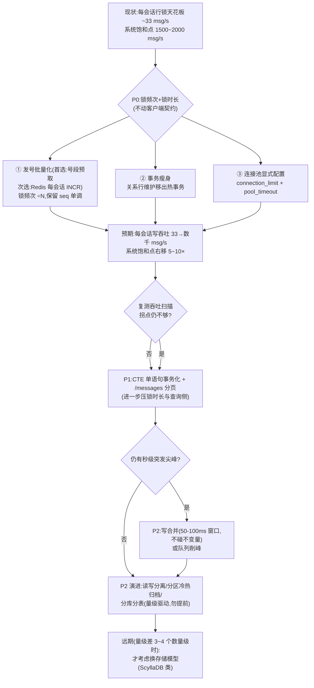

# 消息入库行锁优化：批量插入与本场景适配性、业界方案全景与选型分析

> 分支 `feat/perf-monitoring`。接续《DB性能瓶颈分析与优化方案.md》：那里定位了瓶颈是"会话发号行锁 + 连接池 + 事务往返"。
> 本文回答两个问题：**① 数据批量插入是本场景（IM 实时消息）的最佳方案吗？② 针对行锁热点，业界还有哪些方案、各有什么权衡、本项目该选哪个组合。**
>
> 结论先给：**批量插入不是该场景的最佳方案**——它的甜点区是"离线/归档/迁移"类写入，与"实时单条 ack"的热路径错位；
> 本场景最优解是"**降低锁频次**（发号批量化）+ **缩小锁持有时间**（事务瘦身）+ **扩大并发**（连接池）"的组合拳。

---

## 一、先回答：批量插入是本场景的最佳方案吗？——不是

### 1.1 场景特征决定了答案

本项目的消息写入路径（`server/src/services/message.ts` + `server/src/utils/socket.ts:192-196`）有三个硬约束：

| 约束 | 出处 | 含义 |
|---|---|---|
| **ack = 已持久化** | `message.ts` 注释「落库成功后调用方才回 ack」 | 客户端收到 `message.ack` 时，消息一定已在 PG 里——这是可靠性的根基 |
| **幂等去重** | `schema.prisma:231` `uniq_msg_idem` 唯一约束 | 客户端按 `clientMsgId` 重发，服务端必须逐条判断"这条落过没有" |
| **seq 会话内单调递增** | `message.ts:42-47` 发号（行锁串行化） | 顺序正确性的根基：补拉 `seq > since` 与排序都只依赖单调；**空洞已核实无害**（gap 检测/差值未读数均未实现，见 §五） |

这三个约束把写入路径钉死成"**逐条事务**"形态。批量插入（多行 VALUES / COPY / 攒批单事务）会同时撞上三条约束：

### 1.2 批量插入在本场景的四个代价

1. **攒批窗口直接加在 ack 延迟上**。批量必须"等一批攒齐"，若批窗口 50ms，p50 延迟从 30ms 起跳变 50ms+，且**越闲越糟**（低流量时永远攒不满，延迟恒等于窗口上限）——而 IM 消息恰恰是"白天忙、半夜闲"的长尾分布。实测基线 S1 的 RTT p50 只有 33ms，批量会让这个数字成倍变差。
2. **不解决发号行锁本身**。批量插入仍需给每条消息发号；除非"整批取号"——但那已经升级成**号段方案**（见 §2.1），批量的收益大头其实是号段带来的，不是"多条 INSERT 塞一个语句"带来的。
3. **幂等去重与 ack 拆解复杂化**。批量落库后要逐条判断去重命中、逐条回 ack、部分失败的补偿逻辑，代码复杂度与出错面显著上升。
4. **收益错位**。批量插入的收益是"摊薄每行的固定开销"（PG 端每行 ~µs 级），而本场景的瓶颈根本不在 INSERT 执行（DB 单查询 p50≈3ms），在**行锁排队**（服务内 p50 从 30ms 爆到 1275ms）。往一个不疼的地方下药，疼的地方一点没减轻。

### 1.3 批量插入真正的用武之地（本项目里也值得留的位置）

| 场景 | 为什么合适 |
|---|---|
| 离线消息批量投递 | 收件人上线时一次性拉 N 条离线消息落库/标记，天然成批、无逐条 ack 压力 |
| 历史归档 / 冷数据迁移 | 热表 → 归档表/分区表搬迁，纯吞吐场景 |
| 数据导入 / 回放 | 一次性灌入 |
| 群已读聚合（未来） | `markMentions` 类旁路写入可以合并 |

**结论：批量插入保留为"辅助手段"，不作为热路径主方案。**

---

## 二、业界方案全景：六类 21 项，逐一评析

### 类别 1：降低锁频次——每 N 条消息才碰一次热行（对症率最高）

**1.1 号段预取（内存发号）**
原理：一次 `UPDATE next_seq = next_seq + N RETURNING next_seq` 取走一段号，N 条消息在内存发号、零锁落库。锁频次降为 1/N。
代表案例：美团 Leaf-segment、阿里 TDDL 号段模式——国内 IM/电商的标配。
代价：**崩溃丢段**（已取未用的号作废）→ seq 出现空洞。经源码核查（§五）：gap 检测与差值法未读数均未实现，`seq > since` 补拉只依赖单调——**空洞实际无害，无需客户端配合改**。
本项目适配：⭐⭐⭐ **P0 首选**（纯 PG、零新增依赖、改动集中在 `persistMessage` 一处）。

**1.2 Redis 原子计数器发号**
原理：每会话一个 key，`INCR` 原子发号（Redis 单键 10 万+ ops/s），PG 只落库不锁发号。启动时 `max(Redis, PG max(seq))` 校准。
代价：引入 Redis 依赖（本项目已有 Redis，零新增）；Redis AOF 丢失极小窗口（`everysec` 配置下 ≤1s 数据，可接受）。
**不变量保留：seq 仍严格连续**（若未来想保留"差值法未读数"选项或要求零空洞时选它）。
本项目适配：⭐⭐ **P0 可选**（比号段方案多 Redis 校准逻辑，收益是零空洞）。

**1.3 独立发号服务（Leaf / Snowflake）**
原理：号段服务独立部署（Leaf-segment）；或雪花算法全局唯一 ID（Leaf-snowflake，时钟有序）。
代价：多一跳 RPC；雪花 ID 是全局时间序，不天然等于"会话内连续 seq"，需额外排序字段与客户端适配；时钟回拨处理复杂。
本项目适配：⭐ 过重。会话内 seq 语义用全局发号服务是杀鸡用牛刀，且破坏连续语义。

**1.4 多行号段轮询（热点多行化）**
原理：一个会话对应 K 行号段（如 100 行），轮询取号，单行热点分散为 K 行。
代价：seq 合并排序复杂；单行 PG UPDATE 容量 ~1-3k/s，本项目单会话仅 40 msg/s，远未到单行极限。
本项目适配：✗ 不需要（除非未来出现单会话千级 msg/s 的"直播间"场景）。

### 类别 2：分散锁——把热点从一行/一表摊到多行/多分片

**2.1 PG 声明式分区**：按会话哈希分区。对"同会话高并发"无解（同会话写仍锁同一行），收益在表膨胀维护、查询剪枝、历史冷热分离。
本项目适配：P2（做冷热分离时顺带，不是行锁对症药）。

**2.2 分库分表**：会话路由到固定分片，横向扩展写容量与连接数。单库远未到顶前不引入（复杂度/运维成本高）。
本项目适配：P2+ 演进。

**2.3 热点会话特化**：检测单会话 QPS 超阈 → 该会话独立分片/表。大 V/直播间模式。
本项目适配：✗ 暂不需要。

### 类别 3：缩小锁持有时间——行锁多快释放

**3.1 事务瘦身**：把非必要语句移出事务。当前事务 4 语句（`message.ts:30-75`），其中 `userConversation.createMany` 每消息必执行——关系行可懒建/异步维护（单聊成员可从 `single_<u1>_<u2>` 解析，`message.ts:96-105`）。锁持有时间直接与事务时长成正比。
本项目适配：⭐⭐⭐ **P0 必做**，零风险。

**3.2 单语句事务化（CTE / 存储过程）**：把"发号+插入"压成一条 `INSERT ... SELECT` 或存储过程，6 次往返 → 1-2 次，锁持有时间压到语句执行时间。
代价：Prisma 需 `$executeRaw` 手写 SQL，牺牲部分类型安全；与幂等去重叠加的 SQL 复杂。
本项目适配：⭐⭐ P1 可选（与发号批量化二选一或叠加）。

**3.3 乐观并发（CAS）**：`UPDATE ... WHERE next_seq = :expected`，失败重试。
代价：同会话高并发时**重试风暴**反而更糟（本场景每会话 40 msg/s 是典型高冲突）。
本项目适配：✗ 不推荐。

**3.4 SKIP LOCKED**：PG 特有，队列消费模型跳过已锁行，避免排队等待。IM 消息不是队列表模型。
本项目适配：✗ 不适用。

### 类别 4：写入路径重构——延迟换吞吐（需谨慎评估）

**4.1 批量 INSERT（多行 VALUES / COPY）**：见 §1.2，攒批窗口伤 ack 延迟、不解决发号锁、幂等/ack 拆解复杂。
本项目适配：⭐ 辅助手段（离线/归档），不进热路径。

**4.2 写合并（coalescing）**：同会话短窗口（50-100ms）合并落库，落库后拆 ack。p50 延迟 +窗口值，吞吐 ×N，且**不触碰不变量**（仍是逐条持久化+逐条 ack，只是落库时间点后移几十 ms）。
代价：客户端感知 ack 延迟上浮；实现中等复杂度（窗口缓冲 + 超时 flush + 逐条拆 ack）。
本项目适配：⭐⭐ P2 可选——若 P0 做完吞吐仍不足再上。

**4.3 异步落库（先 ack 后落库）**：收到即入内存/Redis → 立即 ack → 后台批量落库。
**代价：放弃"ack=已持久化"不变量**——崩溃窗口内已 ack 的消息丢失，必须靠客户端重试 + 接收端幂等兜底。这是 WhatsApp 模型的思路（内存为主、异步刷盘），但它们的可靠语义与本项目契约不同。
本项目适配：⚠️ 架构级决策，高风险，当前不推荐；若将来接受"ack=已受理"，需整条客户端链路重定义。

**4.4 队列削峰（Kafka / Redis Stream）**：写入尖峰先进队列，消费者批量写 DB。适合流量整形，常驻延迟上升。
本项目适配：P2+（出现秒级突发尖峰时）。

### 类别 5：数据库层调优（通用增益）

**5.1 pgbouncer 事务池化**：多实例/大池场景下减少 PG 后端连接开销。本项目单实例 + Prisma 应用层池已覆盖，多副本后再评估。
本项目适配：P2。

**5.2 PG 参数调优**：`shared_buffers`/`effective_cache_size`/`synchronous_commit`（IM 场景常评估 `synchronous_commit=off`，以"丢已提交事务的小窗口"换写吞吐）。
本项目适配：部署侧清单（当前 colima 默认参数偏保守）。

**5.3 读写分离**：读（sync/messages/lastMessages）与写分流，消除互扰。
本项目适配：P2。

**5.4 unlogged table / 冷热分区归档**：消息表按时间归档，热表常小。
本项目适配：P2（与 2.1 协同）。

### 类别 6：换存储模型（远期重决策）

**6.1 宽表/时序存储（Cassandra / ScyllaDB）**：Discord 消息存 ScyllaDB——无自增行锁，snowflake ID + 会话分区键，写入天然无热点锁。
代价：放弃事务与强一致性便利、运维复杂度高、团队新技能栈。
**6.2 消息独立 KV 引擎（RocksDB append-only 类）**：微信消息存储思路，append-only 无锁写。
代价：同上，自建存储是长期工程。
本项目适配：✗ 远期（当前量级差 3-4 个数量级，见 §三数据）。

---

## 三、横向对比总表

| # | 方案 | 解决发号锁? | 延迟影响 | 吞吐增益 | 复杂度 | 触碰不变量? | 本项目优先级 |
|---|---|---|---|---|---|---|---|
| **1.1** | **号段预取** | ✅ 锁频次÷N | 无 | **高** | **低** | ❌ 洞无害(已核实) | **P0 首选** |
| 1.2 | Redis 原子发号 | ✅ 彻底移除 | 无 | 高 | 低 | ❌ 无 | P0 可选(保连续更强) |
| 1.3 | 独立发号服务 | ✅ | +1 RPC | 高 | 中高 | ⚠️ seq 语义变 | ✗ |
| 1.4 | 多行号段轮询 | ✅(热点摊开) | 无 | 中 | 中 | ⚠️ 排序复杂 | ✗ |
| 2.1 | PG 分区 | ❌ 同会话仍串行 | 无 | 无(对本瓶颈) | 中 | ❌ | P2 |
| 2.2 | 分库分表 | ❌ 同会话仍串行 | 无 | 横向 | 高 | ❌ | P2+ |
| **3.1** | **事务瘦身** | ✅(锁时长↓) | 无 | 中 | **低** | ❌ | **P0 必做** |
| 3.2 | CTE 单语句事务 | ✅(锁时长↓↓) | 无 | 中 | 中 | ❌ | P1 |
| 3.3 | 乐观并发 CAS | ❌ 重试风暴 | 恶化 | 负 | 中 | ❌ | ✗ |
| **4.1** | **批量 INSERT** | ❌ | **+批窗口** | 中(错位) | 中高 | ⚠️ ack 拆解 | 辅助场景 |
| 4.2 | 写合并 | ❌(需搭配发号) | +窗口值 | 高 | 中 | ❌ | P2 可选 |
| 4.3 | 异步落库 | ✅ | 负(更快) | 高 | 高 | ⚠️⚠️ ack 语义 | 需重决策 |
| 5.1-5.4 | 连接池/PG 参数/读写分离/归档 | 部分(池化间接) | 无 | 中 | 低-中 | ❌ | P1/P2 |
| 6.x | 换存储 | ✅(无行锁模型) | 无 | 极高 | 极高 | ⚠️ 全链路 | 远期 |

---

## 四、本项目的推荐组合与实施顺序

### P0（立即，低风险高收益）
1. **发号批量化（首选号段预取，次选 Redis 发号）**：
   - 首选：`persistMessage` 改为"每会话取段 `UPDATE next_seq = next_seq + N RETURNING` + 内存发号"，PG 事务只做 `INSERT message`（+幂等去重）。崩溃丢段产生的空洞已核实无害（§五）。
   - 次选：Redis `INCR conversation:seq:<id>` 发号 + 启动 `max(Redis, PG)` 校准——当需要"零空洞"或未来恢复差值法未读数时选它。
2. **事务瘦身**：`userConversation.createMany` 移出热事务（懒建/异步；单聊成员由 `deriveParticipants` 从 id 解析，本就无需每消息维护）。
3. **连接池显式配置**：`database/prisma.ts` 设 `connection_limit`（50~100，压测校准）与 `pool_timeout`（快速失败优于无限排队）。

### P1（短期）
4. CTE 单语句事务化（可选，与发号批量化叠加收益递减，按需）。
5. `/user/messages` 加分页（对齐 `routes/sync.ts` 范式）。

### P2（演进，量级驱动）
6. 写合并（50-100ms 窗口）——仅在 P0 后吞吐仍不足时。
7. 读写分离、PG 参数、分区冷热归档。
8. 分库分表——等单库写带宽真正逼近上限再上，**勿提前引入复杂度**。

---

## 五、不变量清单与风险（每个方案触碰了什么）

| 不变量 | 现状契约 | 触碰它的方案 | 风险与对策 |
|---|---|---|---|
| **seq 会话内单调递增**（空洞已核实无害） | 补拉 `seq > since`（sync.ts:32-36）与排序只依赖单调；gap 检测、差值法未读数均未实现 | 无 | 保留"单调 + 不重复 + 幂等重发不占新号"即可；客户端展示建议改按 seq 排序 |
| **ack = 已持久化** | 客户端以 ack 为发送成功唯一依据 | 4.3 异步落库 | 崩溃窗口丢"已 ack"消息。对策:需整体重构可靠语义,当前不做 |
| **幂等去重** | `uniq_msg_idem` 唯一约束,重发取首次结果 | 4.1 批量插入 | 批量落库时逐条判断去重命中,部分失败补偿,复杂度↑ |
| **身份由握手派生** | 不信任帧内 senderId | 所有方案均不触碰 | — |

实施红线：**任何优化不得改变客户端可见行为**（ack 时机语义、seq 连续性、错误回执形态），否则压测基线对比失效且客户端需同步改。

---

## 六、业界参考与出处

- **美团 Leaf**：号段模式（segment）与雪花模式（snowflake）双模发号服务——"降锁频次"路线的工业级标杆。
- **Discord**：消息存 **ScyllaDB**（snowflake ID + 会话分区键，无行锁自增），read-states 从 Go 迁 Rust 消除 GC 毛刺——"换存储模型"路线。
- **微信**：接入层分配消息 sequence，存储层无自增锁；自研 PaxosStore 类 KV——"发号与存储解耦"路线。
- **阿里 TDDL / 号段**：`UPDATE seq SET value=value+N` 的经典号段预取。
- 本项目实测数据出处：`docs/监测设施/测试报告/26-9-14/data/tp_r10~r30.json`（饱和拐点）、`s1_throughput.json`（DB p50≈3ms 与事务时长证据）。

---

## 附：一句话决策表

| 你的目标 | 选它 |
|---|---|
| 立即解除发号行锁、不动客户端 | 号段预取（或 Redis 发号）+ 事务瘦身 + 连接池（P0） |
| 进一步压锁持有时间 | CTE 单语句事务化（P1） |
| 离线/归档/迁移类大批量写入 | 批量 INSERT（辅助场景,不是热路径） |
| 容忍 ack 延迟上浮换吞吐、且不想碰不变量 | 写合并（P2） |
| 接受"ack=已受理"新语义 | 异步落库（需架构级重决策） |
| 单库写带宽逼近上限 | 分库分表（P2+,量级驱动） |
| 千万级并发消息量级 | 换存储模型（远期） |
