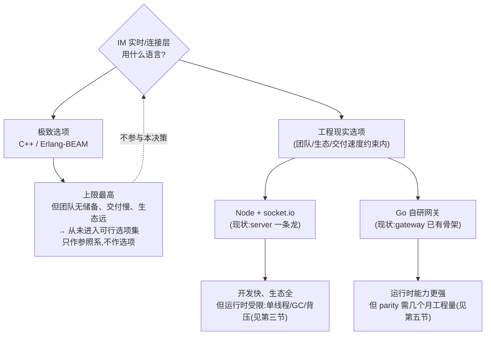
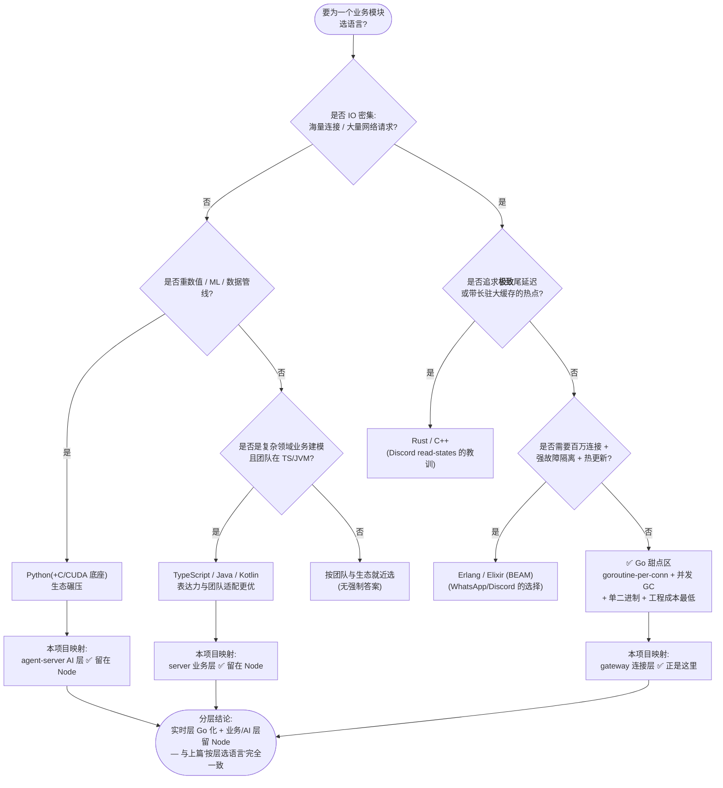
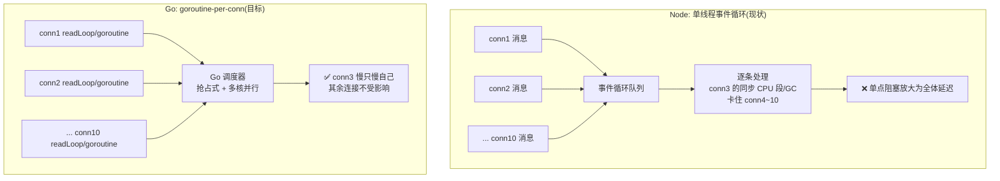

# Go 语言适配性分析——它适合什么业务场景、能为我们的 IM 业务带来什么提升

> 面向零背景读者。专业名词首次出现即在同句解释。
> 本文是《IM高并发选型-该不该全用Go-业界调研与分层分析》的姊妹篇。那篇论证了"极致角度 C++/BEAM 更强、不该全用 Go"，
> 但它留下一个论证缺口：**"Go 不如 C++ 极致" 并不等于 "用 Go 优化 Node 不合理"**——这是两个不同的比较。
> 本文认真回答两件事：① Go 语言本身适合什么业务场景（通用能力画像）；② 在本项目（IM：消息 + 信令）的业务场景下，
> 用 Go 优化/重写 Node 实时层，能带来哪些**具体、可验证**的能力提升。结论映射回本项目（server=Node、gateway=Go）。

---

## 术语表

| 名词 | 一句话大白话 |
|---|---|
| **事件循环（event loop）** | Node 的单线程调度器：所有连接的所有回调都在这一条线程上排队执行。谁占住它，谁就卡住所有人。 |
| **goroutine** | Go 的轻量并发单位（比线程轻得多）；Go 调度器会把它们分配到多个 CPU 核上并行跑。 |
| **抢占式调度** | Go 调度器会主动"打断"一个 goroutine 把 CPU 让给别人，避免单个任务独占。Node 没有这个：一个同步重活会卡死全部连接。 |
| **GC（垃圾回收）** | 自动回收不用的内存。Node（V8）与 Go 都有，但停顿幅度与对业务的影响方式完全不同（见 3.2）。 |
| **尾延迟（p99/p999）** | 最慢的那 1%/0.1% 请求有多慢。均值好看没用，卡顿都出在尾部。 |
| **背压（backpressure）** | 下游消费不动时，让上游"慢下来或丢弃"而不是无限堆积。 |
| **慢消费者逐出** | 某条连接读得太慢（客户端卡死/网络差），主动踢掉它，避免它拖垮整个服务。 |
| **parity（特性对齐）** | 新实现必须把旧实现已有的能力（ack/心跳/重连/顺序）全部补齐，才有资格做公平对比或替换。 |
| **扇出（fan-out）** | 一条群消息要发给群里所有在线成员——把 1 条放大成 N 条投递。 |
| **惊群重连** | 大量客户端在断网恢复后同一瞬间重连，把后端瞬间打爆。 |
| **单二进制部署** | 编译出一个可执行文件，拷过去就能跑，不用装运行时/依赖。Go 的招牌优点。 |
| **工程经济学** | 不只看性能，还看团队上手速度、招人难度、部署运维、编译速度、出 bug 概率——综合总成本。 |

---

## 一、先厘清决策空间：上篇文档的论证错位在哪

### 1.1 上篇正确、本文继承的部分

- **"按层选语言"是对的**：连接层、业务层、热点层、AI 层的约束不同，不存在一种语言在所有层都最优。
- **"极致并发最优不是 Go"是对的**：海量连接 + 强故障隔离的极限是 BEAM，极致资源效率/尾延迟的极限是 C++/Rust。
- **"全用 Go"确实没必要**：业务层留 Node、AI 层留 Node/Python 是合理判断。

以上结论本文不推翻。**本文只纠偏它的论证结构**——上篇用"正确的事实"推出了一个**偏移的结论倾向**。

### 1.2 三处论证错位

**错位一：比较对象偷换。** 上篇的推理链是"极致并发最优是 C++/BEAM → 所以 Go 不是最优 → 所以用 Go 换 Node 值得怀疑"。这里把两对不同量级的比较混在了一起：

- 比较 A：C++ vs Go → C++ 更强（真）；
- 比较 B：Node vs Go → 上篇没有认真比过，却借比较 A 的势暗示"Go 也就那样"（跳步）。

**"Go 不如 C++" 和 "Go 比 Node 强" 完全可以同时成立**——前者说的是上限，后者说的是我们真实决策空间里的选项。选型从来不选"绝对最强的语言"，选的是"在团队、生态、交付速度、维护成本的约束下，性价比最高的语言"。C++ 更强，但以本项目的团队与交付要求，它从未进入可行选项集——拿一个不可选项当参照物，得不出关于可选项的任何结论。

**错位二：靶子是稻草人。** 上篇把火力集中在反驳"全用 Go"。但我们讨论的从来不是"全用 Go"，而是"**把实时/连接层从 Node 迁到 Go**"——这恰好是上篇自己承认的"Go 的正确甜点区"（它的原话：gateway=Go ✅ 连接层是 Go 的正确甜点区）。既然承认连接层是 Go 的甜点区，那么"把连接层从 Node 迁到 Go"就是把甜点区做大的动作，方向与上篇自己的结论一致。

**错位三：把投入节奏问题归因为方向错误。** 上篇指出 gateway 停在 `message.send` PoC、离 socket.io 的 parity 还有几个月工程量，并以此暗示"用 Go 做连接层成本高、要认这笔账"。诚然——但这笔账的性质要认清：

- socket.io 白给的那套能力（presence/已读/信令/重连补偿），**在 Node 侧也不是免费的**：本仓库 `server/src/utils/socket.ts` 里 `message.send` 的可靠上行、`read.report`、grace 重连窗、deviceRoom 信令路由，全部是团队一行行自己写出来的（见 `socket.ts:164-410`），而且至今仍在迭代。
- 换句话说：**这笔"实时层能力"的工程量，无论留在 Node 还是迁到 Go，都躲不掉**。差别只在"用哪种语言付这笔账"。Go 侧付账，换来的是运行时能力（见第三节）；Node 侧付账，换来的是迭代速度。这才是真正的取舍，而不是"Go 有隐藏成本、Node 没有"。

### 1.3 真实的决策空间

> 结论先行：本项目的语言决策从来不在"C++ vs Go"之间，而在"**Node vs Go**"之间。下面两节分别回答：Go 本身适合干什么（第二节）、在本项目的具体约束下它比 Node 强在哪（第三节）。

---

## 二、Go 语言本身适合什么业务场景

### 2.1 Go 的能力画像：它是一门"为工程化网络服务而生的语言"

Go 的设计目标（来自其创始团队的公开陈述）不是跑分，而是解决 Google 的**工程管理问题**：让大量普通工程师在大型代码库上，快速、少踩坑地写出**足够快的网络服务**。由此衍生出它独特的能力组合：

| 能力 | 说明 | 对业务的含义 |
|---|---|---|
| **goroutine + 抢占式调度** | 启动一个并发任务的成本极低（初始栈仅约 2KB，按需增长）；调度器会把 goroutine 分配到多个 CPU 核并行执行，且会主动打断长时间占用者 | "一条连接一个 goroutine"直接映射网络服务，天然多核并行，无需 async/await 心智 |
| **并发 GC** | 垃圾回收大部分工作与业务并发执行，停顿目标为亚毫秒级（Go 官方文档声明 <500µs 级别） | 尾延迟比"会卡住整个应用的 GC"可控得多（对比见 3.2） |
| **静态编译 + 强类型** | 编译期就抓出类型错误；生成单个可执行文件 | 重构敢下手、运行时零依赖、单二进制部署 |
| **标准库 + 工具链统一** | `net/http`、`context`、`fmt/test/pprof` 开箱即用；格式化、测试、剖析工具官方统一 | 团队协作零工具链内耗 |
| **语法极简** | 关键字少、特性克制，语言几年不变 | 新人几天上手，招人容易，代码好交接 |

这五项合起来的结论是：**Go 赢的不是任何单项极限，是"性能足够好 + 工程成本极低"的综合最优**。

### 2.2 Go 的甜点区：适合什么业务场景

| 场景 | 为什么适合 | 业界代表 |
|---|---|---|
| **高并发网络服务 / 长连接网关** | goroutine-per-conn 直接映射连接模型；阻塞调用自动让出 CPU；多核天然并行 | Slack 边缘层（Flannel/Envoy）、无数 WebSocket 网关（含本项目 `gateway/`） |
| **云原生基础设施与中间件** | 整个云原生底座几乎全是 Go 写的，SDK/生态/示例全是 Go，单二进制天然适配容器 | Docker、Kubernetes、etcd、Prometheus、Terraform |
| **API 网关 / 反向代理 / 消息转发层** | 高并发 + 低内存 + 快速交付的组合，正是这类中间层的约束 | Traefik、Caddy、各类自研网关 |
| **"要够快、又要快速交付、还要好维护"的中大型后端微服务** | 不需要 Rust 的极致、也受不了 C++ 的坑、又嫌 Java 重的中间地带，Go 是性价比之王 | 绝大多数中大型公司的服务端基础设施 |
| **CLI / DevOps / 跨平台小工具** | 单二进制、交叉编译、启动快 | `gh`、`docker` 生态工具链 |

### 2.3 谨慎 / 不适合的场景（诚实清单）

| 场景 | 原因 |
|---|---|
| **极致尾延迟 + 长驻大内存缓存的热点服务** | Go 的 GC 在"每次回收都要扫描整个装满存活对象的大缓存"时会产生毛刺——Discord 的 read-states 正是因此从 Go 迁到 Rust。适合 Rust/C++ |
| **需要百万连接 + 强故障隔离 + 热更新** | BEAM（Erlang/Elixir）的进程模型与"let it crash"是 Go 学不来的。适合 Erlang/Elixir |
| **重数值计算 / ML / 数据管线** | 生态在 Python（+C/CUDA 底座），Go 的数值生态远不如 |
| **强领域建模的大型业务 + 团队已在 JVM/TS 生态** | Go 的类型表达力（无泛型继承、错误处理样板）在复杂业务建模上不如 TypeScript/Java/Kotlin 顺手 |
| **嵌入式 / 操作系统底层** | C/C++ 的领域，Go 的运行时（GC、调度器）不适合 |

### 2.4 判定流程：一个业务模块要不要用 Go

> 这张图回答了第一个问题：**Go 适合"IO 密集、但不追求极致尾延迟/不带长驻大缓存"的网络服务**——恰好是本项目实时/连接层的约束画像。

---

## 三、针对本项目：Node vs Go 在实时层的逐项真实差异

> 本节全部基于仓库源码对照，标注 file:line 作为证据。对照双方：
> - A 侧（现状）：`server/` Node + Express + Socket.io（`server/src/utils/socket.ts`）
> - B 侧（目标）：`gateway/` Go + gorilla/websocket（`gateway/internal/hub/`）

### 3.1 并发模型：单线程排队 vs 每连接独立 goroutine

**Node 侧**：所有连接共用一个事件循环线程。`socket.ts:168-206` 的 `message.send` 处理里，zod 校验、JSON 序列化、Prisma 参数构造、ack 组装，全部在事件循环上同步执行；`socket.ts:268-371` 的整段通话信令（`call:start/accept/reject/end/rejoin/ice`）同样如此。**任何一个连接的同步 CPU 段（哪怕 1ms）都在阻塞其他所有连接的回调**，这是 Node 模型的结构性约束，不是代码写得不够好。

**Go 侧**：`hub.go:130-133` 每条连接独立启动 `readLoop` + `writeLoop` 两个 goroutine；Go 调度器抢占式调度 + 多核并行（`GOMAXPROCS` 默认等于 CPU 核数）。一条连接的处理慢，只影响它自己。

**差异的本质**：Node 的隔离边界是"整个进程"，Go 的隔离边界是"单条连接"。在连接数上万后，这决定了单点抖动是否会放大成全体抖动。

### 3.2 GC 与尾延迟：V8 会卡住世界，Go 与业务并行

| 维度 | Node（V8） | Go |
|---|---|---|
| 停顿方式 | 分代 GC；major GC（mark-compact）是**全停顿**，且发生在事件循环线程上——停顿期间**所有连接的消息处理全部停滞** | 并发标记 + 与业务并行执行；STW（全停顿）阶段目标是亚毫秒级 |
| 停顿与负载的关系 | 堆越大（连接越多、缓冲越多），major GC 越久越频繁；百万连接规模的堆会把停顿放大到几十甚至上百 ms | 停顿主要与指针数量相关，不随堆线性恶化；可用 `GOMEMLIMIT` 限内存换停顿预算 |
| 可观测性 | 需自行埋点（`perf_hooks`，本项目在监测计划 P1 才补） | `go_gc_duration_seconds` 等指标**开箱即用**（gateway 已暴露） |

结论：**两边都有 GC，但 GC 对业务的影响方式不同**——Node 的 GC 直接卡住唯一的处理线程（尾延迟毛刺直接可见），Go 的 GC 与业务并行（毛刺幅度小一个量级）。这并不意味着 Go 没有 GC 问题（Discord 的教训在"长驻大缓存"场景依然成立，见 5.1），但本项目网关进程**不驻留大缓存**（热数据在 PostgreSQL/Redis），不在 Go GC 的危险区。

### 3.3 每连接内存占用

- **Node/socket.io**：每条连接是 JS 对象 + 事件监听器 + 帧缓冲（Engine.IO 缓冲、JSON 帧），对象头 + 闭包开销大，业界实测单连接常驻开销在几十 KB 级别；连接数上去后堆增长快，反过来又加重 3.2 的 GC 压力（**恶性循环**）。
- **Go**：goroutine 初始栈约 2KB；每连接是紧凑的 struct（`conn.go:18-28`，含一个 `send chan []byte`）+ 两个 goroutine，单连接开销在几 KB 级别。

对"单机挂几十万连接"的目标，两者差出的是**一个数量级的内存预算**。

### 3.4 多核利用

- **Node**：单进程单线程。要用满多核必须上 `cluster`/`worker_threads`——多进程间还要靠 Redis adapter 同步（本项目 `socket.ts:102-106` 已接入 Redis adapter 做跨副本广播，但**单副本内仍是单线程**）。
- **Go**：天然多核并行，无需任何额外架构。

### 3.5 背压与慢消费者：B 侧已有、A 侧没有的能力

这是 Go 侧最有说服力的一条**已有证据**（不是愿景，是代码）：

- 每条连接的下行投递走**有界 channel**（`conn.go:54` 创建 `send: make(chan []byte, h.sendBuffer)`）；
- 投递用 **select-default 非阻塞**（`conn.go:37-44`）：`send` 缓冲打满立即返回 false，绝不阻塞广播循环；
- 打满的慢消费者**直接逐出**（`hub.go:110-118`：`enqueue` 失败 → `Evicted` 指标 +1 → `close()` 踢掉连接），且只踢这一条，同用户其他正常设备不受影响（`hub.go:97-119` 注释明确）。

**Node/socket.io 侧没有等价机制**：慢消费者会积压在服务端缓冲里，最终以"全体延迟上升"或"进程内存膨胀"的形式买单。在 IM 场景（弱网用户大量存在），这是"一个人拖垮全群"还是"只踢一个人"的区别。

### 3.6 可观测性

- **gateway（Go）**：连接数、上下行计数/标签、逐出、`uplink_duration` 直方图、`go_goroutines`、`go_gc_duration_seconds`、`process_*` 全部**已暴露**（Prometheus 客户端默认 collector + `internal/metrics`）。
- **server（Node）**：监测计划（`docs/监测设施/性能监测设施-开发计划-Node与Go实时层可量化对比.md`）第一页就承认："server 侧一个后端指标都没有……是本计划要补的最大缺口"，eventloop lag / GC 停顿需要 P1 阶段才补齐。

Go 的运行时指标是"出生自带"，Node 的是"后装"。

### 3.7 类型与契约

- **Node/TS**：编译期类型，运行时无——网络进来的 JSON 必须靠 zod 运行时校验兜底（`socket.ts:175-178` 的 `safeParse` 正是为此）。
- **Go**：静态编译期强类型，编译不过就不存在类型 bug；契约层（`gateway/internal/contracts`）与 proto 生成对齐，跨语言契约一致。

### 3.8 部署与运维

- **Go**：单二进制 + 极小镜像（gateway Dockerfile），无 node_modules，无运行时版本漂移。
- **Node**：运行时 + 依赖树 + 冷启动；虽然日常可用，但扩缩容/滚动发布时二进制方案的"拷过去就跑"是实打实的运维省心。

### 3.9 汇总表

| 维度 | Node（现状 A） | Go（目标 B） | 差距性质 |
|---|---|---|---|
| 并发模型 | 单线程事件循环，全连接共享 | goroutine-per-conn，抢占式 + 多核 | **结构性差距，不可在 Node 内消除** |
| GC 尾延迟 | major GC 全停顿且卡事件循环 | 并发 GC，停顿亚毫秒级 | 差距一个量级 |
| 每连接内存 | 几十 KB 级，堆大→GC 恶化（负循环） | 几 KB 级 | 数倍 |
| 多核 | 需 cluster/worker_threads 额外架构 | 天然 | 结构性 |
| 背压/慢消费者 | 无等价机制 | 有界 channel + 逐出（**已实现**） | 能力有无 |
| 可观测性 | 后装（P1 计划） | 内建（**已暴露**） | 能力有无 |
| 类型 | 编译期 + 运行时 zod 兜底 | 编译期全量 | 中等 |
| 部署 | 运行时 + 依赖树 | 单二进制 | 运维省心 |

---

## 四、Go 能带来的能力提升（映射到本项目业务）

### 4.1 提升清单与验证方式

| 能力提升 | 现状 Node | Go 化后预期 | 量级预期 | 验证方式（已有设施） |
|---|---|---|---|---|
| **单机稳定连接数** | 受堆内存与 GC 恶化制约 | goroutine-per-conn + 低每连接开销 | 数倍（实测为准） | `perf/ramp-probe.mjs` 阶梯加压找拐点（`perf/README.md:86`） |
| **消息 RTT 尾延迟（p99/p999）** | major GC / event loop 卡顿产生毛刺 | 并发 GC + 无单点事件循环 | 毛刺幅度显著收窄 | `perf/harness.mjs` 消息 RTT 分位 + 服务端直方图 |
| **群扇出延迟** | 单线程串行广播给 N 个成员 | 多核并行投递 | 大群（N≥100）拉开差距 | `perf/fanout-bench.mjs`（`perf/README.md:88`） |
| **惊群重连恢复** | 握手（JWT + presence 登记）在事件循环排队，尖峰时建连慢且积压 | 每连接独立 goroutine 并行握手 | 恢复更快、资源尖峰更小 | `perf/storm-reconnect.mjs`（`perf/README.md:87`） |
| **慢消费者隔离** | 弱网用户拖累全体 | 缓冲满即逐出该连接（已实现） | 能力从无到有 | `gateway_evicted` 指标已暴露 |
| **每连接资源成本** | 几十 KB/连接 | 几 KB/连接 | 数倍 | `node-run.mjs` RSS 采样 vs gateway 指标 |
| **运维/交付** | 运行时 + 依赖 | 单二进制 | 省心 | — |

> 量级预期只写"数倍/收窄"而不写具体数字，是因为**同口径 A/B 实测数据是本仓库 `feat/perf-monitoring` 分支正在做的事**（`docs/监测设施/性能监测设施-开发计划-Node与Go实时层可量化对比.md`），测出来之前不编数。但这不影响方向判断：**每一项提升的方向和机制都是确定的**，测的是幅度不是有无。

### 4.2 与现有监测/压测计划的衔接

本仓库已有的《性能监测设施-开发计划》正是为这个 A/B 对比铺的路：指标口径契约（同名同 buckets）、四类压测场景（1:1 消息 / 群扇出 / 连接爬坡 / 惊群）、公平性前提（gateway 补齐 parity 再比）。**该计划的存在本身就说明"用 Go 换 Node 实时层值不值得"是一个可量化验证的工程问题，而不是需要靠"感觉"或"大厂传闻"裁决的问题。** 本文第四节的每一项，都能落到该计划的对比报告模板里。

### 4.3 两种处理模型的直观对比（同一时刻，10 条连接同时来消息）

---

## 五、代价与边界（诚实清单）

用 Go 重写实时层不是免费的，以下代价必须认账，但它们**不否定方向**：

1. **parity 工程量**：gateway 目前只实现 `message.send` 透传（`conn.go:99-115` 上行转发 Node 落库）。要把 socket.io 已有的 ack/心跳/重连补偿/presence/已读/通话信令补到对齐，是几个月的活（上篇对此的判断是对的）。但如 1.2 错位三所述：这笔工程量留在 Node 侧也躲不掉，只是换语言支付。
2. **Go GC 的适用边界**：如果未来在网关进程内做"长驻大内存缓存的热路径服务"（例如把最近消息缓存进内存做扇出），Go 的 GC 会重演 Discord 的毛刺问题——那类模块该用 Rust/C++ 或外置缓存（Redis）。**当前架构没有这个模块**（热数据在 PostgreSQL/Redis），但这是设计红线：网关只做转发，不做大缓存。
3. **业务层不建议动**：会话/好友/已读的落库逻辑、OAuth IdP、文件上传编排留在 Node 是合理的（迭代速度 + Prisma/zod 生态 + 与 web 同构）。**本文主张的是"实时层 Go 化 + 业务层留 Node"，不是"全用 Go"**——在这个分工下，上篇担心的"全用 Go 的净亏"并不发生。
4. **团队成本**：需要有人持续维护 Go 网关；但 Go 语法极简、招人容易，且 gateway 已有骨架与测试，边际成本可控。

---

## 六、结论

1. **"极致角度 C++ 最佳" 与 "用 Go 优化 Node" 不冲突**：前者比较的是 C++ vs Go（Go 输），后者比较的是 Node vs Go（Node 在实时层的并发模型、GC 尾延迟、内存、背压上均处于结构性劣势，差距不是靠"把 Node 代码写好"能消除的）。C++ 更强，但它不在本项目的可行选项集里——**选型是"在可行集里选性价比最高的"，不是"选全世界最强的"**。
2. **Go 适合的场景**：IO 密集、非极致尾延迟、无长驻大缓存的网络服务/网关/中间件——本项目实时/连接层的约束画像正好落在甜点区（判定流程见 2.4）。
3. **Go 带来的提升是具体的、已有部分实现的**：慢消费者逐出、有界背压、内建可观测性已在 `gateway/internal/hub` 落地；连接容量、尾延迟、扇出、惊群恢复的提升方向确定，幅度待 A/B 实测量化（现有 perf 设施就是为此而建）。
4. **正确姿势**：不是"全用 Go"，而是"**实时层 Go 化 + 业务/AI 层留 Node**"——这恰好与上篇"按层选语言"的框架一致，两篇文档的分歧只在"实时层这一层的裁决"：上篇倾向"守住 Node 的既得成本"，本文论证"同样的成本用 Go 支付能买到运行时能力，值得付"。
5. **行动建议**：按监测计划的优先级推进——先补 parity（ack/心跳/重连/顺序对齐 socket.io），再用同口径 A/B 压测出对比报告，用数据裁决切换时点。**在此之前**，任何"Go 更快"或"Node 够用"的说法都只是断言；**在此之后**，这是一个闭环的工程决策。

---

## Sources（证据来源）

仓库内（本文论证的直接证据）：

- Node 实时层实现：`server/src/utils/socket.ts`（message.send 可靠上行 `:168-206`、心跳 `:152-156`、通话信令 `:268-371`、Redis adapter `:102-106`）
- Node presence：`server/src/realtime/presence.ts`（ZSET TTL 结构、心跳续约、批量在线判定）
- Go 连接层实现：`gateway/internal/hub/conn.go`（有界 send channel + 非阻塞投递 `:37-44`、读写双 goroutine、协议 ping/pong `:117-140`、上行透传 Node 落库 `:99-115`）
- Go 下行路由与逐出：`gateway/internal/hub/hub.go`（配额上限 `:59-62`、慢消费者逐出 `:110-118`、每连接双 goroutine `:130-133`）
- 压测与基线设施：`perf/README.md`（harness / ramp-probe / storm-reconnect / fanout-bench）
- A/B 对比计划：`docs/监测设施/性能监测设施-开发计划-Node与Go实时层可量化对比.md`（metric contract、四类场景、parity 前提）
- 上篇（本文的对照对象）：`docs/架构/IM高并发选型-该不该全用Go-业界调研与分层分析.md`

仓库外：

- Discord: [Why Discord is switching from Go to Rust](https://discord.com/blog/why-discord-is-switching-from-go-to-rust)（Go GC 毛刺的适用边界：长驻大缓存热点）
- Slack: [Flannel: An Application-Level Edge Cache to Make Slack Scale](https://slack.engineering/flannel-an-application-level-edge-cache-to-make-slack-scale/)（Go 在边缘/连接层的业界实践）
- Go GC 设计：Go 官方文档 [A Guide to the Go Garbage Collector](https://go.dev/doc/gc-guide)（并发 GC、STW 目标、GOMEMLIMIT）
