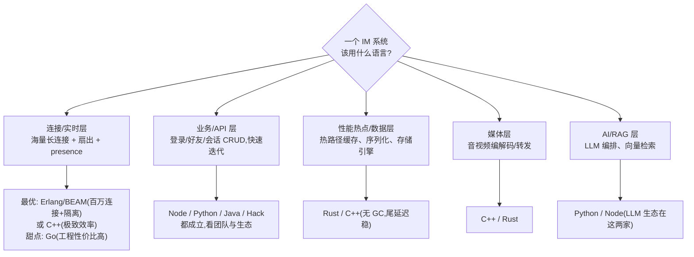
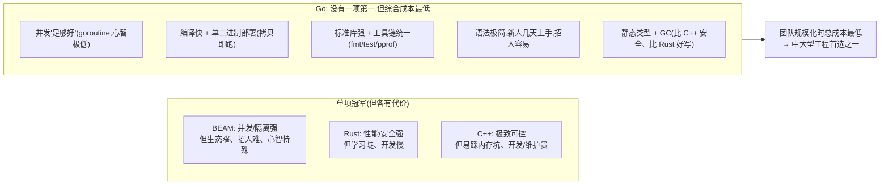

# 高并发长连接 IM 该不该"整个项目都用 Go"？——业界真实选型调研 + 分层与语言分析

> 面向零背景读者。先读术语表；正文所有专业名词首次出现即在同句给一句解释。
> 本文回答三个问题：① 微信/Discord 这类项目是不是该全用 Go？（用它们的**真实**技术选型说话）
> ② 为什么有的把 API/业务层放在 Python 而不是 Node？③ 高并发层 Go 并非最优，为何业界这么火——
> Go 到底适合干什么、什么是它**不可替代**的场景。结论会映射回本项目（server=Node、gateway=Go、agent-server=Node）。

---

## 术语表

| 名词 | 一句话大白话 |
|---|---|
| **长连接** | 客户端和服务器保持一条不断开的连接（WebSocket/TCP），用于服务器随时推消息，而不是每次都重新请求。 |
| **并发连接数** | 一台服务器同时挂着多少条这样的长连接。IM 的核心压力就在这里（百万级）。 |
| **BEAM / Erlang VM** | Erlang 和 Elixir 运行的虚拟机；它的"进程"极轻（几百字节一个），一台机器能同时跑几百万个，天生适合"一连接一进程"。 |
| **Elixir** | 跑在 BEAM 上的现代语言，语法友好，继承 Erlang 的海量并发 + 容错能力。 |
| **goroutine** | Go 的轻量并发单位，比操作系统线程轻得多；Go 靠它做到"一连接一 goroutine"。 |
| **GC（垃圾回收）** | 自动帮你回收不用的内存。方便，但回收时可能造成短暂停顿（尾延迟毛刺），对极致低延迟服务是麻烦。 |
| **尾延迟（p99/p999）** | 最慢的那 1%/0.1% 请求有多慢。均值好看没用，卡顿都出在尾部。 |
| **fault isolation（故障隔离）** | 一个连接/模块崩了，不牵连其他。BEAM 的"let it crash"是这方面的标杆。 |
| **NIF** | Native Implemented Function：在 Elixir/Erlang 里嵌一段原生代码（如 Rust）跑 CPU 热点。 |
| **RPC 框架** | 让一个服务像调本地函数一样调另一个服务的接口（微信的 Svrkit、gRPC 都是）。 |
| **fan-out（扇出）** | 一条消息要发给一个群里所有在线成员——把 1 条放大成 N 条投递。 |
| **backplane（背板）** | 多个连接节点之间用 Redis 发布订阅互相转发，保证连在不同节点的人也能收到彼此消息。 |
| **云原生基础设施** | Docker/Kubernetes/etcd/Prometheus 这类"跑服务的底座"软件。 |
| **单二进制部署** | 编译出一个可执行文件，拷过去就能跑，不用装运行时/依赖。Go 的招牌优点。 |
| **工程经济学** | 不只看性能，还看：团队多快能上手、招人难不难、部署运维省不省、编译快不快、出 bug 概率——综合总成本。 |

---

## 一、先给结论

**不该"整个项目都用 Go"。而且有个反直觉的事实：那些把"海量长连接"做到极致的公司，恰恰都不是用 Go 做连接层的——WhatsApp/Discord 用 Erlang/Elixir，微信用 C++。** 没有任何一家大型 IM 是"全用一种语言"写的，它们无一例外是**按层选语言（right tool per layer）**：连接/实时层、业务 API 层、数据/性能热点层、媒体层，各挑各自最合适的语言。

"全用 Go" 犯的错，是把一个**分层问题**当成**单选题**。下面用真实选型证明，再逐层拆"每层为什么这么选"。

---

## 二、业界真实选型调研（关键事实）

| 系统 | 连接/实时层 | 业务 / API 层 | 性能热点 / 数据层 | 媒体层 | 备注 |
|---|---|---|---|---|---|
| **WhatsApp** | **Erlang/BEAM**（一连接一进程，~200 万连接/机） | Erlang | — | — | FreeBSD、热更新、~50 工程师撑 4.5 亿用户 |
| **Discord** | **Elixir/BEAM**（每个服务器=一个 GenServer 进程） | **Python**（HTTP REST 单体） | **Rust**（NIF 热点；read-states 从 **Go 迁到 Rust**；ScyllaDB） | **C++**（语音视频） | 12M+ 并发、26M ws 事件/秒；~5 人聊天基础设施团队 |
| **微信（WeChat）** | **C++**（自研接入层长连接） | **C++**（Svrkit RPC + Logicsvr CGI） | C++ | C++ | N 层架构（接入/逻辑/存储），日 RPC 百万亿级 |
| **Slack** | **Java**（Channel/Gateway/Presence Server，有状态内存） | **Hack/PHP**（HHVM） | Java + MySQL/Vitess/Kafka | — | **边缘层(Flannel/Envoy)用 Go**，一致性哈希路由，Flannel 峰值 400 万连接 |
| **Signal** | Java（Dropwizard，REST + WebSocket） | Java | Java | — | 服务端开源 |
| **Telegram** | C++（服务端闭源，普遍认为 C++） | C++ | C++ | C++ | 服务端不开源 |

### 从这张表能提炼出的三条规律

1. **极致长连接层选的是 Erlang/BEAM 或 C++，不是 Go。**
   - WhatsApp/Discord 靠 BEAM 的"进程极轻 + 一连接一进程 + 天然故障隔离 + 消息传递"扛百万连接——这套模型 Go 学不来（goroutine 轻，但没有 BEAM 那种"进程隔离 + let it crash + 分布式透明"的整套运行时）。
   - 微信/Telegram 用 C++ 换极致的资源效率与可控性。
2. **业务/API 层各家分化**：Discord=Python、Slack=Hack/PHP、Signal/微信=同栈语言。说明**业务层没有唯一正确语言**，取决于历史、团队、生态邻接。
3. **Go 真正的高光位置是"边缘/基础设施"**：Slack 明确把**边缘服务（Flannel 缓存、Envoy 旁路）用 Go**——不是核心实时算法，而是"高并发网络中间件"。这非常能说明 Go 的甜点区（见第五节）。

### Discord 的"Go→Rust"是本问题最直接的反例

Discord 有个在**热路径**上的 read-states 服务（每次连接、每收发一条消息都要读它），最早用 **Go** 写。现象：**每 2 分钟一次、10–40ms 的延迟毛刺**。根因是 **Go 的 GC**——Go 强制至少每 2 分钟触发一次垃圾回收，且每次要扫描整个装满存活对象的 LRU 缓存（大白话：不是要回收的垃圾多，而是"检查有没有垃圾"这件事本身就要遍历一大堆还活着的对象，很贵）。他们把缓存调小反而抬高了 p99（命中率下降要回库）。最后**迁到 Rust**（无 GC、内存即时释放）彻底消除毛刺。

> 这说明：**在"极致低尾延迟 + 长驻大缓存"的热点服务上，Go 的 GC 是硬伤**，会被 Rust/C++ 这类无 GC 语言替换。Go 不是"高并发万金油"。

---

## 三、把"全用 Go"这个命题证伪（并映射到本项目）

一句话：**不同层的约束完全不同**（连接层要海量并发+隔离；业务层要迭代速度；热点层要尾延迟；AI 层要生态），根本不存在"一种语言在所有层都最优"。所以"全用 Go"必然在某些层是错的选择。

映射到**本项目**（这也印证了之前几轮的判断）：
- **gateway=Go** ✅：连接层，goroutine-per-conn + 单二进制 + Redis 背板，是 Go 的正确甜点区。
- **server=Node（Express+Socket.io）** ✅：IM 业务 CRUD + 实时，迭代快、与 web 同语言。
- **agent-server=Node（NestJS）** ✅：AI/RAG 层强绑 JS/Python 的 LLM 生态，绝不该用 Go 重写。
- 若"全项目 Go"：业务层迭代变慢、agent 层等于自造 LLM 轮子——**净亏**。

---

## 四、为什么有人把 API/业务层放 Python 而不是 Node？（诚实对比，不吹不黑）

先破一个误解：**"API 层要用 Python 不用 Node"不是一条技术定律。** Discord 用 Python 主要是**历史**（2015 年从 Python 单体起家）+ **生态邻接**（数据分析、机器学习、Trust&Safety 反滥用模型都在 Python 生态），不是因为 Python 处理 HTTP 天生强于 Node。反过来，PayPal、Netflix、Uber、LinkedIn 等一大批公司的 API/BFF 层用的正是 **Node**。二者都是主流正解。

真正驱动这个选择的是下面这些维度：

| 维度 | Python 更占优的场景 | Node/TypeScript 更占优的场景 |
|---|---|---|
| **生态邻接** | 业务本身重数据科学/ML/爬虫/AI（模型、pandas、科学计算都在 Python） | 前后端同语言（web 也是 JS/TS），共享类型/校验/契约代码 |
| **并发模型** | 计算型任务多、用多进程/异步框架（FastAPI/asyncio）也够 | **IO 密集**（大量并发网络请求/长连接）——Node 事件循环 + 单线程非阻塞是天生强项 |
| **迭代与类型** | 语法极简、上手最快；大型项目靠 type hints 补类型 | TypeScript 提供**编译期强类型**，大型业务建模更稳 |
| **实时能力** | 需额外方案 | **Socket.io 等实时库是 Node 生态原生优势**（本项目 server 正吃这个红利） |
| **团队** | 团队是 Python/数据背景 | 团队是前端/全栈背景 |

**对本项目的结论**：用 **Node** 是**更贴合**的选择，不是妥协——因为 ① web 与 server 同为 JS/TS，能共享 proto 生成的类型与校验逻辑（你们的 `contracts/gen` 正是这么用的）；② IM 是典型 IO 密集 + 实时，Node 事件循环 + Socket.io 是甜点；③ 团队全栈心智负担低。**只有当业务重度绑定 ML/数据管线时，Python 的生态邻接才会反超**——而那正是 agent-server 用到 LLM 的地方（它也确实可以是 Python，只是你们选了 Node/NestJS，同样成立，因为 LLM 调用是 HTTP、Node 生态也齐全）。

> 反直觉小结：**"Python vs Node 做 API"更多是团队与生态问题，不是性能问题**。谁的生态离你的业务更近、谁和你其余技术栈更统一，就用谁。别被"某大厂用了 X"带偏——它的历史约束不是你的。

---

## 五、Go 并非高并发最优，为何这么火？它到底适合干什么、什么无法被替代

### 5.1 先承认：Go 在"极限"维度上都不是第一

- **海量连接 + 强隔离**：BEAM（Erlang/Elixir）更强——进程更轻、故障隔离、热更新、分布式透明，是 WhatsApp/Discord 的选择。
- **极致尾延迟 / 无 GC**：Rust/C++ 更强——Discord 的 read-states 正是因为 Go 的 GC 毛刺而迁到 Rust。
- **极致资源效率 / 底层可控**：C++ 更强——微信、Telegram 的选择。
- **重数值/ML**：Python（+C/C++/CUDA 底座）生态碾压。

**所以：如果只看某一个极限指标，Go 每一项都能找到更强的对手。**

### 5.2 那 Go 为什么火？——因为它赢的不是"某个极限"，是"工程经济学的综合最优"

Go 的设计目标从一开始就是 Google 的**工程管理问题**：让**大量普通工程师**在**大型代码库**上，**快速、少踩坑、易维护**地写出**够快的网络服务**。它每一项都"足够好 + 心智负担极低"，加起来就是**规模化团队里总成本最低**——这才是它火的根因，不是某个跑分。

### 5.3 Go 真正"几乎不可替代"的场景

**① 云原生基础设施——这是 Go 最硬的护城河。**
Docker、Kubernetes、etcd、Prometheus、Terraform、Consul、containerd、Istio……**整个云原生底座几乎全是 Go 写的**。后果是：
- 你写 K8s operator、CLI 插件、云原生中间件、可观测性组件时，**官方 SDK/生态/示例都是 Go**，用别的语言是逆水行舟。
- 这一层的"事实标准语言"地位，短期内**无可替代**——不是因为 Go 性能最强，而是**生态锁定 + 单二进制天然适配容器**（镜像里就一个可执行文件，极小极干净）。

**② 高并发网络中间件 / API 网关 / 反向代理 / 连接层。**
goroutine-per-connection 直接映射网络服务，不用 async/await 的心智负担；配 Redis 背板做跨节点扇出。Slack 的边缘层、无数公司的 WebSocket 网关（含**本项目的 gateway**）都在这个甜点区。

**③ CLI 工具 / DevOps 工具 / 跨平台可分发的小工具。**
单二进制、跨平台交叉编译、启动快——`gh`、各种运维工具都是 Go。分发体验无对手。

**④ "要够快、又要快速交付、还要好招人好维护"的微服务。**
不需要 Rust 的极致、也受不了 C++ 的坑、又嫌 Java 重的中大型后端，Go 是性价比之王。

### 5.4 但要清醒：Go 做连接层有个"生态空缺"必须自己补

调研里一句话点破：**Go 没有 Socket.io 的等价物**。一条 WebSocket 只给你"一根双向字节管道"，其余全是你的活——**消息格式、路由、投递确认、重连状态、presence、顺序保证，全得自己写**，一个生产级 Go 网关往往要**几个月**才把边界情况打磨稳。

> 这正好解释了**本项目 gateway 的现状**：它连接层骨架做得对，但业务只覆盖到 `message.send` 的 PoC——因为"把 socket.io 已经白给的那套能力（presence/已读/@/信令/重连补偿）在 Go 侧重新造一遍"本就是几个月的工程量。这不是 Go 没用，而是**用 Go 做连接层的固有成本**，选它前要认这笔账。

### 5.5 什么时候**不该**用 Go
- 极致尾延迟、长驻大内存缓存的热点服务 → Rust/C++（Discord read-states 的教训）。
- 需要百万连接 + 强故障隔离 + 热更新 → Erlang/Elixir。
- 重 ML/数值/数据管线 → Python。
- 需要极丰富领域类型建模的大型业务、且团队在 JVM/TS 生态 → Java/Kotlin/TypeScript。

---

## 六、常见误区（踩坑）

1. **"高并发 = 上 Go"**：错。高并发有很多种（海量连接 / 高吞吐计算 / 低尾延迟），Go 只在"海量连接的工程性价比"这一支是甜点；极限并发反而是 BEAM/C++ 的天下。按**约束**选，别按热度选。
2. **"某大厂用了 X，所以我也该用 X"**：错。大厂的选择带着它的**历史包袱 + 团队构成 + 规模**（Discord 的 Python 是 2015 年起家的历史，不是给你的处方）。抄结论不抄约束，必翻车。
3. **"用 Go 写连接层就等于白得高性能网关"**：错。Go 只给你并发原语，协议/路由/presence/重连/扇出全要自研（见 5.4），是几个月的隐藏成本——本项目 gateway 停在 PoC 正是这个原因。
4. **"全用一种语言最省心"**：在小项目成立；到 IM 这种分层约束差异极大的系统，强行单语言会在某些层付出更大代价。真正省心的是**清晰的分层 + 每层选对语言 + 用 IDL/契约把层间接口固定住**（你们的 proto 契约正是干这个的）。

---

## 七、回到本项目的最终判断

- **现状的语言分层是对的**：gateway=Go（连接层甜点）、server=Node（IM 业务+实时甜点）、agent-server=Node（AI 生态）。**不需要、也不应该"全用 Go"。**
- **真正要决策的不是语言，而是 gateway 的去留**：Go 网关的价值只有在"把连接层能力补到与 socket.io 对齐并真正切流量"后才兑现；否则就是维护双实时栈、收益为零（见 `docs/项目重构方案` 相关分析）。要么排期推进切换，要么明确冻结止损。
- **一句话**：Go 不是"最快的语言"，是"团队规模化时综合成本最低、且在云原生基础设施与连接层生态位上近乎不可替代"的语言。把它用在对的层（你们已经这么做了），别用它去替换本就更合适的 Node/Python 层。

---

## Sources（引用来源）

- Discord: [Using Rust to Scale Elixir for 11 Million Concurrent Users](https://discord.com/blog/using-rust-to-scale-elixir-for-11-million-concurrent-users)
- Discord: [Why Discord is switching from Go to Rust](https://discord.com/blog/why-discord-is-switching-from-go-to-rust)
- WhatsApp: [How WhatsApp Grew to Nearly 500 Million Users, 11,000 cores, and 70 Million Messages a Second (High Scalability)](https://highscalability.com/how-whatsapp-grew-to-nearly-500-million-users-11000-cores-an/)
- WeChat: [Overload Control for Scaling WeChat Microservices (arXiv)](https://arxiv.org/pdf/1806.04075)
- Slack: [Real-time Messaging (Slack Engineering)](https://slack.engineering/real-time-messaging/) ・ [Flannel: An Application-Level Edge Cache to Make Slack Scale](https://slack.engineering/flannel-an-application-level-edge-cache-to-make-slack-scale/)
- Signal: [What I've learned from Signal server source code (SoftwareMill)](https://softwaremill.com/what-ive-learned-from-signal-server-source-code/)
- Telegram: [Telegram (software) — Wikipedia](https://en.wikipedia.org/wiki/Telegram_(software))
- Go WebSocket 生态: [Go WebSocket Server Guide: coder/websocket vs Gorilla (WebSocket.org)](https://websocket.org/guides/languages/go/) ・ [Empowering WebSockets in Go with Centrifuge](https://medium.com/@fzambia/empowering-websockets-in-go-with-centrifuge-library-f2712e5317bd)
