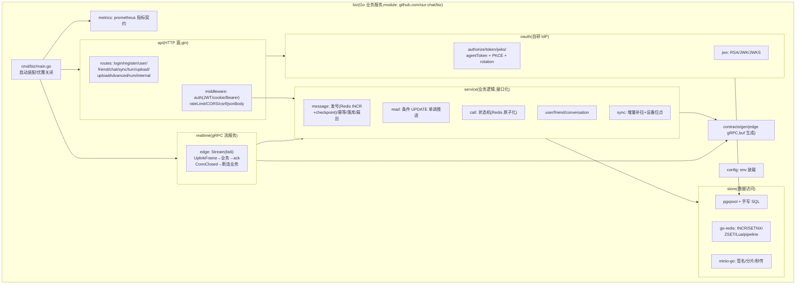

# Go 业务层重写 · 技术选型报告

> 面向 Go 全面重写业务层（`server/` Node → 新 Go 服务）的技术选型决策。
> 每项选型给出：候选对比、2025-2026 业界实践现状（含检索到的公开评测）、本项目的选择与理由、备选切换条件。
> 选型锚点：与既有 gateway（Go）同栈一致、契约单源（buf）、客户端零改动、三期压测工具链可复测。
> 本文与 `docs/监测设施/prompts/26-9-16-Go全面重写业务层.md` 配套：提示词定任务，本文定技术底座。

---

## 0. 选型总表（结论先行）

| # | 维度 | 选择 | 备选（切换条件） |
|---|---|---|---|
| 1 | HTTP 框架 | **业务层：`gin`**（保守备选 chi）；**连接层：stdlib mux 维持**（详见《业务层与连接层HTTP框架选型分析.md》） | 业务层 stdlib（端点 <15 且无 multipart 时） |
| 2 | 数据库驱动/访问 | **`pgx/v5` + 手写 SQL**（pgxpool 连接池） | sqlc（SQL 增多后补代码生成） |
| 3 | Schema 迁移 | **golang-migrate（embed 单二进制）**，存量 Prisma 迁移一次性转换 + `force` 基线，不做过渡 | atlas（声明式） |
| 4 | Redis 客户端 | **`go-redis/v9`**（生态第一，独立评估） | rueidis（热路径性能优化时） |
| 5 | JWT（会话令牌 HS256） | **`golang-jwt/jwt/v5`**（维护活跃，独立评估） | — |
| 6 | JOSE（OAuth RSA/JWKS） | **`lestrrat-go/jwx/v4`** | go-jose/v4 |
| 7 | OAuth IdP | **自研流程（对齐 Node 版语义）+ jwx 密码学** | ory/fosite（未来要完整 OIDC 生态时） |
| 8 | 对象存储 | **`minio-go/v7`**（S3 兼容 SDK） | aws-sdk-go-v2 |
| 9 | gRPC | **`google.golang.org/grpc`**（复用已生成 edge 契约）+ health/keepalive | — |
| 10 | 指标 | **`prometheus/client_golang`**（指标名/buckets 对齐 Node 契约） | — |
| 11 | 日志 | **stdlib `log/slog`（JSON handler）**（与 gateway 一致） | — |
| 12 | 配置 | **env 手写装载**（12-factor，与 gateway config 同构） | viper/koanf（配置面膨胀时） |
| 13 | 入参校验 | **手写校验函数**（错误文案与 Node 逐条对齐） | go-playground/validator |
| 14 | 测试 | **stdlib `testing` + `testify`（断言）**；mock 用手写接口 | gomock/mockery |
| 15 | 契约共享 | **buf 增加 Go 输出到 biz/（契约单源）** | 复制生成物 |

---

## 1. 选型原则（修订版）

> **修订说明**：初版把"与 gateway 同栈一致"列为第一原则——这是方法论错误。gateway 当初选库是开发顺手之选，
> **并未经过严格选型评估**（见 §2.0 的独立重审：其 WebSocket 库 gorilla/websocket 就有归档史与更优替代）。
> "跟随 gateway"只能作为认知成本的 tie-breaker，不能作为正确性依据。原则重排如下：

1. **独立正确性优先**：每项选型先做独立评估（维护状态/性能/正确性/生态/API 质量），结论与 gateway 是否同库**无关**；只有在独立评估并列时，"与 gateway 同库"才作为打破平局的次要因素。
2. **克制依赖**：IM 业务层 SQL 与逻辑都不复杂，优先标准库与轻量库，每引入一个重型框架都要有明确收益。
3. **契约对齐**：HTTP 响应结构/状态码/错误文案与 Node 逐一对齐；指标名与 buckets 对齐既有监测看板；proto 单源生成。
4. **可验证**：选型必须能用现有压测工具链（perf/，客户端零改动）验证。

---

## 2. 逐项分析

### 2.0 gateway 既有依赖的独立重审（选型锚点更正）

gateway（`gateway/go.mod`）当前依赖逐项独立评级——**结论是：多数项独立评估后仍合理，但当初的"顺手选型"至少有一处经不起严格评估（WebSocket 库），且其存在意味着"同栈"原则必须降级**：

| gateway 依赖 | 独立重审结论 | 判定 |
|---|---|---|
| `gorilla/websocket v1.5.3` | 项目 2022 年底宣布归档（后由社区接手），API 老旧（无 context 原生支持、并发写需外部锁、无优雅关闭原语）；2025-2026 新项目主流已转向 `coder/websocket`（nhooyr 精神继承者，更 idiomatic、更快，pkg.go.dev 自述"更符合惯用 Go、更快更易用"） | ⚠️ **当初未严格选型，属于"最流行顺手选"；gateway 下次迭代应评估迁移**（业务层不涉及 WS，不受影响） |
| `go-redis/v9` | 独立评估本就合理（生态第一、维护活跃、功能全） | ✅ 维持，但理由改为独立理由 |
| `golang-jwt/jwt/v5` | 独立评估合理（HS256 主流库、维护活跃） | ✅ 维持 |
| `prometheus/client_golang` | 事实标准，无争议 | ✅ 维持 |
| stdlib mux / `log/slog` | 标准库，无争议 | ✅ 维持 |
| `gopkg.in/square/go-jose`（未在 gateway，业务层 OAuth 候选） | 见 §2.6 | — |

**对业务层选型的直接影响**：§0 总表中"与 gateway 同栈"字样仅代表"并列时优先"，每项结论均已独立评估；若某项独立评估与 gateway 冲突（如未来 WS 场景），以独立评估为准。

### 2.1 HTTP 框架 → 分层结论：业务层 `gin`（保守备选 chi），连接层 stdlib 维持

> 独立评估（不锚定 gateway）：**流量来源不决定框架需求，该层承接的 HTTP 面复杂度才决定**。
> 完整论证见《业务层与连接层HTTP框架选型分析.md》。修订史：初版（受已废除的"同栈"原则影响）误将业务层也定为 stdlib。

| 候选 | 2025-2026 现状（检索结论） | 分层评价 |
|---|---|---|
| stdlib net/http | Go 1.22 起 `ServeMux` 支持方法+路径变量路由 | **连接层：足够且有余量**（3~5 前缀 + 反代直转，零绑定需求）；业务层：可行但 40 端点手写绑定/校验/错误样板 800~1500 行 |
| gin | GitHub 星标/生态第一，性能接近原生路由（httprouter 级），绑定/校验/中间件生态最全 | **业务层：绑定（Query/JSON/Uri/multipart）+ 中间件 + 统一错误，样板大部分被框架吸收**；自定义 binding 错误文案对齐 Node |
| chi | 轻量、100% 兼容 net/http，中间件友好 | 保守备选：依赖更轻，但绑定生态弱（样板只省一半） |
| fiber | 基于 fasthttp，性能极端但**不兼容 net/http 生态** | 不建议：生态兼容性风险大于性能收益 |

**选择：业务层 `gin`，连接层 stdlib mux 维持**。理由：① 反代只换入口不削减职责——业务层 ~40 端点 + 路径变量 + query/json/form/multipart 绑定 + 错误信封统一，gin 收益真实；② 框架性能差异（μs 级）在业务 I/O 主导的路径上不可感知；③ 连接层面薄（反代不解析业务参数），引入框架是负收益。**业务层保守备选**：端点 <15 且无 multipart → stdlib；团队偏好最小依赖 → chi。

### 2.2 数据库 → `pgx/v5` 原生 SQL

| 候选 | 现状 | 评价 |
|---|---|---|
| **pgx/v5** | 事实标准的 PG 专用驱动：二进制协议、COPY、批量、语句缓存、pgxpool | 性能最优、PG 类型完整（BIGINT/JSONB/timestamptz 映射干净）；本项目 SQL 多为精确事务（发号/幂等/ON CONFLICT/RETURNING），原生 SQL 最可控 |
| sqlc | 从 SQL 生成类型安全 Go 代码；被多篇 2025 长文评为"Postgres 场景的正确答案"（brandur.org 等） | 需要 schema 文件 + 查询文件 + 生成步骤；本项目迁移来自 Prisma（schema 在 schema.prisma），sqlc 需另维护 PG schema DDL |
| sqlx | 轻量扫描辅助，介于 database/sql 与 ORM 之间 | 便利性有限，pgx 的 RowToStructByPos 等已覆盖其多数用法 |
| GORM | 最流行 ORM，但性能与 SQL 可控性弱，复杂查询易退化 N+1 | 不建议：本项目强调精确 SQL 与性能 |

**选择：`pgx/v5`（pgxpool）+ 手写 SQL**。理由：事务语义（发号 INCR+checkpoint、幂等唯一约束、条件 UPDATE 单调推进）都需要精确 SQL，手写最贴近 Node/Prisma 的实际 SQL 行为；pgx 的连接池与批处理对压测场景（3000 msg/s）最稳。**备选 sqlc**：当 SQL 数量膨胀、手写扫描样板增多时，从 schema DDL 生成类型安全查询层（本项目 Prisma schema 可导出 DDL 作为 sqlc 输入）。

### 2.3 Schema 迁移 → golang-migrate（一次性全量切目标形态，不做过渡）

现状：数据库由 **Prisma migrations** 管理（`server/prisma/migrations/`，已 apply 到库）。决策：**Go 重写启动时一次性全量切到 golang-migrate**，不保留"短期 Prisma、长期迁移"的过渡期。

| 方案 | 评价 |
|---|---|
| **golang-migrate（选定）** | 最流行、`embed` 进单二进制（单二进制部署的必备）；SQL 文件即迁移（与 Go 同仓同构）；支持 `force` 设置版本基线 |
| Prisma CLI 过渡保留 | 需要 Node 工具链参与 Go 服务的部署（`pnpm db:migrate:deploy`），与"单二进制部署"目标冲突；两套迁移真相源并行是最大风险源 |
| atlas | 声明式（自动 diff），最现代；但引入独立工作流与 HCL 描述，与"迁移文件即 SQL"的简洁路线偏离 |
| goose | 定位与 golang-migrate 接近，生态略小；不构成差异化理由 |

**一次性切换方案（存量衔接，重写启动时执行）**：

1. **存量转换脚本**：把 `server/prisma/migrations/<ts>_<name>/migration.sql` 按时间戳排序，转成 `migrations/000001_<name>.up.sql`、`000002_...`（down 生成空占位——存量反向迁移无业务价值，只保格式完整）；转换脚本与产物一并入库，可重复执行验证。
2. **已部署环境衔接**：库已 apply 全部 Prisma 迁移 → 用 golang-migrate 的 `force <最后版本号>` 把 `schema_migrations` 标到存量末尾，此后增量迁移全部走 golang-migrate（新环境直接从头跑全部迁移）。
3. **schema.prisma 定位变化**：不再承担迁移职责；server/（Node 对照版）保留期间，其 Prisma Client 的 `schema.prisma` 需与 golang-migrate 迁移手工同步（对照版不再演进则无此负担）；Go 侧模型以迁移 SQL + 手写查询为真相。
4. **新表/新列**：一律写 golang-migrate 迁移文件（不再经 Prisma）。

**切换风险与对策**：① 转换脚本产出后先在干净库全量重放验证（CI 加一步：起空 PG → migrate up → 对比表清单）；② force 基线操作在低峰窗口执行并备份 schema_migrations 前状态；③ 首次部署与 Node 版并行期间，禁止两套工具同时迁移（团队约定：迁移唯一入口 = golang-migrate）。

### 2.4 Redis 客户端 → `go-redis/v9`

| 候选 | 现状 | 评价 |
|---|---|---|
| **go-redis/v9** | 生态第一、维护活跃、支持 cluster/sentinel/pipeline/事务/Lua | 本项目的 INCR/SET NX/ZSET/Lua 全部覆盖；与 gateway 同库仅作 tie-breaker |
| rueidis | 自动流水线（热点场景比 go-redis 快数倍，公开评测称最高 14× 于特定基准）、客户端缓存、支持 RESP3 | 性能更强但生态较小 |

**选择：`go-redis/v9`**（独立评估：生态/维护/功能全维度满足）。发号 INCR 的 10 万+/s 量级远超本项目需求，无需为基准数字换库。**备选 rueidis**：若未来出现 Redis 往返成为 p99 主导（可测指标：redis 单次 RTT 占比），再评估切换（两者 API 差异集中在连接与管道层）。

### 2.5 JWT（会话令牌 HS256）→ `golang-jwt/jwt/v5`

会话 token 是 HS256 简单场景（`{id, username}` + expiresIn 7d/1h），与 gateway 的 `auth` 包完全同库（gateway `go.mod` 已依赖 v5.2.1）。无争议项。

### 2.6 JOSE（OAuth 的 RSA 签名 + JWKS）→ `lestrrat-go/jwx/v4`

| 候选 | 现状 | 评价 |
|---|---|---|
| **jwx/v4** | 完整 JWx（JWA/JWK/JWS/JWT），维护活跃（v4 为当前大版本） | 一个库覆盖 OAuth 的 RSA 签名、JWKS 端点、token 解析；API 现代 |
| go-jose/v4 | square 出品，久经考验（fosite 底层用它） | 同样可靠；若未来引入 fosite 会与之重叠 |
| golang-jwt/v5 | HS256/RS256 均可但 JWK 管理弱 | 会话令牌用它，OAuth 场景不敷用 |

**选择：`golang-jwt/v5`（会话）+ `jwx/v4`（OAuth）双库分工**。理由：会话令牌是 HS256 简单场景，golang-jwt 独立评估即可满足（维护活跃、API 简洁，与 gateway 同库仅为附带便利）；OAuth 需要 JWK 装载/JWKS 生成/多算法，jwx 是 2025-2026 该场景的主流选择。**备选 go-jose/v4**：若未来引入 fosite（其底层即 go-jose），改换成本低。

### 2.7 OAuth IdP → 自研流程（对齐 Node 语义）

| 候选 | 评价 |
|---|---|
| ory/fosite | 安全优先的完整 OAuth2/OIDC 框架（Hydra 基础），实现 RFC6749/6819 全套，经同行评审 |
| **自研 + jwx** | Node 版本身就是精简自研 IdP（authorize/token/jwks/agentToken 四端点 + PKCE S256 + refresh rotation + 家族撤销），语义要逐一对齐 |

**选择：自研流程 + jwx 密码学**。理由：① Node 版是自研精简实现，重写的验收标准是"与 Node 行为逐一对齐"（含 agentToken、token 家族轮换的细节语义），fosite 的存储抽象与流程钩子反而增加对齐成本；② 端点面小、RFC 面窄（仅 authorization_code+PKCE、refresh）。**备选 fosite**：当需要完整 OIDC（发现文档、end_session、多客户端复杂授权策略）时整体替换，此时存储层（oauth_* 表）已存在可做存储适配。

### 2.8 对象存储 → `minio-go/v7`

S3 兼容的 Go 事实标准 SDK；覆盖本项目的**服务端中转上传**（putObject/流式/multipart 分片/秒传 StatObject——注意：Node 版是服务端收 buffer 后中转上传，**不是**客户端 presigned 直传，web 前端契约依赖 `POST /api/upload/*` 服务端上传，重写必须保持该语义，见 `server/src/routes/uploadAdvanced.ts` 与 `server/src/storage/storage.ts`）。**备选 aws-sdk-go-v2**：若目标对象存储转为纯 AWS S3（现为 MinIO/COS，minio-go 兼容性足够）。

### 2.9 gRPC → `google.golang.org/grpc`（复用既有契约）

edge 契约（`proto/ourchat/edge/v1/realtime.proto`）已生成到 `gateway/internal/contracts/gen`；业务层需要同源生成。**方案：`buf.gen.yaml` 增加一个 Go 输出目录到 `biz/internal/contracts/gen`**（契约单源，不复制不 replace——避免把 gateway 整个 module 拉为依赖）。配套插件：`grpc/health`（健康检查）、keepalive 参数（与 gateway 流客户端对齐）、可选 reflection（调试）。

### 2.10 指标 → `prometheus/client_golang`（指标契约对齐）

对齐既有监测栈（Prometheus 抓取、Grafana 看板 realtime-node-vs-go）。**指标名/buckets 以 `server/src/metrics/metrics.ts` 注册全集为准，逐一对齐**（否则看板口径断裂）：

| 指标 | 类型 | 对齐要求 |
|---|---|---|
| `server_message_duration_seconds` | histogram | **buckets 必须与 gateway 契约一致**：`[.005,.01,.025,.05,.1,.25,.5,1,2.5]`（监测计划文档 §3 契约） |
| `server_message_in_total` / `server_message_out_total` | counter | result 标签对齐（metrics.ts 全集之一） |
| `server_ws_connections` | gauge | 语义改为"该副本在处理的实时连接上下文数"或去掉（连接在 gateway）——报告里注明口径变化 |
| `server_ws_disconnects_total` | counter | 对齐 |
| `server_online_users` | gauge | 对齐（presence 计数） |
| `server_broadcast_recipients` | histogram | 对齐（扇出规模观测） |
| `server_call_events_total` / `server_active_calls` | counter/gauge | 对齐（通话观测） |
| `server_rum_web_vitals` | histogram | 对齐（RUM 接收端） |
| `http_request_duration_seconds` | histogram | method/route/status 标签对齐 |
| `db_query_duration_seconds` | histogram | 用 pgx 查询计时埋点替代 Prisma 扩展埋点 |
| `nodejs_gc_pause_seconds` | histogram | **Node 专属、Go 无对应物**——用 `go_gc_duration_seconds` 替代并在报告注明口径变化 |
| `process_cpu_seconds_total` 等 | 默认收集器 | client_golang 默认注册（Linux 下完整；macOS 无 /proc 的已知限制） |

### 2.11 日志 → stdlib `log/slog`（JSON handler）

与 gateway 完全一致（`slog.NewJSONHandler`），零依赖，结构化字段（userId/deviceId/err 等）对齐既有日志格式。

### 2.12 配置 → env 手写装载

与 gateway `internal/config` 同构：启动 fail-fast（缺 JWT_SECRET 直接退出）、默认值集中、布尔/整数解析。env 全集复用 `docker/.env.debug`。**备选 viper**：当出现配置文件（yaml 分层配置）需求时。

### 2.13 入参校验 → 手写校验函数

Node 的校验是 zod + 路由内逐条 if（错误文案精确："用户名长度必须在2-50个字符之间"等）。**手写校验最可控**（文案逐条对齐、状态码 400/409 语义精确）。**备选 validator**：仅当出现大量表单类端点时引入（本项目校验逻辑已在 Node 侧成形，翻译即可）。

### 2.14 测试 → stdlib `testing` + `testify`

- 断言：`testify/assert`、`require`（生态事实标准）；
- mock：**手写接口**（Go 惯例，模块间接口已按 V3"模块化单体接口化"设计）；
- 集成测试：对齐 Node 的 test/integration（真 PG/Redis/MinIO 依赖，用 env 控制跳过）；压测级验证用 perf/ 工具链（复用既有 harness，客户端零改动）。

### 2.15 契约共享 → buf 多输出

`buf.gen.yaml` 增加 `out: biz/internal/contracts/gen`（Go 插件 + grpc 插件），edge 契约单源三端生成（gateway/biz/TS）。不改 proto 既有字段语义（提示词硬约束）。

---

## 3. 模块布局（internal/ 结构）

要点：模块间只走接口（service 层接口化，V3"预留拆分边界"）；`store` 是唯一触达 PG/Redis/S3 的层；`contracts/gen` 由 buf 生成不可手改。

---

## 4. 依赖清单（版本锁定建议）

| 依赖 | 版本 | 用途 |
|---|---|---|
| go | **1.24+**（与 gateway 的 go1.22 以上保持兼容即可，建议统一 1.24） | 工具链 |
| github.com/gin-gonic/gin | v1.10.x | 业务层 HTTP 框架（连接层不用） |
| github.com/jackc/pgx/v5 | v5.7.x | PG 驱动+连接池 |
| github.com/redis/go-redis/v9 | v9.7.x（与 gateway 同） | Redis |
| github.com/golang-jwt/jwt/v5 | v5.2.x（与 gateway 同） | 会话 JWT HS256 |
| github.com/lestrrat-go/jwx/v4 | v4.x | OAuth JOSE |
| golang.org/x/crypto | latest（bcrypt cost 12） | 密码哈希 |
| google.golang.org/grpc | v1.83.x（与 gateway 同） | edge 流服务 |
| github.com/prometheus/client_golang | v1.20.x（与 gateway 同） | 指标 |
| github.com/minio/minio-go/v7 | v7.x | S3 |
| github.com/stretchr/testify | v1.x | 测试断言 |
| golang-migrate/migrate | 后期引入 | 迁移（长期方案） |

> gateway 的既有依赖（go.mod）是版本对齐锚点：同库必须同版本，避免行为分叉。

---

## 5. 风险与备选切换条件

| 风险 | 触发信号 | 切换动作 |
|---|---|---|
| gin 绑定行为与 Node 文案对齐偏差 | 对比测试发现字段级响应差异 | → 自定义 binding 错误映射逐条收敛（文案对齐是验收红线） |
| 手写 SQL 样板膨胀 | SQL 数量 >~50 且类型映射重复 | → sqlc（从 Prisma schema 导 DDL） |
| golang-migrate 存量转换出错 | 干净库全量重放验证失败（CI 闸） | → 回退 Prisma CLI 直至转换修复（迁移唯一入口纪律保持） |
| Redis 成为 p99 主导 | redis RTT 占比可测性指标超阈值 | → rueidis（评估自动流水线） |
| OAuth 需要完整 OIDC 生态 | 出现 end_session/发现文档/多客户端策略需求 | → fosite（存储适配既有 oauth_* 表） |

---

## 6. 参考资料

- 2025 Go Web 框架评测（friday-go.icu 等系列）：gin 生态第一、fiber 生态兼容性风险、stdlib 1.22+ 路由增强趋势。
- brandur.org：Postgres 场景 sqlc 为"正确答案"的长文（pgx 为驱动底座）。
- go2share/dasroot 2025：pgx vs sqlx vs GORM 对比（PG 专用场景 pgx 优势明确）。
- ory/fosite：安全优先 OAuth2/OIDC 框架（Hydra 底座）。
- lestrrat-go/jwx v4：当前 JWx 完整实现主流库。
- rueidis 评测：自动流水线场景显著快于 go-redis（具体倍数依赖基准）。
- golang-migrate vs goose vs atlas 对比（2026 系列）：版本化迁移最流行、声明式迁移最现代。
- 内部文档：《系统架构图V3.md》（目标态）、《26-9-16-Go全面重写业务层.md》（任务提示词）、《perf/README.md》（指标契约与测试规范）。
