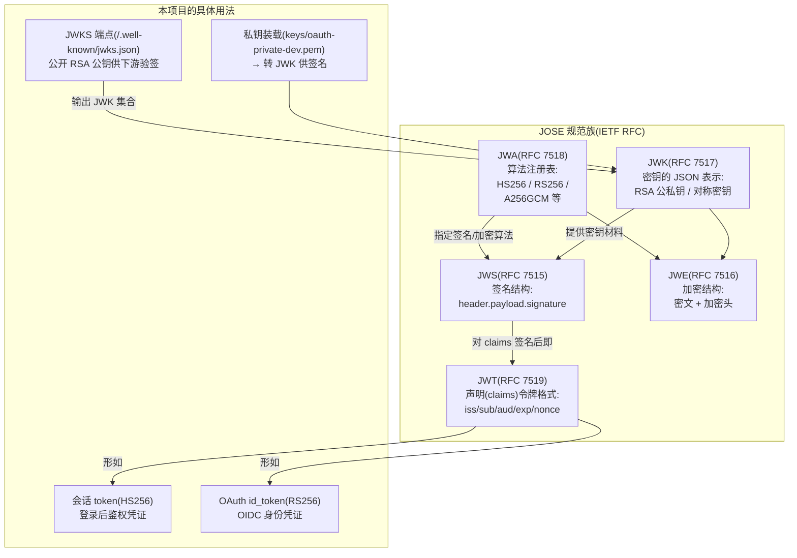

# JOSE 详解：JWA/JWK/JWS/JWE/JWT 与 jwx、go-jose 两个库的对比

> 面向零背景读者。本文回答三个问题：① 选型报告里的 **JOSE、JWK、JWKS、RS256 这些缩写到底指什么**、
> 它们之间什么关系；② **`lestrrat-go/jwx` 与 `go-jose` 这两个 Go 库分别是什么**、有何差异、怎么选；
> ③ 在本项目 OAuth IdP（以及会话令牌）里它们各自承担什么角色。
> 配套：`Go业务层重写技术选型报告.md` §2.5/§2.6（选型结论）。

---

## 0. 一句话总览

**JOSE**（JSON Object Signing and Encryption）是 IETF 的一套**规范族**，解决"如何在 JSON 世界里做签名与加密"。
它拆成四份规范（JWA/JWK/JWS/JWE），再加一个应用层产物 **JWT**（JSON Web Token，严格说 JWT 是独立规范 RFC 7519，但常与 JOSE 一起提）。
Go 生态里完整实现这套规范的库主要有两个：**`lestrrat-go/jwx`** 与 **`go-jose`**——它们不是协议，是**协议的实现**。

---

## 1. 规范族拆解：每个缩写是什么、什么关系



### 1.1 JWA（RFC 7518）——算法注册表

**它不定义任何格式，只登记"哪些算法可以用来签名/加密、编号是什么"**。常见成员：

| 算法名 | 全称 | 用途 | 本项目使用 |
|---|---|---|---|
| HS256 | HMAC-SHA256（对称） | 双方共享同一密钥签名/验签 | ✅ 会话 token（JWT_SECRET 即共享密钥） |
| RS256 | RSASSA-PKCS1-v1_5 + SHA-256（非对称） | 私钥签名、公钥验签 | ✅ OAuth id_token（RSA 密钥对） |
| ES256 | ECDSA P-256 | 非对称，签名更短 | 备选 |
| A256GCM 等 | AES-GCM | JWE 加密用 | 本项目未用 JWE |

### 1.2 JWK（RFC 7517）——密钥的 JSON 表示

**把"密钥"本身用 JSON 描述**，使密钥可以被放进文档、端点、数据库：

```json
{
  "kty": "RSA",
  "n": "0vx7agoebGcQSuuPiLJXZpt...",   // 模数
  "e": "AQAB",                        // 公钥指数
  "kid": "dev",                       // 密钥标识(本项目 OAuth 的 active kid)
  "alg": "RS256",
  "use": "sig"
}
```

本项目用法：启动时把 `keys/oauth-private-dev.pem`（PEM 格式 RSA 私钥）解析后**转成 JWK**，供签名与 JWKS 输出（`server/src/oauth/keys.ts` 的 `loadKeyStore` 做的事，经 `oauth/index.ts` 重导出装配）。

### 1.3 JWKS（JWK Set）——公开公钥集合端点

**一个 JSON 数组形态的 JWK 集合，挂在 `/.well-known/jwks.json`**。下游（agent-server 等）拿它验证 our-chat 签发的 token 真伪——所以里面**只放公钥**（`n`/`e`），绝不放私钥。这是"身份签发方（IdP）与验证方解耦"的标准机制：签发方轮换密钥，验证方从端点实时取新公钥。

### 1.4 JWS（RFC 7515）——签名结构

一条 JWT 的"外壳"就是 JWS：`header.payload.signature` 三段 base64url，中间以 `.` 分隔：

- **header**：声明算法（`{"alg":"RS256","kid":"dev"}`）；
- **payload**：就是 claims（1.5）；
- **signature**：用 header 声明的算法对前两段签名。

### 1.5 JWT（RFC 7519）——声明令牌格式

**一份结构化的"声明"（claims）+ 签名**。claims 分三类：

| 类别 | 例子 | 本项目 OAuth id_token 用法 |
|---|---|---|
| 注册声明 | iss（签发方）/ sub（主体）/ aud（受众）/ exp（过期）/ iat / nonce | 全部使用；nonce 防重放（OIDC 规范要求） |
| 公开声明 | 自定义业务字段 | username、id |
| 私有声明 | 双方约定字段 | — |

**本项目的两种 token**：

| token | 算法 | claims | 谁签发/谁验证 |
|---|---|---|---|
| 会话 token（登录） | HS256 | `{id, username}` + exp（7d/1h） | server 签发；gateway（HS256 验签）与业务层验证 |
| OAuth access_token / id_token | RS256 | iss/sub/aud/exp/nonce/scope 等 | 业务层 OAuth 模块签发；agent-server 等下游经 JWKS 公钥验签 |

### 1.6 顺带澄清：PKCE 与 code_challenge 不是 JOSE

PKCE（Proof Key for Code Exchange，RFC 7636）是**授权码交换时防拦截**的机制，`code_challenge`（S256 方法 = SHA-256 摘要的 base64url）是它的参数。它与 JOSE 常一起出现在 OAuth 流程里，但属于独立规范——选型上它只需要一个哈希函数，两个库都不直接管它。

---

## 2. 两个库是什么、怎么选

### 2.1 定位

| | lestrrat-go/jwx | go-jose（gopkg.in/square/go-jose.v2 / github.com/go-jose/go-jose/v4） |
|---|---|---|
| 一句话 | 社区最活跃的**完整 JWx 实现** | Square 出品的**老牌 JOSE 实现**（Ory Fosite 的底层密码学库） |
| 覆盖 | JWA/JWK/JWS/JWE/JWT 全套 | 全套（JWE 加密是它的历史强项） |
| 当前版本 | v4（v2/v3 已归档） | v4（v2 时代经 square→go-jose 组织移交，曾有一段维护低潮，v4 恢复活跃） |
| 维护与安全 | 活跃，安全响应快 | 稳定；历史上有 CVE（如 CVE-2023-…）但均及时修复 |

### 2.2 API 风格差异（同一件事：签名一个 JWT）

**jwx（builder/chain 风格，链式配置）：**

```go
key, _ := jwk.ReadFile("keys/oauth-private-dev.pem", jwk.WithPEM(true)) // PEM→JWK
tok, _ := jwt.NewBuilder().
    Issuer("http://localhost:3007").
    Subject("10229").
    Audience([]string{"agent-server"}).
    Expiration(time.Now().Add(900*time.Second)).
    Claim("nonce", nonce).
    Build()
signed, _ := jwt.Sign(tok, jwt.WithKey(jwa.RS256, key)) // 返回紧凑 JWT
```

**go-jose（builder 风格，密钥以 JWK 形态传入）：**

```go
priv, _ := jose.LoadPrivateKey([]byte(pemBytes))          // PEM→JWK 私有
signer, _ := jose.NewSigner(jose.SigningKey{Algorithm: jose.RS256, Key: priv}, nil)
signed, _ := signer.Sign(payloadBytes)                     // 面向 []byte 声明，非结构化 claims 类型
```

直观差异：jwx 提供**结构化 claims 类型**（`jwt.Token` 带 Get/Set）；go-jose 更底层（claims 就是 `[]byte`/`interface{}`，OIDC 语义要自己拼）。对**自研 IdP 逐一对齐 Node 语义**的需求，jwx 的结构化 API 更省事；go-jose 的优势是**被 fosite 等框架验证过的久经沙场**。

### 2.3 对比表

| 维度 | jwx v4 | go-jose v4 |
|---|---|---|
| 完整性 | 全 JOSE + JWT 结构化类型 | 全 JOSE，claims 偏底层 |
| API 现代性 | builder + parse + context 支持 | 经典 builder，context 支持较晚 |
| 性能 | 基准测试口碑好（尤其解析路径） | 稳定，无显著差异 |
| 生态背书 | 大量中大型 Go 项目使用 | Ory Hydra/Fosite 底层（OAuth 场景背书最强） |
| 引入它意味着 | 自研 IdP 的密码学底座 | 若未来上 fosite，天然重合 |
| 学习成本 | JWK/JWT 类型体系要理解 | 概念少但样板多 |

### 2.4 本项目结论（对应选型报告 §2.5/§2.6）

- **会话 token（HS256）**：`golang-jwt/jwt/v5`——HS256 简单场景，与 gateway 验签同库，无争议。
- **OAuth IdP（RS256/JWK/JWKS）**：**`lestrrat-go/jwx/v4`**——理由：① 自研 IdP 需要结构化 claims（iss/sub/aud/nonce 逐字段对齐 Node 实现），jwx 的 `jwt.Token` 类型直接映射；② PEM↔JWK 转换与 JWKS 输出是内置能力（`jwk.ReadFile`/`jwk.PublicSetOf`），自研代码量最小；③ 维护活跃、v4 为当前大版本。
- **备选 go-jose/v4**：若后续决定引入 ory/fosite 框架（其底层即 go-jose），为避免双密码学库，届时整体切换（存储层已存在，切换成本可控）。

---

## 3. 速查表（以后看到这些词不再陌生）

| 词 | 一句话 |
|---|---|
| JOSE | JSON 签名与加密的规范族（JWA+JWK+JWS+JWE） |
| JWA | 算法注册表（HS256/RS256/ES256…） |
| JWK | 密钥的 JSON 表示（kty/n/e/kid…） |
| JWKS | JWK 集合端点（只公开公钥） |
| JWS | 签名结构：header.payload.signature |
| JWE | 加密结构（本项目未用） |
| JWT | 带签名的 claims 令牌（header.payload.signature 的 JWS + 结构化声明） |
| HS256 | HMAC-SHA256，对称签名（会话 token 用） |
| RS256 | RSA+SHA256，非对称签名（OAuth id_token 用） |
| kid | JWK 里的密钥标识（轮换密钥时靠它区分用哪把） |
| PKCE/S256 | 授权码防拦截机制（非 JOSE，配套出现） |
| jwx | lestrrat-go 的完整 JWx Go 实现（本项目的选择） |
| go-jose | Square 出品的 JOSE 实现（fosite 底层，备选） |
