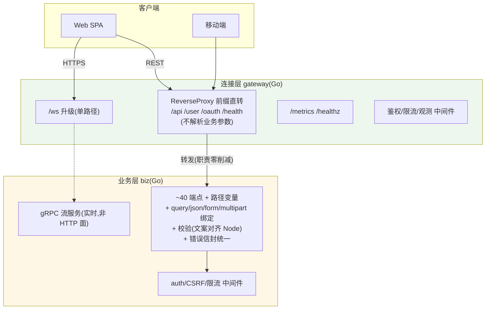

# 业务层与连接层的 HTTP 框架选型分析（流量经转发后，两层各该不该用框架）

> 面向零背景读者。问题来源：业务层（biz）的流量现在**全部经连接层（gateway）转发**（HTTP 反代 + gRPC 流），
> 那么"业务层还应不应该用 HTTP 框架？连接层该不该用 HTTP 框架？"
> 本文结论先行：**流量从哪来，不决定要不要框架；该层自己承接的 HTTP 面复杂度才决定。**
> 本文是 `Go业务层重写技术选型报告.md` §2.1 的深化与修订依据。

---

## 0. 结论摘要

| 层 | 结论 | 核心理由 |
|---|---|---|
| **连接层（gateway）** | **不需要 HTTP 框架，stdlib mux 维持** | 承接面极薄：3~5 个路径前缀 + 反代直转 + 2 个端点；没有任何参数绑定/路由变换需求 |
| **业务层（biz）** | **用 gin**（保守备选 chi） | 反代只换了入口，业务层的 HTTP 职责（~40 端点路由/参数绑定/校验/错误结构/multipart）一点没少；gin 消除 800~1500 行绑定样板 |
| 何时推翻 | 业务层若未来 REST 也收敛 gRPC（转码），框架问题自然消失——但该路径已被 V2 决策否决，故 HTTP 面长期存在 | — |

---

## 1. 先澄清一个反直觉点：流量来源 ≠ 框架需求

常见误区："业务层流量都是 gateway 转发的，业务层就不需要 HTTP 框架了"。

**转发只改变请求的入口，不改变请求的语义落点。** gateway 反代是**路径前缀直转**（`/api/*` → `127.0.0.1:3007/api/*`），它：
- 不解析业务 URL 的路径变量、不解析 query、不解析 body、不生成业务响应结构；
- 鉴权（业务层 auth 中间件）、参数校验、错误 JSON 封装**仍然全部发生在业务层**；
- 移动端流量（nginx → gateway → biz）同样如此。

所以"该不该用 HTTP 框架"的判断对象是**该层自己写的 HTTP 处理代码量**，与流量拓扑无关。

---

## 2. 连接层（gateway）：面薄如纸，stdlib 已超额

### 2.1 它实际承接的 HTTP 职责

| 职责 | 内容 | 框架需求 |
|---|---|---|
| 路由 | `/ws`（升级）、`/api/`、`/user/`、`/oauth/`、`/health`（反代）、`/healthz`、`/metrics` | 5 个前缀匹配 + 2 个端点——**零路径变量、零嵌套** |
| 反代 | `httputil.ReverseProxy` 直转，流式 flush | 与路由框架无关（一个 Handler 挂多前缀） |
| 中间件 | JWT 验签、限流、访问日志、指标 | 3~4 个自写中间件，stdlib `http.Handler` 包装即可 |
| 参数处理 | 无（不解析业务参数） | 无绑定需求 |

### 2.2 结论：不需要框架

stdlib mux（Go 1.22+）足以覆盖且有余量。**引入 gin/chi 到连接层是负收益**：多一个依赖、多一套 Context 编程模型，换不来任何缺失能力。

### 2.3 什么时候连接层才需要"框架级"路由

触发信号：gateway 从"反代"演进为"API 网关"——出现**灰度路由（按 header/用户分流）、请求变换（改写 path/header）、多上游聚合、细粒度租户隔离**时。但注意：那时正确选择是 **API 网关级方案（Envoy/Kong/自研网关）或 chi 级轻路由**，不是业务 HTTP 框架（gin）——gin 的绑定/校验生态对网关无用。

---

## 3. 业务层（biz）：面厚实，框架收益真实

### 3.1 它实际承接的 HTTP 职责（转发之后一样都不少）

| 职责 | 内容 | 规模 |
|---|---|---|
| 路由 | 用户/好友/会话/消息/上传/OAuth/RUM/内部端点 | **~40 端点**，含路径变量（`/user/:id` 等） |
| 参数绑定 | query（分页/过滤/sync 的 conv+since+limit+device）、JSON body（登录/注册/发消息）、form、**multipart 上传（大文件）** | 每端点 1~3 种 |
| 校验 | 长度/格式/正则（用户名、邮箱、手机号、密码），错误文案**逐条对齐 Node** | ~20 组校验规则 |
| 响应 | `{success,data,message}` 信封 + 400/401/403/409/500 状态码语义 | 全端点统一 |
| 中间件 | auth（JWT/cookie/Bearer 双鉴权）、CSRF、限流、指标计时 | 4~5 个 |

### 3.2 stdlib 直写 vs gin：样板量对比（40 端点量级）

| 项 | stdlib（1.22+） | gin |
|---|---|---|
| query 解析 | 每端点手写 `r.URL.Query().Get` + 类型转换 + 校验 | `ShouldBindQuery(&struct)` 一次完成 |
| JSON body | 手写 `json.NewDecoder` + 逐字段判空 | `ShouldBindJSON` |
| multipart | `ParseMultipartForm` + 手写分片边界处理（易错） | `FormFile`/`ShouldBind` 封装 |
| 错误 JSON | 每端点手写 `writeError(w, ...)` | 统一 `c.AbortWithStatusJSON` + 自定义 binding 错误文案（对齐 Node 文案） |
| 中间件链 | 手写包装（可行但零复用） | `gin.HandlerFunc` 生态（限流/日志/恢复） |
| **估计样板** | **800~1500 行** | 大部分被框架吸收 |

### 3.3 结论：业务层用 gin（保守备选 chi）

- **gin**：独立评估下收益真实——绑定、校验、错误处理、multipart、中间件生态，且性能差异在本项目（I/O 主导、40 端点）不可感知（框架间路由差异 μs 级，三期实测的业务 RTT 是 ms 级）。
- **chi**：保守选项——100% stdlib 兼容、依赖更轻；代价是绑定生态弱（query/body 绑定仍要手写或配 validator），样板只省一半。
- **对齐 Node 文案的工程点**：gin 的 binding 校验默认英文文案，需自定义 `binding.Validator` 错误映射（用户名长度、邮箱格式等文案逐条对齐）——这部分工作两个方案都省不掉（校验逻辑本身要翻译）。

### 3.4 一个诚实的边界：什么条件下结论反转

- 若未来把 REST 全部转码到 gRPC（grpc-gateway）→ HTTP 面消失，框架问题消失——**但 V2 决策记录已否掉转码**（REST 语义/大响应体流式/成本），故 HTTP 面长期存在。
- 若端点数量实际 <15 且无 multipart → stdlib 直写也完全合理（样板量不构成负担）。
- 若团队强烈偏好最小依赖 → chi 路线（接受一半样板）。

---

## 4. 流量路径与框架需求的映射（一图总结）

读法：gateway 的 HTTP 面（绿色）是"管道"——薄到不需要框架；业务层的 HTTP 面（黄色）是"业务"——厚到框架收益真实。**反代这条边只转发字节，不转移任何 HTTP 处理职责。**

---

## 5. 两层结论与通用判定标准

| 判定标准（端点/绑定规模） | 建议 |
|---|---|
| 端点 <10、无复杂绑定、无 multipart | stdlib（gateway 属于此类） |
| 端点 10~50、有绑定/校验/中间件需求 | **gin**（或 chi 保守路线）——业务层属于此类 |
| 端点 >50 或网关级功能（灰度/变换/聚合） | 拆服务 + 评估 API 网关（Envoy/Kong），不是加业务框架 |

---

## 6. 对选型报告的修订

本文结论需同步回 `Go业务层重写技术选型报告.md`：
- §2.1 由"业务层 stdlib net/http"修订为"**业务层 gin（保守备选 chi）；连接层 stdlib 维持**"；
- 修订理由：原结论受已废除的"同栈锚定 gateway"原则影响，本文为独立评估。
