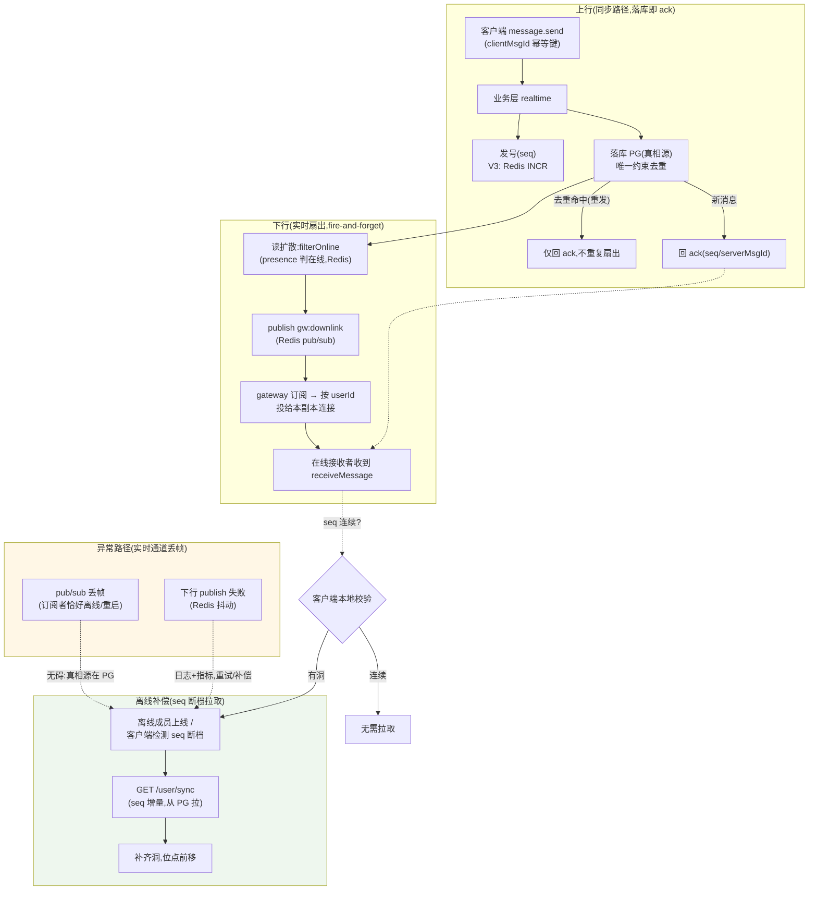
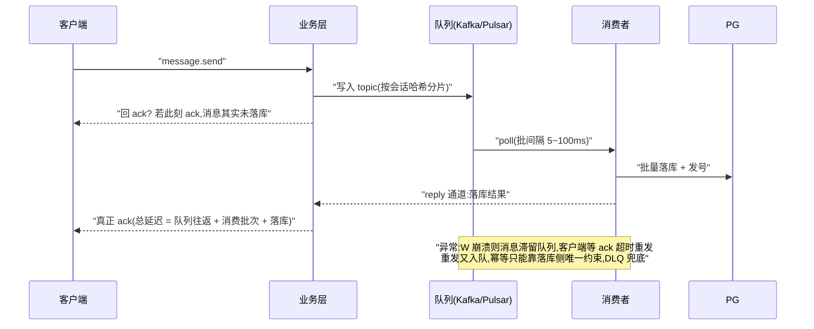

# 消息同步架构分析：为什么不用消息队列——三段式同步与队列的边界

> 面向零背景读者。专业名词首次出现即在同句解释。本文回答三个问题：
> ① 当前分布式架构的消息同步靠什么（Redis+PG 各自承担什么）；② 为什么不用 Kafka/Pulsar 做同步；
> ③ "消息队列解决分布式消息同步"是否业界最佳实践——如果不是，队列的正确位置在哪、什么条件下才引入。
>
> 结论锚定：三期实测数据（`docs/监测设施/测试报告/26-9-14、26-9-16、26-9-16-grpc`）、
> 源码事实（file:line 见附录）、业界真实选型（微信/WhatsApp/Discord/Slack）。
> 与《系统架构图V3.md》§4.3 配套阅读：本文论证"同步主路径为什么保持三段式"，V3 定义队列的旁路位置。

---

## 0. 结论摘要

1. **当前消息同步是三段式模型**：① PG 做持久化真相源（落库/发号/幂等）；② Redis pub/sub 做实时扇出（在线成员即时投递）；③ `/sync` 做离线补偿（seq 增量补拉）。**三个环节互为兜底，可靠性不依赖任何一个单一组件。**
2. **消息队列不是"消息同步"的最佳实践，是"异步事件流"的最佳实践**——两者的时间预算不同：同步路径要求几十 ms 内落库即 ack（客户端 5s 超时、RTT 预算），队列的消费模型（批处理 + poll 间隔 + 提交 + reply 通道）天然 5~100ms 起步且引入"写队列成功 ≠ 落库成功"的一致性问题。
3. **业界无一例外**：微信（存储层+接入层推+seq 断档拉取）、WhatsApp（BEAM 进程内存投递）、Discord（ScyllaDB + Elixir 进程消息，Kafka 只做数据分析）、Slack（Vitess + 有状态 presence 服务器）——**没有任何一家用队列做同步主路径**。
4. **队列的正确位置是三条旁路**：① 削峰（三期实测 3000 msg/s 三次打挂同机 PG，线上若真实尖峰需缓冲）；② 扇出规模化（万人大群 × 多副本，扇出消费解耦）；③ 旁路事件流（搜索/推荐/风控/审计消费消息事件）。**到点才引入，提前引入是架构负优化。**

---

## 1. 术语表

| 名词 | 一句话解释 |
|---|---|
| 消息同步 | 让"每一条消息"最终到达"所有应到达的设备"的机制，包含实时投递与离线补偿两部分。 |
| 真相源（source of truth） | 数据的权威存放处；消息的真相源是 PG——丢了任何实时推送都能从它按 seq 补回来。 |
| 三段式同步 | 「持久化（PG）+ 实时通道（Redis pub/sub）+ 离线补偿（/sync）」的组合；IM 的标准做法。 |
| 读扩散（write-once, fan-out on read） | 消息只落一份，投递时按"谁在线/谁该收"扩散出去；离线成员不推，靠上线后补拉。 |
| seq 断档检测 | 客户端记录每个会话已收到的最大 seq，新消息 seq 不连续（有洞）即判定"实时通道丢过帧"，触发 /sync 补拉。 |
| pub/sub（发布订阅） | Redis 的频道广播：publish 一条消息，所有订阅者收到；订阅者离线时消息直接丢弃（fire-and-forget）。 |
| 消息队列 | Kafka/Pulsar 这类"生产者写入、消费者拉取"的异步管道：持久化、可回放、消费确认、按分区有序。 |
| ack 语义 | 服务端"落库成功才回 ack"的确认契约：客户端凭 ack 判定消息已持久化，收不到按同 clientMsgId 重发。 |
| 削峰 | 流量尖峰时用缓冲队列把瞬时压力摊平，消费者按自己的节奏处理。 |
| DLQ（死信队列） | 队列中消费失败重试仍不成功的消息归集处，供人工/自动补偿。 |

---

## 2. 问题定义：分布式消息同步要解决的四个子问题

| # | 子问题 | 本质约束 |
|---|---|---|
| Q1 | **持久化**：消息要落盘、要可查询、要按序 | 写放大可控、会话内 seq 连续 |
| Q2 | **实时投递**：在线成员尽快收到（几十 ms 级） | 低延迟、跨副本路由（接收者可能连在任意网关副本） |
| Q3 | **离线补偿**：离线/丢帧的成员最终不漏 | 按 seq 增量可回放（真相源必须支持） |
| Q4 | **确认语义**：发送方知道消息已安全 | 落库成功 = ack；幂等（同 clientMsgId 重发不重复） |

任何"同步方案"都必须同时满足 Q1~Q4。下面看三段式如何用两个组件满足，以及队列方案在 Q2/Q4 上的代价。

---

## 3. 当前架构的三段式模型（源码级）

**读法**：主流程是"上行落库→ack"（同步）+ "扇出→在线投递"（异步 best-effort）+ "断档→/sync 补拉"（兜底）。
关键不变量：**实时通道可以丢任何东西，最终一致性由 PG + seq + /sync 保证**——这正是三段式设计的核心思想，
源码锚点：`server/src/realtime/push.ts:76-87`（读扩散注释明确写着"实时只推在线成员,离线成员靠 /sync 补拉"）。

### 3.1 三段式各自的可靠性边界

| 环节 | 可靠性 | 失效后果 | 兜底 |
|---|---|---|---|
| PG 持久化 | 强（WAL + 事务） | 落库失败 = 不 ack（客户端重发） | 幂等唯一约束 |
| Redis pub/sub 扇出 | **弱（订阅者离线即丢）** | 在线成员漏收一帧 | **seq 断档检测 → /sync 补拉** |
| /sync 补偿 | 强（读 PG 真相源） | 唯一可能失败是 PG 不可用（系统级故障） | 重试 |

注意这里最重要的一个设计判断：**pub/sub 的"不可靠"不是缺陷，而是被允许的**——它只承担"尽量快"的角色，不承担"必须达"的角色。"必须达"由 PG+/sync 承担。允许实时通道不可靠，换来了它的极致简单与低延迟（实测扇出 span p99=2ms）。

---

## 4. 消息队列方案全推演（三种放法逐一分析）

### 4.1 方案 A：队列前置（写队列 → 消费者落库 → 扇出）——最激进，代价最大

代价链（每一条都是对 Q2/Q4 的直接伤害）：

1. **延迟预算超支**：ack 路径从"业务层→PG 一个往返（~3ms）"变成"入队 + poll 批间隔 + 消费 + 落库 + reply 通道"，实测量级 5~100ms 起步——IM 的 RTT 预算（几十 ms、客户端 5s 超时）会被系统性侵蚀；
2. **确认语义复杂化**：队列写成功 ≠ 落库成功。若先回 ack 后落库 → 违反"落库即真相"（客户端以为发送成功，消息可能在队列里滞留/进 DLQ）；若落库后才 ack → 需要 reply 通道 + 关联 id，复杂度上升一个量级；
3. **一致性缺口**：发号（seq）在消费者侧做还是业务层做？在业务层做 → 消息还未落库就占了号（洞）；在消费者做 → 消费者之间需要协调（回到原子计数问题，且消费乱序会乱号）；
4. **收益不匹配**：方案 A 的唯一收益是削峰（三期实测 3000 msg/s 打挂同机 PG 的场景），但该收益有更轻的替代（§6 触发条件 1 的"同步落库 + 队列喂下游"折中）。

**结论：方案 A 是把"同步路径"强行塞进"异步管道"，属于架构负优化，业界无人这么做。**

### 4.2 方案 B：队列后置（落库后写队列，扇出消费者投递）——可行，但不是"同步"，是"扇出优化"

- 保持"落库即 ack"不变，落库后消息入队，扇出消费者按副本/成员投递；
- 收益：业务层热路径缩短（Promise.all 扇出移出）、群扇出削峰、投递重试/缓冲；
- 代价：**扇出延迟从 2ms（pub/sub 实测）涨到 5~50ms**（消费批间隔）——对"即时性"是倒退；
- 判定：**这是"扇出规模化"的优化手段，不是"消息同步"的必要组成**。三期实测扇出不是瓶颈（span p99 2ms、群 e2e p99 27ms），当前不需要；触发条件是万人大群 × 多副本（§6 触发条件 2）。

### 4.3 方案 C：队列替代 pub/sub 做跨副本广播——收益冗余

- pub/sub 的弱点是"订阅者离线丢消息、无确认、无重试"；
- 队列能补上这些（持久化、消费确认、重试）——**但在三段式里这些收益是冗余的**：丢消息有 PG+/sync 兜底，确认/重试有客户端 clientMsgId 重发机制兜底；
- 换来的代价：延迟上升（poll 模型）+ 运维一个重型组件；
- 判定：**除非未来出现"实时通道必须可靠"的场景（当前不存在），否则不换。**

---

## 5. 业界最佳实践对照（真实选型）

| 系统 | 持久化真相源 | 实时投递通道 | 离线补偿 | 队列用在哪 |
|---|---|---|---|---|
| **微信** | 存储层（分布式 KV/表引擎） | 接入层长连接直推 | 客户端 seq 断档拉取 | 旁路：日志/事件管道 |
| **WhatsApp** | Cassandra/MySQL 分片 | BEAM 进程间消息（内存） | seq 拉取 | 不用队列做同步 |
| **Discord** | ScyllaDB | Elixir 进程消息 + 网关推送 | 网关/客户端补偿 | **Kafka 仅做数据分析/事件流** |
| **Slack** | Vitess（MySQL 分片） | Java 有状态 presence 服务器内存投递 | 客户端补拉 | Kafka 做日志/事件管道 |
| **Telegram** | 自研存储分片 | MTProto 长连接 + 服务器路由 | seq/msgid 拉取 | 不公开 |

三条规律：

1. **同步主路径全部是"存储 + 实时通道 + 补偿"三段式**，没有任何一家把队列放进同步路径；
2. **队列（Kafka）在 IM 里是"旁路事件流"**——Discord 用 Kafka 把消息事件喂给分析/搜索，而不是用它投递消息；
3. **实时通道允许不可靠**（WhatsApp 的内存投递、Slack 的内存状态都可能丢），可靠性由"真相源 + 补偿"保证——与本项目 pub/sub + /sync 的设计完全同构。

---

## 6. 为什么"队列 = 分布式同步最佳实践"是误解

三个本质差异（时间预算 / 确认语义 / 顺序语义）：

| 维度 | 消息同步（Q2/Q4） | 消息队列 |
|---|---|---|
| **时间预算** | 几十 ms（客户端在等 ack） | 秒级可容忍（消费者按批次/节奏处理） |
| **确认语义** | 落库成功 = ack，一条链走完 | 生产/消费分离，需要 reply 通道重建关联 |
| **顺序语义** | 会话内严格连续（seq 是业务契约：已读、@、同步全靠它） | 分区内有序、跨分区无序；"有序"不等于"连续" |
| **可靠性模型** | 真相源（PG）单一，其他环节允许丢 | 队列自身成为第二真相源 → 双真相源一致性问题 |

核心一句话：**队列是"把请求从同步链路上拆下来"的工具；而消息同步的 ack 语义要求请求"留在同步链路上直到落库"。两者在设计意图上相悖。**

---

## 7. 队列的正确位置：三条旁路 + 引入触发条件

| # | 旁路 | 触发条件（可验证） | 落地形态 |
|---|---|---|---|
| ① | **削峰缓冲** | 三期实测 3000 msg/s 三次打挂同机 PG；线上真实流量出现不可控尖峰且 PG 先于业务层成为瓶颈 | "同步落库快路径 + 异步队列喂下游"折中（ack 语义不变），或写队列→批量落库（接受 ack 延迟升高） |
| ② | **扇出规模化** | 万人大群 × 多副本，业务层同步 Promise.all 扇出成为热点 | 落库后写扇出 topic，扇出消费者按 presence 副本投递（V3 P3 之后） |
| ③ | **旁路事件流** | 出现搜索/推荐/风控/审计等消息事件消费者 | 落库后发事件 topic（outbox 模式），消费者独立扩展 |

落地注意：仓库已有 `agent-pulsar` 基建（agent-server 在用），引入时**优先复用 Pulsar**（单分区多消费者 + request-reply + 低延迟调优比 Kafka 更适合本场景；Kafka 优势在超大规模吞吐与生态）。若上①的折中形态，ack 语义不变是红线。

---

## 8. 决策记录（写入 V3 的结论）

| 决策 | 结论 | 理由 |
|---|---|---|
| 同步主路径 | **保持三段式（PG + Redis pub/sub + /sync），不引入队列** | 延迟预算、ack 语义、业界同构（§5/§6） |
| 队列角色 | 三条旁路（削峰/扇出规模化/事件流），到点才引入 | 收益与触发条件绑定（§7） |
| 队列选型 | 若引入：Pulsar（已有基建复用） | 单分区多消费者 + request-reply |
| 禁止项 | 禁止"先 ack 后落库"（队列前置 + 提前 ack） | 违反落库即真相（Q4） |

---

## 9. 附录：事实锚点

**源码（file:line）**：

| 位置 | 事实 |
|---|---|
| `server/src/realtime/push.ts:76-87` | 读扩散三段式注释："实时只推在线成员，离线成员靠 /sync 补拉"；单聊直推双方、群聊 filterOnline |
| `server/src/realtime/push.ts:20-21` | 下行 publish 到 `gw:downlink`（Redis pub/sub） |
| `server/src/realtime/push.ts:69-105` | persistAndBroadcast：落库成功且非去重才扇出（ack 与扇出的次序契约） |
| `gateway/internal/backplane/backplane.go:24` | 网关订阅 `gw:downlink` 频道代投 |
| `server/src/realtime/presence.ts:94-112` | filterOnline：pipeline 批量在线判定（扇出前置） |
| `server/src/routes/sync.ts` | `/user/sync` 增量补偿接口（PG 真相源回放） |
| `server/src/services/message.ts:41-46` | seq 发号（V3 改 Redis INCR 的现状锚点） |

**实测数据（`docs/监测设施/测试报告/26-9-16/`、`26-9-16-grpc/`）**：

| 数据 | 值 | 说明 |
|---|---|---|
| 群扇出 span p99 | 2ms（pub/sub 路径） | 实时通道不是瓶颈，队列替代无收益 |
| 群扇出 e2e p99 | 27ms | 满足即时性预算 |
| 过载 3000 msg/s | colima PG 三次失联 | 削峰旁路（§7-①）的触发依据 |
| 消息 RTT p99（1000 msg/s） | 63ms（gRPC 流）/ 57ms（纯 Node 基线） | ack 路径的延迟预算基准 |
