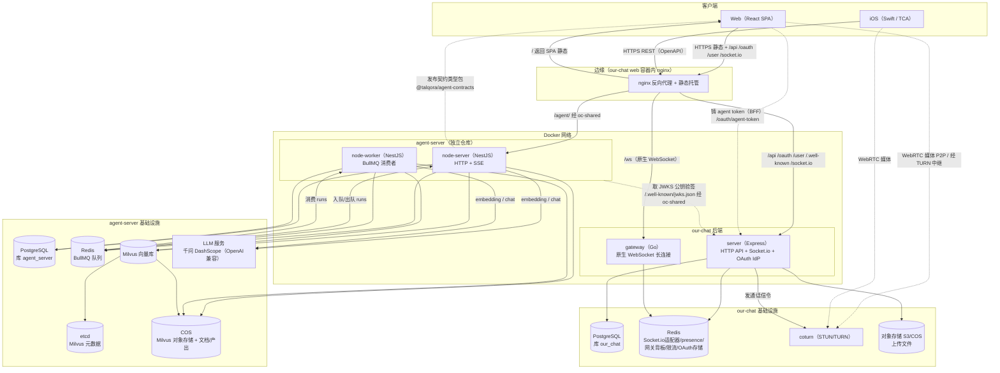
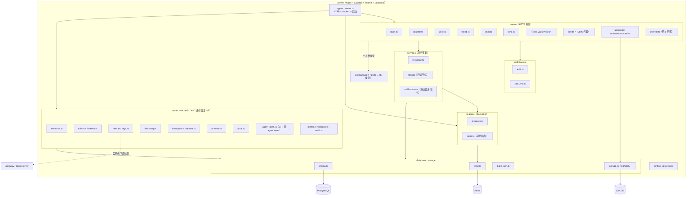
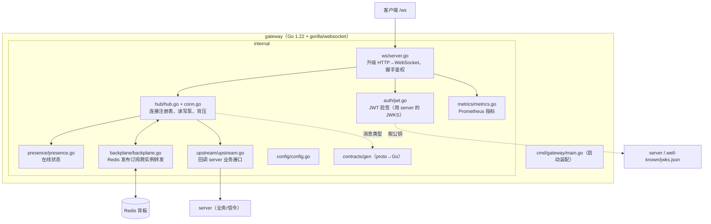
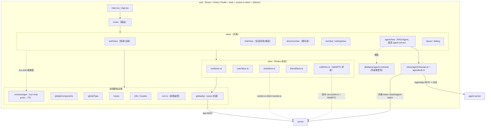
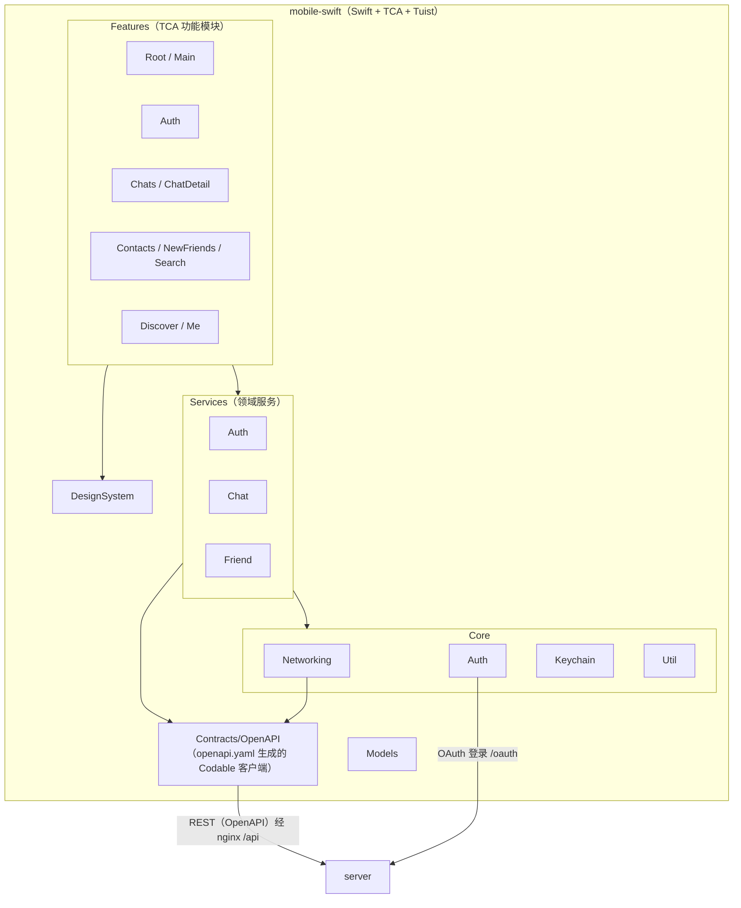
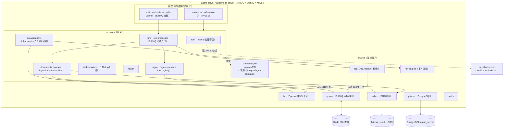
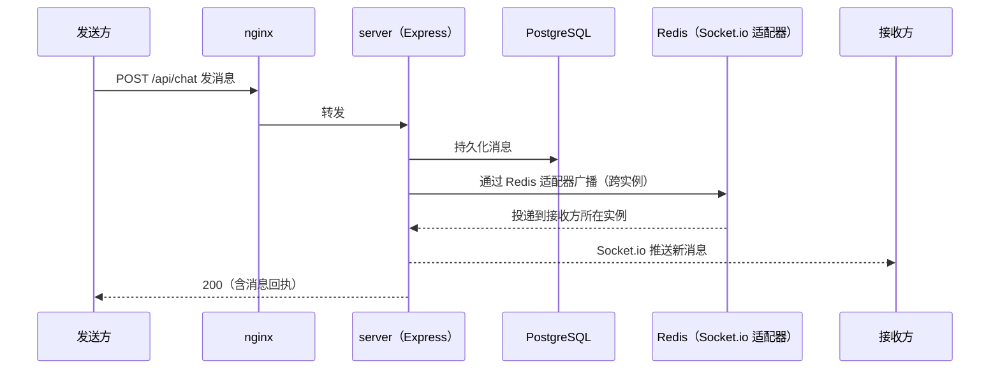
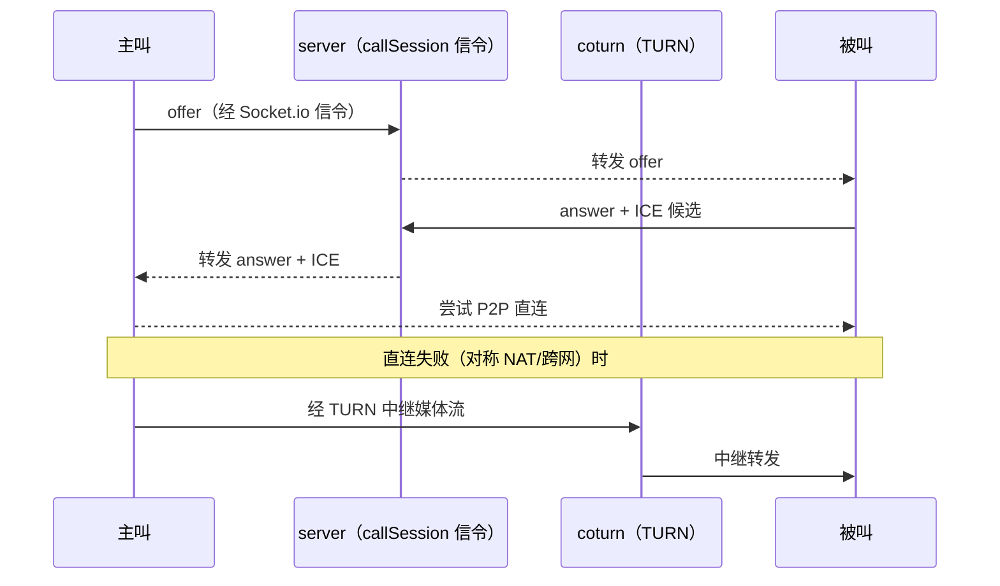
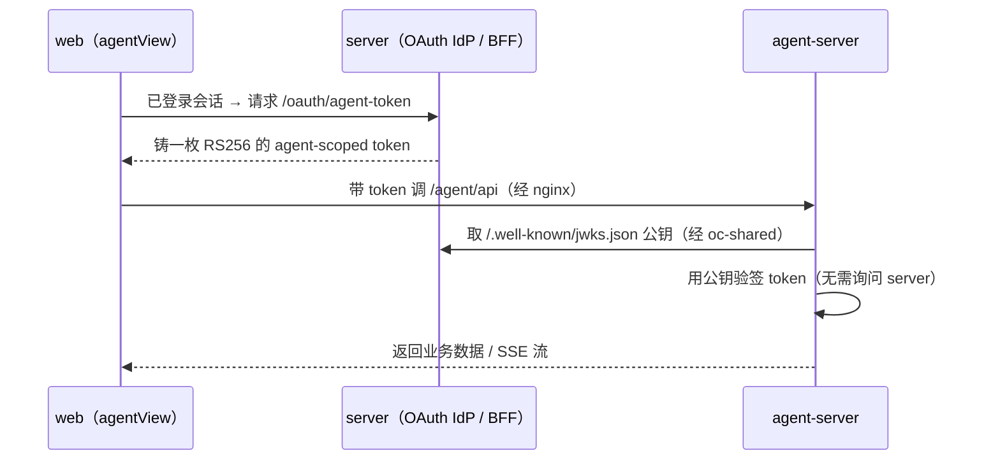
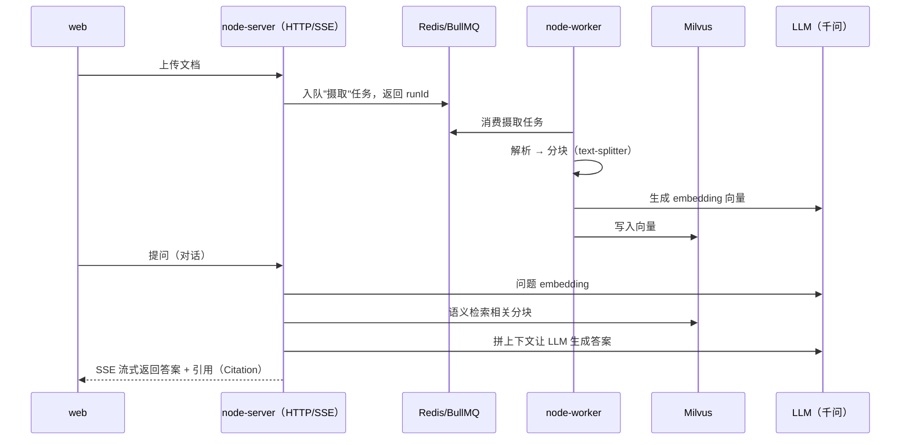

# 系统架构图（模块级）

> 面向零背景读者。先读术语表与图例，再看图。图用 [Mermaid](https://mermaid.js.org) 描述，
> GitHub / VS Code（装 Mermaid 插件）/ mermaid.live 均可渲染。
> 本项目横跨两仓同属一个系统：**our-chat**（IM + WebRTC，含 server/gateway/web/mobile-swift）与
> **agent-server**（RAG + Agent 微服务，独立仓库 `talqora/agent-server`）。

---

## 术语表 / 图例

| 名词 | 大白话解释 |
|---|---|
| **IM** | Instant Messaging，即时通讯（发消息、好友、会话）。 |
| **WebRTC** | 浏览器/App 之间直连传音视频的技术；连不通时经 TURN 服务器中继。 |
| **STUN/TURN（coturn）** | 帮两端穿透 NAT（家用路由器的地址转换）建立音视频连接；穿透失败就由 TURN 中继媒体流。 |
| **信令（signaling）** | 通话前双方交换"我在哪、用什么编码"的控制消息；本项目走业务后端。 |
| **Socket.io** | 一个基于 WebSocket 的实时通讯库（server 用它做实时推送）。 |
| **原生 WebSocket** | 浏览器标准的长连接协议（gateway 用它，不带 Socket.io 那层封装）。 |
| **长连接 / 网关（gateway）** | 客户端与服务器保持不断开的连接，用于实时推送；gateway 是专门扛这类连接的 Go 服务。 |
| **backplane（背板）** | 多个网关实例之间用 Redis 发布订阅互相转发消息，保证"连在不同实例上的两个人也能收到对方消息"。 |
| **presence（在线状态）** | 谁在线/离线/正在输入。 |
| **RAG** | 检索增强生成：先从你上传的知识库里检索相关片段，再让大模型据此回答。 |
| **Agent / 任务编排** | 让大模型按步骤调用工具完成任务；run-engine 记录每步事件。 |
| **向量库（Milvus）** | 把文本转成数字向量后存起来，支持"语义相似检索"（RAG 的检索靠它）。 |
| **BullMQ** | 基于 Redis 的任务队列；把耗时活（文档摄取、agent 任务）丢队列由 worker 异步跑。 |
| **JWKS** | JSON Web Key Set，一组验签公钥。server 是身份签发方（IdP），下游用它的 JWKS 公钥验证 token 真伪。 |
| **BFF** | Backend For Frontend，为前端服务的后端；这里指 server 帮 web 铸 agent-server 用的 token。 |
| **oc-shared** | 两仓容器互通用的 Docker 外部网络（agent-server 经它访问 server 的 JWKS；nginx 经它反代到 agent）。 |
| **契约类型包** | `@talqora/agent-contracts`：agent-server 的 proto 生成的 TS 类型，发布到 GitHub Packages 供 web 消费。 |

**连线含义**：实线箭头 = 运行时调用/数据流；虚线 = 构建期/契约依赖。

---

## 图 0 · 系统总览（客户端 → 边缘 → 服务 → 基础设施）

---

## 图 1 · our-chat / server（Express）模块级

---

## 图 2 · gateway（Go）模块级

---

## 图 3 · web（React）模块级

---

## 图 4 · mobile-swift（iOS）模块级

---

## 图 5 · agent-server（NestJS）模块级（双进程：HTTP + Worker）

---

## 图 6 · 关键运行时流程（时序）

### 6.1 发消息 + 多实例实时扇出

### 6.2 WebRTC 通话（信令 + TURN 中继兜底）

### 6.3 跨服务鉴权（server 签发 → agent-server 验签）

### 6.4 Agent / RAG（文档摄取 + 检索问答）

---

## 附：数据存储归属一览

| 存储 | 归属 | 存什么 |
|---|---|---|
| PostgreSQL `our_chat` | our-chat/server | 用户、好友、会话、消息、OAuth 客户端/授权 |
| PostgreSQL `agent_server` | agent-server | 文档、会话、run、task-session |
| Redis（our-chat） | server + gateway | Socket.io 适配器广播、presence、网关背板、限流、OAuth 临时态 |
| Redis（agent-server） | agent-server | BullMQ 队列（runs） |
| Milvus（+etcd+COS） | agent-server | 知识库分块向量 |
| S3/COS（our-chat） | server | 用户上传的图片/文件 |
| COS / 本地卷（agent-server） | agent-server | 原始文档、agent 产出、Milvus 对象存储 |

> 契约依赖（构建期）：agent 域类型的权威是 agent-server 的 proto，经 `@talqora/agent-contracts`
> 发布给 web 消费；our-chat 自身域（read/message/presence/call）的 proto 在 our-chat 仓库，
> 生成 server（TS）与 gateway（Go）两端类型。详见 `docs/技术方案` 与 agent-server `docs/SOP`。
