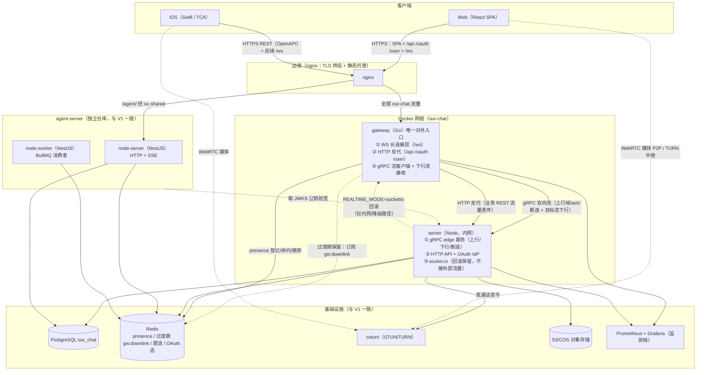
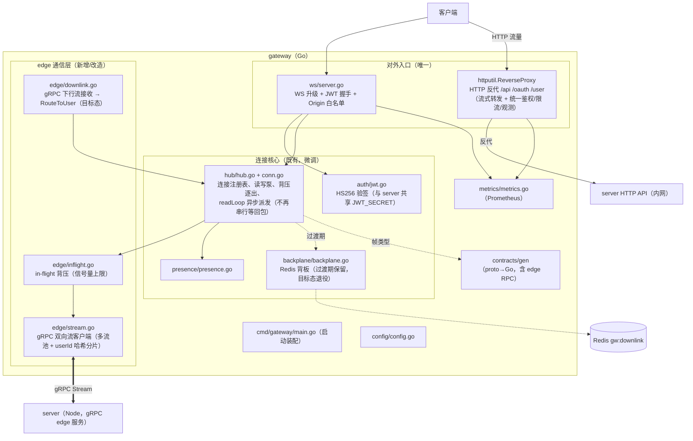
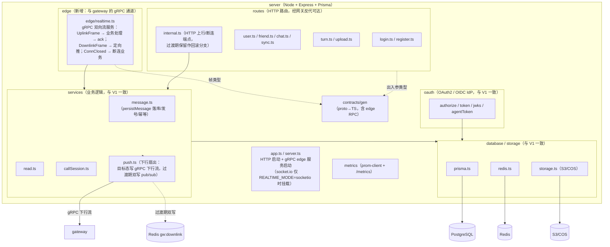
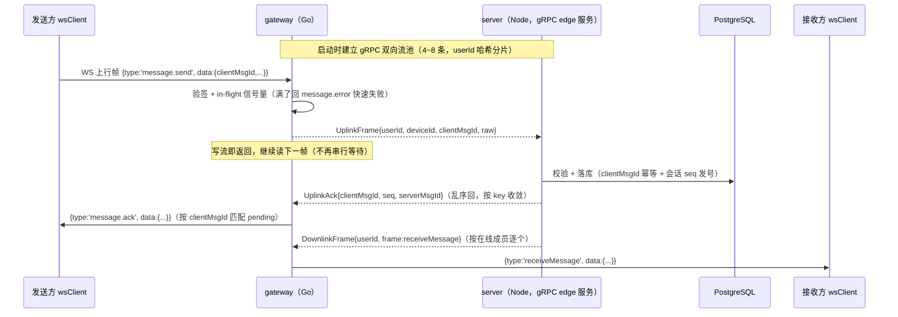
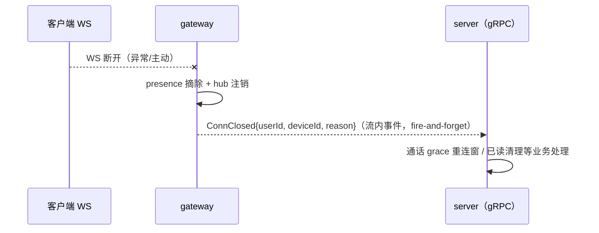
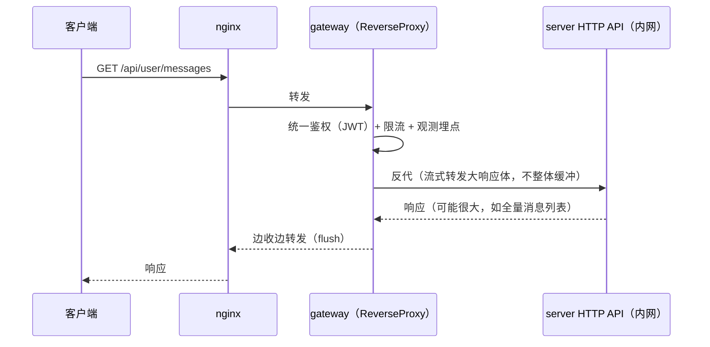

# 系统架构图 V2（目标态：gRPC 流通信 + 网关唯一入口）

> 面向零背景读者。先读术语表与图例，再看图。图用 [Mermaid](https://mermaid.js.org) 描述。
>
> **与 V1 的关系**：`系统架构图V1.md` 是现状快照（gateway 与 server 之间 HTTP-per-message 转发、下行走 Redis 背板）。
> **本 V2 是目标态**：26-9-16 实测证明 V1 的通信方式在 ≈1000 msg/s 即出现上行 dial 耗尽（10,341 次 upstream_error、
> 客户端 RTT p99 2.8s@2500 msg/s），演进方向已定——见
> `docs/监测设施/测试报告/26-9-16/26-9-16-连接层业务层通信架构演进方案-RPC改造.md`（下称《RPC 改造方案》）。
> V2 只画**目标态**；过渡期双通道/双模式见 §6 演进路径。
>
> 本项目横跨两仓同属一个系统：**our-chat**（IM + WebRTC）与 **agent-server**（RAG + Agent 微服务，独立仓库）。
> agent-server、coturn、对象存储、OAuth IdP 在 V2 中**与 V1 完全一致**，本文不再重复展开（图 0 保留全貌，细节见 V1）。

---

## 术语表 / 图例

| 名词 | 大白话解释 |
|---|---|
| **gRPC 双向流（bidi streaming）** | 一条长连接上双向持续收发消息的 RPC：不像"每问一次答一次"，而是"开着水管两头互灌"。gRPC 是 Google 开源的 RPC 框架。 |
| **RPC** | Remote Procedure Call，让一个进程像调本地函数一样调另一个进程的接口。 |
| **HTTP-per-message** | 每条业务消息都用一次独立 HTTP 请求转发（V1 的做法）：26-9-16 实测 ≈1000 msg/s 就因短连接风暴耗尽临时端口（TIME_WAIT 打满）。 |
| **多流池（stream pool）** | gateway 每个副本与 server 之间保持 N 条（如 4~8 条）双向流，按 userId 哈希分片：同用户的帧固定走同一条流，流数量与连接数解耦。 |
| **in-flight 背压** | 允许"已发出、尚未确认"的上行帧数量设上限；满了就快速失败（回 message.error）而不是无限排队。 |
| **幂等** | 同一条消息重复发 N 次，服务端只处理一次（按 clientMsgId 去重）。 |
| **网关唯一入口** | 客户端只认识 gateway 一个地址：WS 长连接由它终结，HTTP API 由它反向代理转发；业务层只在内网。 |
| **反向代理（反代）** | 代理站在服务器前面，替服务器接客再转发；客户端无感知。Go 的 `httputil.ReverseProxy` 开箱即用。 |
| **presence（在线状态）** | 谁在线/离线；存在 Redis，由 gateway 维护。 |
| **下行帧（downlink）** | 服务器推给客户端的消息（收到新消息、已读同步、通话信令等）。 |
| **回滚开关** | `REALTIME_MODE=socketio`：一键切回纯 Node 的 Socket.io 路径（`server/src/server.ts:53`），作为整体兜底。 |
| **parity（特性对齐）** | 新实现必须把旧实现的能力（ack/心跳/重连/顺序）全部补齐，才有资格替换。 |

**连线含义**：实线箭头 = 运行时调用/数据流；虚线 = 构建期/契约依赖或过渡期保留通道。

---

## 图 0 · 系统总览 V2（客户端 → 唯一入口网关 → 内网业务层 → 基础设施）

---

## 图 1 · gateway（Go）模块级 V2

---

## 图 2 · server（Node）模块级 V2

---

## 图 3 · 关键运行时流程 V2（时序）

### 3.1 发消息 + 扇出（gRPC 流路径，目标态主路径）

### 3.2 断连通知（流内事件，替代 HTTP 端点）

### 3.3 HTTP 业务请求（网关反代，业务层内网化）

---

## 图 4 · V1 → V2 差异清单

| # | 维度 | V1（现状） | V2（目标态） | 依据 |
|---|---|---|---|---|
| 1 | 上行通信 | 每消息一次 HTTP POST `/internal/gateway/uplink`（默认 Transport，MaxIdleConnsPerHost=2） | gRPC 双向流（多流池 + 哈希分片） | 26-9-16：≈1000 msg/s dial 耗尽（10,341 次 upstream_error）；《RPC 改造方案》§3 |
| 2 | 上行并发 | 每连接串行等回包（conn.go readLoop） | readLoop 异步派发 + in-flight 背压上限 | 26-9-16：tp_r25 单次上行 98ms 但客户端 RTT p99 2802ms（串行排队） |
| 3 | 下行通信 | Redis pub/sub `gw:downlink`（server 不知网关拓扑） | 目标态：server 按 presence 副本表定向写 gRPC 下行流；过渡期保留 pub/sub | 26-9-16：pub/sub 扇出本身快（span p99 2ms），非瓶颈，故延后替换 |
| 4 | 断连通知 | HTTP POST `/internal/gateway/disconnect` | gRPC 流内 `ConnClosed` 事件 | 统一通信面；《RPC 改造方案》§4.4 |
| 5 | 对外入口 | 三入口：HTTP→server:3007、WS→gateway:8090、SPA→vite/nginx | 单入口：gateway 反代全部 HTTP + 终结全部 WS | 《RPC 改造方案》§6 |
| 6 | 业务层暴露面 | server 对外监听 HTTP（nginx 直连） | server 仅内网可达（鉴权/限流/观测收敛到网关） | 安全面收窄 + 单点管控 |
| 7 | 契约基建 | proto 仅生成 message 类型（buf 无 grpc 插件） | 补 grpc 插件，`proto/ourchat/edge/realtime.proto` 单源生成 Go/TS | 《RPC 改造方案》§5 |
| 8 | 回滚 | `REALTIME_MODE=socketio`（server.ts:53） | 保留，另加 `GATEWAY_UPSTREAM=grpc|http` 双模式过渡 | 《RPC 改造方案》§8 P1 |
| 9 | 不变项 | — | agent-server、coturn、S3、OAuth IdP、监测栈与 V1 完全一致 | 语言分层结论见选型两篇 |

---

## 5 · 设计决策记录（为什么这么定，详见《RPC 改造方案》）

| 决策 | 结论 | 一句话理由 |
|---|---|---|
| RPC 形态 | **gRPC 双向流，不是 unary** | unary 只解决 dial 耗尽，串行等待排队依旧；流 + 异步 ack 才能消灭排队（26-9-16 数据证实瓶颈在"串行"不在"单次往返"） |
| 流拓扑 | **per-instance 多流池（4~8 条），非 per-connection 流** | 流数 O(副本数) 而非 O(连接数)；userId 哈希分片保证同用户帧同流；断连用事件帧表达而非拆流 |
| 保序 | 上行不保序，顺序由服务端 **seq 发号** 保证 | IM 客户端看到的顺序以 seq 为准，上行到达顺序无业务含义 |
| 幂等竞态 | 同 clientMsgId 在途**串行等待**（per-key）+ 服务端唯一约束兜底 | 26-9-16 重发撞在途插入产生 5,396 条 unique constraint 500 |
| 错误帧 | errorFrame 必须带 clientMsgId | 否则客户端无法收敛 pending，只能等超时（26-9-16 已证实） |
| HTTP 接管方式 | **Go 反向代理直转**，不做 grpc-gateway 转码 | REST 语义不变、改动最小；大响应体需流式转发（26-9-16 见 /user/messages 全量 3.9s） |
| 下行通道 | 过渡期 pub/sub 双通道，目标态并入 gRPC 下行流 | pub/sub 扇出已证明快且 server 免拓扑感知；先解决上行瓶颈，下行延后替换 |

---

## 6 · 演进路径（每阶段独立可验证、可回滚）

| 阶段 | 内容 | 验收 |
|---|---|---|
| **P0 止血** | gateway 上游 `http.Client` 换调优 Transport（消 dial 耗尽） | S1（1000 msg/s）错误率 12.8% → 0 |
| **P1 gRPC 流通道** | edge 契约 + server 侧 `@grpc/grpc-js` 服务 + gateway 流客户端；`GATEWAY_UPSTREAM=grpc|http` 双模式 | grpc 模式冒烟通过，双模式并存 |
| **P2 并发上行** | readLoop 异步派发 + in-flight 背压 + per-key 串行化 + 错误帧补 clientMsgId | tp_r25 RTT p99 2802ms → <500ms |
| **P3 网关统一入口** | HTTP 反代接管 + 统一鉴权/限流/观测 + server 内网化；下行切 gRPC 流 | HTTP 7 接口复测一致；全场景回归 |
| **P4 容量复测** | 全套 A/B + 2~5 万连接爬坡 + 多副本 | 对照《RPC 改造方案》§7 验收表 |

> 每阶段完成后按 `docs/监测设施/README.md`（性能测试 skill 提示词）跑对应场景验证；数据归档 `docs/监测设施/测试报告/<日期>/`。
