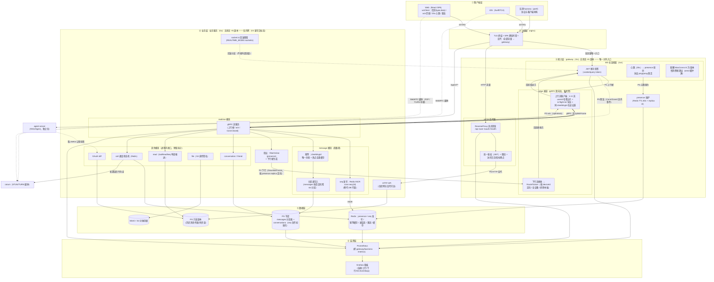

# 系统架构图 V3（最终版：分布式 Go 实时层 + Go 业务层 + DB 优化）

> 面向零背景读者。先读术语表与图例，再看**图 1（全系统唯一架构图，含全部关键业务流程）**。
> 图用 [Mermaid](https://mermaid.js.org) 描述，GitHub / VS Code（Mermaid 插件）/ mermaid.live 均可渲染。
>
> **与 V1/V2 的关系**：V1 是现状快照（HTTP-per-message 转发）；V2 是 gRPC 流 + 网关唯一入口（已落地并复测，
> 见 `docs/监测设施/测试报告/26-9-16-grpc/`）。**V3 是最终目标态**，在三期实测数据上补齐三项重大设计：
> ① **DB 优化**（seq 发号 Redis 化——三期实测共同指向的 2 秒行锁瓶颈）；② **业务层 Go 重写**（模块化单体 ×N 副本，
> strangler 渐进替换）；③ **全链路分布式**（接入层/业务层无状态副本 + 状态全外置 + 定向下行）。
> agent-server（RAG）、coturn、对象存储为外围不变项，与 V1 一致不再展开。

---

## 术语表 / 图例

| 名词 | 一句话解释 |
|---|---|
| **seq 发号** | 会话内消息的递增序号；旧实现用 DB 行锁（`UPDATE ... RETURNING`），三期实测证明它是 2500+ msg/s 时 2 秒 p99 的根源；V3 改 Redis 原子自增。 |
| **INCR** | Redis 的原子自增命令，单键高并发安全，是 V3 发号的核心。 |
| **分区表（partitioning）** | 把大表按规则切成多个物理分区（如按会话 id 哈希分 64 片），写入落在小分区上，减小锁与索引压力。 |
| **读写分离** | 写走主库、读走只读副本，把读流量从写入路径上挪开。 |
| **模块化单体（modular monolith）** | 一个进程里按领域切模块（realtime/message/read/...），模块间进程内调用，但边界清晰、接口化——需要时可把某模块拆成独立服务（微服务）。 |
| **strangler（绞杀者模式）** | 渐进式重写：新系统一个模块一个模块地替换旧系统的对应功能，期间新旧并存，直到旧系统被完全"绞杀"。 |
| **presence（在线状态）** | 谁在线/离线；存 Redis（TTL），登记时带副本标识（replica id）。 |
| **定向下行（targeted downlink）** | 业务层查 presence 得到用户所在网关副本，直接把下行帧经 gRPC 流发给那个副本（替代全副本广播的 Redis pub/sub）。 |
| **in-flight 背压** | 单连接"已发出未确认"的上行帧数量上限（64）；满了读循环阻塞（TCP 背压传导），不无限堆积。 |
| **幂等** | 同一条消息重发 N 次只落库一次（clientMsgId 唯一约束 + 热点去重缓存）。 |
| **gRPC 双向流** | 一条长连接上双向持续收发的 RPC 通道；网关与业务层之间的唯一通信面（多流池 + userId 哈希分片）。 |
| **回滚开关** | `REALTIME_MODE=socketio`（整体回退纯 Node）+ `GATEWAY_UPSTREAM=grpc|http`（网关上游双模式）。 |

**连线含义**：实线箭头 = 运行时调用/数据流；粗实线 = gRPC 流通道；虚线 = 构建期契约依赖 / 回滚保留路径。

---

## 图 1 · 全系统最终架构与关键业务流程（唯一主图）

> **图 1 读法**：自上而下六层（①客户端 → ②边缘 → ③接入 → ④业务 → ⑤数据 → ⑥监测）+ 两个外围不变项；
> 边标签 P1~P7 是七条关键业务流程，逐条展开见 §3。**本图即全系统唯一架构图**——模块职责、关键机制、
> 数据流与业务流程全部在图内标注，正文只做展开解释。

---

## 2. 图 1 分层详解（颗粒度：模块级，含关键参数）

### ③ 接入层 gateway（Go，无状态 ×N 副本）

| 模块 | 职责与关键机制 | 关键参数 |
|---|---|---|
| JWT 握手验签 | cookie/query token → HS256 验签（与业务层共享 `JWT_SECRET`），先验签再升级协议 | 失败 401，不进连接层 |
| 心跳保活 | 应用层 25s 心跳帧续约 presence；协议层 ping/pong 推后读截止 | 心跳超时 60s（TTL 对齐） |
| 背压与配额 | 每连接 send 缓冲 256 帧，打满即逐出慢消费者（`gateway_evicted_total`）；副本连接数硬上限 | MaxConns=50,000/副本 |
| 上行流客户端 | 每副本与业务层保持 4~8 条 gRPC 双向流，userId 哈希分片（同用户帧恒同流）；读循环非阻塞派发；in-flight 64/连接信号量（满则 TCP 背压传导）；同 clientMsgId 在途去重 | in-flight=64，流数可配 |
| 下行流接收 | 收 DownlinkFrame → `RouteToUser`（targetDevice/exceptDevice 语义与现 hub 一致） | 乱序回投，按 clientMsgId 收敛 |
| HTTP 反代 | `/api /user /oauth /health` 直转业务层，流式转发大响应体（不整体缓冲）；反代前统一鉴权/限流/观测 | 反代零损耗（实测 login 19.7 vs 直连 19.4 rps） |
| presence 维护 | 登记/续约/摘除（Redis TTL），登记带 replica id 供业务层定向下行 | TTL=60s |

### ④ 业务层 业务服务（Go，无状态 ×N 副本，V3 重写目标态）

| 模块 | 职责与关键机制 | 关键设计 |
|---|---|---|
| realtime | gRPC 流服务（UplinkFrame/UplinkAck/ConnClosed），唯一实时入口 | 与现 `edgeGrpc.ts` 语义对齐 |
| message（热路径） | ① seq 发号：Redis `INCR conv:seq:{conversationId}`（初始化值从 PG `next_seq` 装载，定期 checkpoint 回 PG）；② 幂等：clientMsgId 唯一约束 + 热点去重缓存；③ 分区表写入 | **三期实测的 2s 行锁瓶颈在此消除** |
| conversation/friend | 会话、好友关系、群成员 | 进程内接口，预留 gRPC 服务定义 |
| read | 已读单调推进 + read.sync 推其它设备 | 同现逻辑 |
| call | 通话状态机（Redis，SESSION TTL），忙线裁决/grace 重连 | 同现逻辑 |
| file | S3 直传签名、秒传、分片合并 | 同现逻辑 |
| OAuth IdP | 授权码/令牌/JWKS | 同现逻辑 |
| 扇出 | `filterOnline`（读 presence）→ 生成 DownlinkFrame → **按 presence.replica 定向写 gRPC 下行流**（V2 过渡期 pub/sub 在此退役） | 少一跳 + 单一通信面 |
| HTTP API | 全部 REST 接口，仅经网关反代可达（内网化） | 同现路由面 |
| socket.io | 回滚保留，不接外部流量 | `REALTIME_MODE=socketio` |

### ⑤ 数据层

| 设施 | V3 设计 | 解决的问题 |
|---|---|---|
| PG 写库 | messages 按 `hash(conversation_id) % 64` 分区；conversations 表仅存元数据（seq 权威值在 Redis，PG 做初始化与 checkpoint） | 单表膨胀、锁竞争 |
| PG 只读副本 | 历史消息拉取、会话列表、同步读走副本 | 读写分离，读不挤占写路径 |
| Redis | presence / seq 发号 / 幂等缓存 / 通话态 / 限流 / 热点缓存 | 全链路状态外置（分布式前提） |
| MinIO/S3 | 文件对象存储（不变） | — |

---

## 3. 七条关键业务流程（对照图 1 的 P1~P7）

1. **P1 上行（发消息）**：客户端 WS 帧 → gateway 验签 → in-flight 信号量 → 上行流（按 userId 分片）→ 业务层 realtime → message 模块：INCR 发号 → 幂等去重 → 分区写入 → 原路回 **P2 ack**（UplinkAck 带 seq/serverMsgId，gateway 按 clientMsgId 收敛回投发送方）。**上行不保序：客户端看到的顺序以 seq 为准。**
2. **P3 下行（扇出）**：message 模块落库后 → 扇出模块 `filterOnline` 取在线成员 → 查 presence 得到每个成员所在网关副本 → DownlinkFrame **定向**写入对应副本的下行流 → gateway `RouteToUser` 回投（单聊 2 人、群聊 N 人；targetDevice/exceptDevice 支持属主路由与排除本端）。
3. **P4 心跳保活**：客户端每 25s 发 heartbeat → gateway 本地续约 presence（TTL 60s）+ 推后协议读截止；不转发业务层（网关本地消化，与现状一致）。
4. **P5 断连**：WS 断开 → gateway 摘 presence + hub 注销 → 经流发 `ConnClosed`（fire-and-forget）→ 业务层做通话 grace 重连窗等处理。
5. **P6 HTTP 业务请求**：客户端 → nginx → gateway 反代（统一鉴权/限流/观测）→ 业务层 HTTP API → 读走 PG 只读副本（大响应体流式回传）。
6. **P7 读路径**：历史消息/会话列表/同步读全部走只读副本，与写入路径物理隔离。
7. **监测闭环**：两侧 /metrics → Prometheus → Grafana（连接数/上行直方图/下行直方图/GC/eventloop/goroutine），容量规划与归因都靠它。

---

## 4. 三大新增设计详解

### 4.1 DB 优化（三期实测的第一优先级）

| 设计 | 方案 | 依据与预期 |
|---|---|---|
| **seq 发号 Redis 化** | `INCR conv:seq:{conversationId}`；业务启动时若无键则从 PG `next_seq` 装载初始值；定期（如每 1000 条/分钟）把当前值 checkpoint 回 PG 兜底；Redis 失联时降级回 DB 行锁路径 | 三期实测：2500~3000 msg/s 时行锁等待把 p99 打到 ~2s、错误率 40~80%。INCR 单键 10 万+/s 无压力，预期过载平台 **2s → 50~150ms**，纯 Node 与 Go 两条路径同步受益 |
| **分区表** | messages 按会话哈希 64 分区，热点会话写入分散；历史归档分区可独立维护 | 单表 122 万行已现写入/索引压力；分区后写入放大与锁竞争随分区数下降 |
| **读写分离** | 读接口（历史/列表/sync）走只读副本 | 26-9-16 实测 `/user/messages` 全量返回 3.9s 会挤压写路径 |
| **幂等缓存** | clientMsgId 去重前置到 Redis（热点 TTL 短缓存），DB 唯一约束兜底 | 减少重发场景下的 DB 往返 |

### 4.2 业务层 Go 重写（模块化单体，strangler 演进）

决策依据（详见 `26-9-16-grpc-业务层分布式化与Go重写分析.md`）：
- **形态选"模块化单体 ×N 副本"而非微服务**：当前业务域规模（约 1 万行 TS 业务逻辑）拆微服务是过度设计；模块间进程内接口 + 预留 gRPC 服务定义，将来单模块热点（如 message）可平滑拆出。
- **演进走 strangler**：先 Go 化消息热路径（realtime+message 模块，约 200~400 行核心逻辑），与 Node 旧实现双跑（按会话/流量比例切流），三期压测数据做 A/B 验收（客户端协议零改动，harness 复用）；随后 conversation/read/call/file/oauth 依次替换，最后移除 socket.io 回滚面。
- **重写与 DB 优化的顺序**：**先做 §4.1（语言无关，收益最大），重测后再启动重写**——在行锁未除时重写，性能收益会被遮蔽（26-9-16-grpc 报告的结论）。
- 与选型文档的呼应：《IM高并发选型》的结论是"业务层没有唯一正确语言"——V3 选择 Go 的理由不是"Go 必然更快"，而是**与接入层同栈（单一语言面/单二进制/统一观测）+ CPU 密集化后的效率冗余 + 分布式生态**。

### 4.3 分布式设计（接入层与业务层双无状态）

| 能力 | 设计 |
|---|---|
| 副本拓扑 | gateway ×N（无状态，presence 登记 replica id）；business ×N（无状态，全部状态在 Redis/PG） |
| 负载均衡 | 客户端 → nginx（轮询/一致性哈希）→ gateway；gateway → business 的 gRPC 流自带多后端连接（客户端 LB） |
| 定向下行 | business 按 presence.replica 直接把 DownlinkFrame 发给持有连接的副本（替代 V2 过渡期 pub/sub 全副本广播） |
| 扩缩容 | gateway：注册即用（presence 自登记）；business：gRPC 流重连 + 业务健康检查（gRPC health 协议） |
| 会话热点 | 单会话消息率超限时按会话限流（业务层计数），保护发号与扇出路径 |
| 一致性 | 消息幂等（clientMsgId 唯一约束跨副本一致）、seq 发号（Redis 单键原子）、presence（TTL 最终一致） |

---

## 5. V2 → V3 差异清单

| # | 维度 | V2（已落地现状） | V3（最终目标态） | 依据 |
|---|---|---|---|---|
| 1 | seq 发号 | DB 行锁 `UPDATE ... RETURNING` | Redis INCR + PG checkpoint | 三期实测 2s p99 / 40~80% 过载错误 |
| 2 | 业务层语言 | Node（Express+Prisma） | Go 模块化单体（strangler 演进） | 分布式分析文档 §5 |
| 3 | 业务副本 | 单实例 | ×N 无状态副本 | 状态外置已就绪（presence/幂等/通话态/下行） |
| 4 | 下行通道 | Redis pub/sub `gw:downlink`（V2 过渡期） | gRPC 下行流按 replica 定向 | V2 §5 决策记录（延后项在 V3 兑现） |
| 5 | 数据层 | 单 PG | 写库分区 + 只读副本 + Redis 发号/缓存 | §4.1 |
| 6 | 不变项 | 网关 gRPC 上行/反代唯一入口、客户端协议、agent-server、coturn | 与 V2 一致 | 已复测验收 |

---

## 6. 演进路径（每阶段独立可验证、可回滚）

| 阶段 | 内容 | 验收标准（复用三期压测工具链） |
|---|---|---|
| **V3-P1 DB 优化** | 发号 INCR 化（含降级路径）+ 分区表 + 读写分离 | tp_r25/r30 复测：p99 <150ms、错误率 <1%（两路径同步） |
| **V3-P2 业务层 Go 化（消息热路径）** | realtime+message 模块 Go 实现，双跑 + 按流量切流 | 全场景 A/B：RTT/错误率与 Node 实现同档；CPU/内存下降 |
| **V3-P3 业务层 Go 化（全域）** | conversation/read/call/file/oauth 依次替换，移除 socket.io | 209 项既有测试平移通过 + 全场景回归 |
| **V3-P4 全链路分布式** | business ×N 副本 + 定向下行 + gRPC health | 多副本下全场景回归 + 副本扩缩容演练 |
| **V3-P5 容量复测** | 2~5 万连接爬坡 + 风暴混合场景 + 独立多机环境 | 对照《26-9-16-grpc 复测报告》§8 四个实验 |

> 每阶段按 `docs/监测设施/README.md` 跑对应场景验证，数据归档 `docs/监测设施/测试报告/<日期>/`；回滚开关全程保留（`GATEWAY_UPSTREAM=grpc|http` + `REALTIME_MODE=socketio` + V3-P2 双跑切流）。

---

## 7. 性能预期（锚定三期实测，诚实标注）

| 指标 | V2 实测（gRPC 流 + DB 行锁） | V3 预期 | 依据 |
|---|---|---|---|
| tp_r25 p99（2500 msg/s） | 2075ms | **50~150ms** | 行锁消除，剩余为写入+扇出（S1 基线行锁外部分仅 ~10ms 量级） |
| tp_r30 错误率（3000 msg/s） | 79.9% | **<5%**（超出则快速拒绝） | 发号不再是单点 |
| S1 RTT p99（1000 msg/s） | 63ms | ~60ms（边际改善） | 本就不受行锁影响 |
| 业务层内存（同负载） | 183~505MB（Node） | 50~150MB（Go，估算） | V8/Prisma → Go 结构体 |
| 单机连接容量 | 10000+（未探顶） | 50000/网关副本（配额内） | 爬坡实测线性 |

---

## 8. 风险与对策

| 风险 | 对策 |
|---|---|
| Redis 发号失联/重启丢计数 | 初始装载（PG `next_seq`）+ 定期 checkpoint + 降级回行锁路径 |
| Go 重写行为漂移 | 双跑灰度 + 既有 209 测试平移 + 三期 A/B 数据验收（客户端零改动） |
| 模块化单体演变为泥球 | 模块接口化 + 契约（proto）先行 + 预留拆分边界 |
| 定向下行的副本漂移（presence 变更窗口） | presence TTL 短（60s）+ 下行失败回退全副本广播重试 |
| 业务副本扩容时 gRPC 流重连风暴 | 流 keepalive + 退避重连（网关侧已有实现复用） |
| 分区表迁移风险 | 迁移窗口内双写/回填，分区键选定后不可变 |

---

## 附录：决策依据文档链

- 实测数据：`docs/监测设施/测试报告/26-9-14/`（纯 Node 基线）、`26-9-16/`（HTTP 模式 + RPC 改造方案）、`26-9-16-grpc/`（gRPC 流复测 + 分布式化与 Go 重写分析）。
- 选型依据：本目录《IM高并发选型-该不该全用Go-业界调研与分层分析.md》《Go语言适配性分析-适合什么业务场景-能为IM业务带来什么提升.md》。
- 历史版本：本目录《系统架构图V1.md》（现状快照）、《系统架构图V2.md》（gRPC 流 + 唯一入口，已落地）。
