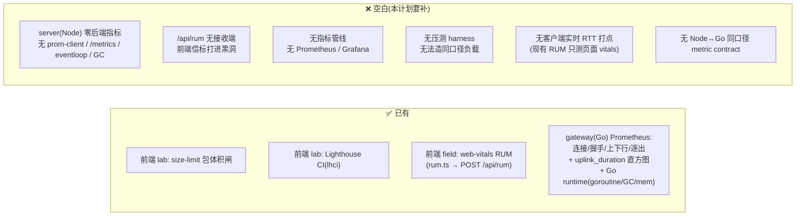
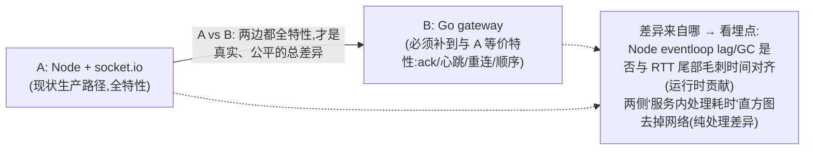
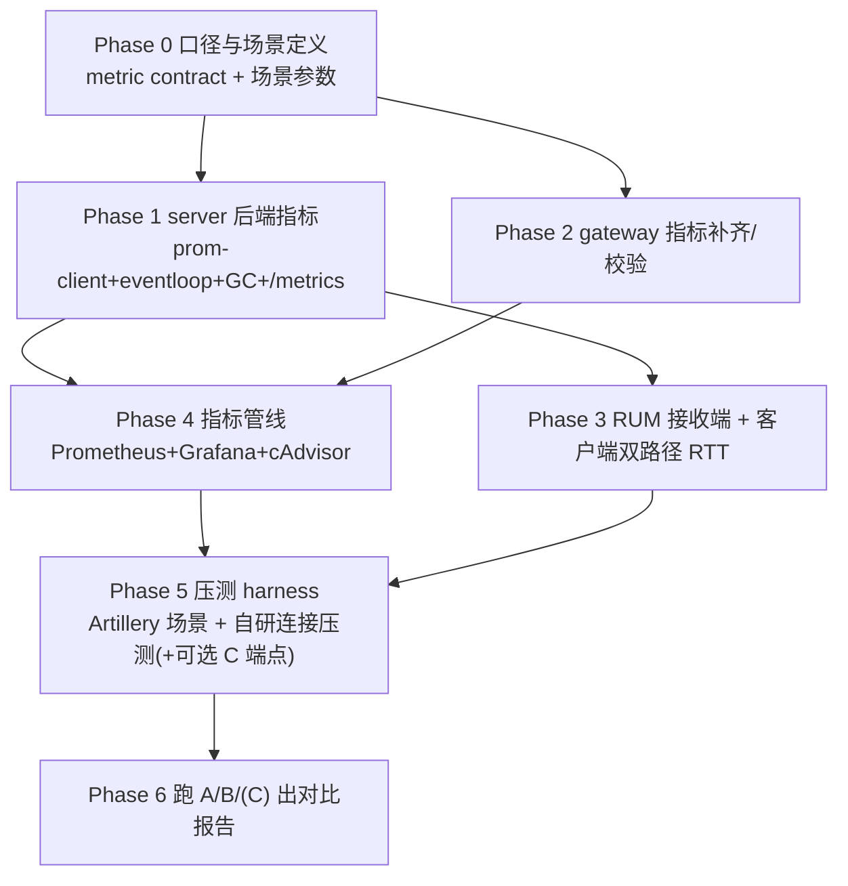

# 性能监测设施 · 开发计划（Node vs Go 实时层可量化对比）

> 分支：`feat/perf-monitoring`。面向零背景读者，术语首次出现即在同句解释。
> **本计划的核心目的**：给 IM 项目补齐一套**后端 + 端到端**的性能监测，使我们能在**同一负载**下，
> 用**同口径指标**量化出「引入 Go gateway 后」相对「现在纯 Node（Express + Socket.io）」的**实时消息链路**
> 性能差异——差多少、差在哪（尾延迟毛刺？单机连接容量？每连接内存？扇出延迟？）。

---

## 术语表

| 名词 | 一句话大白话 |
|---|---|
| **RUM（真实用户监控）** | 采集真实用户在真实设备/网络下的体验数据（field 数据），区别于 CI 里跑的 lab 数据。 |
| **lab 数据 / field 数据** | lab = 干净 CI 机器上的实验室测量（Lighthouse）；field = 线上真实用户测量（web-vitals RUM）。 |
| **Prometheus** | 一个时序指标数据库 + 抓取器：周期性去各服务的 `/metrics` 拉数字存起来，供查询/告警。 |
| **Grafana** | 把 Prometheus 里的指标画成仪表盘的可视化工具。 |
| **histogram（直方图指标）** | 把一批耗时按预设区间（bucket）分桶计数，事后能算出 p50/p95/p99 分位。 |
| **分位 p50/p95/p99/p999** | 排序后第 50%/95%/99%/99.9% 的值；p99 = 最慢 1% 有多慢，是卡顿的真相。 |
| **端到端延迟（E2E）** | 从"发送方点发送"到"接收方屏幕看到"整条链路的耗时。 |
| **RTT（往返时延）** | 客户端发一个带时间戳的探针、收到回执，用「回执时刻 − 发出时刻」算出的往返耗时；不需要两端时钟同步。 |
| **扇出延迟（fan-out）** | 群消息 1 条要发给 N 个在线成员，最后一个收到相对第一个的时间差。 |
| **event loop lag（事件循环延迟）** | Node 单线程事件循环"被卡住"的程度；变大 = 有同步重活/GC 在阻塞，是 Node 健康的核心信号。 |
| **GC pause（垃圾回收停顿）** | 自动回收内存时的短暂停顿；Node/Go 都有 GC，停顿抖动直接体现在尾延迟上。 |
| **goroutine** | Go 的轻量并发单位；数量是 Go 侧连接/协程健康的核心信号。 |
| **metric contract（指标口径契约）** | 约定 Node 和 Go 两侧用**相同的指标名/标签/分桶**，否则两边数字没法直接比。 |
| **压测 harness** | 造负载的程序：模拟 N 个客户端、每秒 M 条消息，去压被测服务并记录结果。 |
| **thundering herd（惊群）** | 大量客户端在断网恢复后同一瞬间重连，把后端瞬间打爆的现象。 |
| **OpenTelemetry（OTel）** | 一套跨语言的可观测性标准（指标 + 链路追踪 + 日志），可把一条消息在多服务间的路径串起来。 |

---

## 0. 目标与成功标准

**目标**：让「Node 实时路径」与「Go 实时路径」在受控、同口径、同负载下可量化对比。

**成功标准（可验证 = 计划完成的定义）**：能一键跑出一份对比报告，至少包含下列指标、且 Node 侧与 Go 侧口径一致：

- 消息**端到端 RTT** 的 p50/p95/p99/p999（客户端视角，两路径同法测量）；
- **吞吐**：稳定态下每秒可处理消息数（msgs/s）与投递成功率；
- **单实例最大稳定连接数**：连接爬坡到延迟/丢包开始恶化前的连接量；
- **每连接资源**：稳态下 RSS 内存 / 连接、CPU / 连接；
- **尾延迟毛刺**：Node 的 event loop lag 与 GC 停顿分布 vs Go 的 GC 停顿 / goroutine 曲线（这是"Node GC 抖动 vs Go"最关键的对比，呼应 Discord 从 Go 迁 Rust 的 GC 毛刺教训）；
- **扇出延迟**：群规模 N=10/100/1000 时的 fan-out p99；
- **断连恢复 / 惊群**：批量重连时的连接建立时长与后端资源尖峰。

---

## 1. 现状盘点（诚实：已有 vs 空白）

要点：**已有的三层前端设施量的是"页面加载/交互体验"(LCP/INP/CLS)，不是"实时消息链路 + 后端资源 + Node vs Go 对比"**。后者基本空白：server 侧一个后端指标都没有（无法对比的最大障碍），`/api/rum` 甚至没有接收端（前端 `sendBeacon` 打到 `/api/rum` 但 server 无此路由，静默 404）。gateway 侧反而已经相当完整，可直接复用/对齐。

> 约束（来自前几轮 gateway 分析）：gateway 目前只实现 `message.send` 的 PoC，客户端也没接入 `/ws`。因此**公平对比范围限定在"消息收发路径"**；presence/已读/@/通话信令等在 gateway 达到 parity 前不纳入对比。

---

## 2. 要量什么（指标分类）

| 类别 | 具体指标 | 采集点 |
|---|---|---|
| 连接层 | 活跃连接数、连接建立耗时、最大稳定连接数 | Node server / Go gateway / 客户端 |
| 消息路径 | E2E RTT（p50/95/99/999）、服务内处理耗时（收帧→落库→ack）、吞吐 msgs/s、投递成功率 | 客户端 RTT + 服务端直方图 |
| 扇出 | 群 N=10/100/1000 的 fan-out p99 | 客户端多接收方 |
| 资源 | RSS 内存、CPU、每连接内存/CPU | 容器（cAdvisor）+ 进程指标 |
| Node 专属 | event loop lag、GC 停顿分布、堆大小 | prom-client + perf_hooks |
| Go 专属 | goroutine 数、GC 停顿、堆 | promauto 默认 Go collector（已有） |
| 韧性 | 断连恢复时长、惊群重连时的资源尖峰、慢消费者逐出 | 压测场景 + gateway 已有 evicted 指标 |

---

## 3. Metric Contract（Node 与 Go 同口径——可比性的地基）

**没有统一口径就没有可比性**。以 gateway 已有指标为基准，让 server 补齐**对应项、同分桶**：

| 语义 | gateway（Go，已有） | server（Node，待补，需同名对齐/同 buckets） |
|---|---|---|
| 活跃连接数 | `gateway_connections` (gauge) | `server_ws_connections` (gauge) |
| 消息处理耗时（收→落库→ack） | `gateway_uplink_duration_seconds` (histogram, buckets `[.005,.01,.025,.05,.1,.25,.5,1,2.5]`) | `server_message_duration_seconds`（**buckets 必须完全一致**） |
| 上/下行计数 | `gateway_uplink_total` / `gateway_downlink_total` | `server_message_in_total` / `server_message_out_total` |
| 进程 CPU/内存 | `process_*`（默认 collector 已有） | prom-client `collectDefaultMetrics()` 提供 `process_*` |
| 运行时健康 | `go_goroutines` / `go_gc_duration_seconds`（已有） | `nodejs_eventloop_lag_seconds` / `nodejs_gc_duration_seconds`（Node 专属，对照观测） |

> 客户端侧再加一个**跨路径统一**的用户视角指标：`msg_rtt_ms{path="socketio"|"ws"}`——这是最终"用户感知延迟"的直接对比量，与服务端直方图互为分解。

---

## 4. 要建的监测模块（逐块，含技术选型）

### 4.1 server（Node）后端指标 —— 最大缺口，优先级最高
- 引入 **`prom-client`**：`collectDefaultMetrics()`（进程 CPU/内存/句柄）+ 自定义 `server_ws_connections`、`server_message_duration_seconds`（Socket.io 收到 `message.send` → `persistMessage` 落库 → 回 ack 的耗时，**对齐 gateway 的 buckets**）。
- **event loop lag**：`perf_hooks.monitorEventLoopDelay()` 直方图 → 导出 `nodejs_eventloop_lag_seconds`（Node 健康的头号信号）。
- **GC 停顿**：`perf_hooks.PerformanceObserver` 订阅 `gc` 条目 → 导出 `nodejs_gc_duration_seconds`。
- 暴露 **`GET /metrics`**（内部端口或加内部令牌，别对公网开）。
- 影响面：新增一个 `metrics` 模块 + 在 Socket.io 消息处理处埋点（`realtime/`、`services/message.ts`）。

### 4.2 gateway（Go）指标补齐
- gateway 已有 `uplink_duration`（收帧→Node ack）。**补一个"客户端可感知"的口径**：下行投递耗时 / 端到端在网关内的停留；确保 `go_goroutines`、`go_gc_duration_seconds`、`process_resident_memory_bytes` 已随 promauto 默认注册暴露（默认已带，验证即可）。
- 影响面：`internal/metrics` 增 1~2 个 histogram + 在 hub 下行投递处埋点。

### 4.3 `/api/rum` 接收端 + 落库（补上信标黑洞）
- server 加 `POST /api/rum` 路由：接收 web-vitals 信标，写入时序库（可直接转成 Prometheus 指标经 pushgateway，或落一张表/日志后由采集器读）。先落地"能收、能查 P75 分位"。
- 影响面：server 新增 1 个路由 + 存储选择（见 4.5）。

### 4.4 web 客户端实时 RTT 打点（双路径）
- 扩展 `web/src/rum.ts`：新增实时链路探针——客户端发消息时带 `clientSentTs`，收到 ack/回显时算 `msg_rtt_ms`，标注 `path=socketio|ws`；采样上报 `/api/rum`。
- 关键：**用 RTT（往返）而非单向延迟**，规避客户端与服务端时钟不同步问题。
- 影响面：`rum.ts` + `store/chatStore.ts`（socket.io 路径）、未来 ws 客户端（Go 路径）。

### 4.5 指标管线：Prometheus + Grafana（+ 可选 OTel）
- **Prometheus** 抓 `server:/metrics`、`gateway:/metrics`；**cAdvisor / node-exporter** 采容器级 CPU/内存（算"每连接资源"）。
- **Grafana** 建对比看板：同一面板叠放 Node 路径与 Go 路径的 p99 / 连接数 / GC / eventloop。
- 部署：docker-compose 加 `prometheus` + `grafana` + `cadvisor` 三个服务（仅监测环境用，不进生产主链路）。
- **可选进阶**：接 **OpenTelemetry** 做跨服务链路追踪，把一条消息 web→(server|gateway)→落库 串成一条 trace，定位延迟具体花在哪一跳。

---

## 5. 压测 / 基准 harness（产生可比负载）

### 5.1 工具选型

| 工具 | socket.io 支持 | 原生 ws 支持 | 场景化 | 备注 |
|---|---|---|---|---|
| **Artillery**（推荐） | ✅ `engine: socketio` | ✅ `engine: ws` | ✅ YAML 场景 | 一套场景打两条协议，最省事 |
| **k6 / xk6-websockets** | ⚠️ socket.io 需自实现握手 | ✅ | ✅ JS 脚本 | ws 强，socket.io 麻烦 |
| **自研 Node harness** | ✅ `socket.io-client` | ✅ `ws` 库 | 需自写 | 最高保真、最易测"最大连接数"，控制力最强 |

**建议**：Artillery 做"到达率/爬坡/吞吐"场景；**自研 Node harness** 做"单机最大稳定连接数"与"惊群重连"（这两个需要精确控制海量长连接的建立节奏，自研更可控）。

### 5.2 场景定义（两路径完全一致）
1. **1:1 消息**：C 个并发连接两两成对，各以 R msgs/s 发送，测 RTT/吞吐。
2. **群扇出**：1 个群 N 成员在线，1 人发，测最后一个收到的 fan-out p99（N=10/100/1000）。
3. **连接爬坡**：以固定速率新增连接直到 RTT p99 或错误率越阈，记录**最大稳定连接数**与彼时每连接内存/CPU。
4. **惊群重连**：建立 C 连接后瞬时全断再全连，测恢复时长与后端资源尖峰。

### 5.3 公平性：特性对齐（parity），而非"减掉 socket.io 开销"
一个必须先立住的前提：**ack、心跳、重连、有序投递是实时层的必备特性，任何生产实现（包括 Go gateway）都得做**——它们不是 socket.io 强加的"可省开销"，而是这条路径本该付的成本。因此：

- **Node 侧不需要改**：socket.io 是成熟、正确的生产选择。拿"Node + 裸 ws"这种谁都不会上线的配置去比，是测一个 strawman，没有意义，也不该把 socket.io 的成本从 A 里扣减。这份成本就是选 socket.io 要付的真实代价，**计入 A vs B**。
- **公平对比的负担落在 Go 侧**：gateway 必须实现与 socket.io **等价的特性集（ack / 心跳 / 重连 / 顺序）**，否则 B 因"少干活"而**虚假地快**。

**重要推论**：gateway 现在只到 `message.send` PoC、上述特性都没有，**今天直接对比反而对 Node 不公平（B 会虚高）**。所以"能公平对比"本身依赖"先把 gateway 补到 parity"——这也定了投入优先级：**先补 parity，再谈对比**。

> 诚实的小 nuance：socket.io 自身的协议编码（Engine.IO 握手 + JSON 帧）确实比一个精简二进制协议重一点，但这是 **A 路径的真实成本、留在 A vs B 里**，不做扣减——和"选 socket.io 就要付这笔账"是一回事。

---

## 6. A/B 对比方法学（避免测出假结论）

- **同环境**：A/B/C 三者容器 CPU/内存 limit 相同、同机、payload 相同（如固定 200B 文本）、同一 harness、同网络。
- **warm-up + 稳态**：丢弃前 30~60s 预热，取稳态窗口统计；每场景跑 ≥3 轮取分位中位，记录方差。
- **爬坡找拐点**：连接数/QPS 逐级加压，记录"延迟开始劣化的拐点"而非只报单点。
- **RTT 用往返**：规避时钟同步问题；服务端另用直方图分解"服务内处理耗时"。
- **特性对齐后再比**：确认 gateway 已实现与 socket.io 等价的 ack/心跳/重连/顺序，否则 B"少干活"导致的虚高不是真实差异。socket.io 的成本留在 A 里、不扣减（Node 不改）。
- **Node 专属信号重点看**：event loop lag 与 GC 停顿是否与 RTT 尾部毛刺同步出现（验证/证伪"Node GC 抖动导致尾延迟"这一核心假设）。

---

## 7. 分阶段开发计划（任务 + 依赖 + 验收）

| 阶段 | 交付物 | 验收标准 |
|---|---|---|
| **P0** | metric contract 文档 + 场景参数表 | Node/Go 指标名·标签·buckets 定稿，评审通过 |
| **P1** | server `metrics` 模块 + `/metrics` | 本地 `curl /metrics` 能看到连接数、`server_message_duration_seconds`、eventloop、GC |
| **P2** | gateway 指标补齐 | `/metrics` 含端到端耗时 + `go_goroutines`/`go_gc_duration_seconds` |
| **P3** | `/api/rum` 接收端 + `rum.ts` 实时 RTT | RUM 信标可落库、可查 P75；chatView 发消息能采到 `msg_rtt_ms{path}` |
| **P4** | 监测栈 compose + Grafana 看板 | 看板能同屏对比两路径 p99/连接/GC/eventloop |
| **P5** | Artillery 场景 + 自研压测脚本 | 一条命令对 A/B（可选 C）跑完 4 类场景 |
| **P6** | 对比报告（见第 8 节模板） | 报告含全部成功标准指标 + 变量归因 |

> 说明：P1–P4 是"把两侧都变得可观测"，P5–P6 才是"加压对比"。**Go 路径的真实对比依赖 gateway 至少能被客户端连上并处理 message.send**——若要测 A vs B 的真实客户端路径，需先让 web/harness 能连 `/ws`（否则只能用 harness 直连 gateway 测服务端侧，客户端 RTT 对比缺 Go 侧）。这条依赖要在 P0 明确。

---

## 8. 对比报告产出格式（模板）

| 指标 | A: Node+socket.io | B: Go gateway（等价特性） | A vs B 差异 | 归因（来自埋点） |
|---|---|---|---|---|
| E2E RTT p50 / p99 / p999 | | | | |
| 吞吐 msgs/s（稳态） | | | | |
| 单机最大稳定连接数 | | | | |
| 每连接 RSS 内存 | | | | |
| 每连接 CPU | | | | |
| 尾延迟毛刺（GC/eventloop 相关） | | | | |
| 群扇出 p99（N=100） | | | | |
| 惊群恢复时长 | | | | |

> 前置校验：B 必须已实现与 A 等价的 ack/心跳/重连/顺序（parity），否则本表不成立。
> "归因"列依据埋点填写（如"p99 毛刺与 Node GC/eventloop lag 时间对齐 → 运行时贡献"），不靠 strawman 端点。

结论段需回答用户的原始问题：**引入 Go 后相对纯 Node，具体快/省多少、差异主要来自协议还是运行时、在什么负载点开始拉开差距、是否值得投入把 gateway 补到 parity 并切流量。**

---

## 9. 风险与坑

1. **口径不一致 → 数字不可比**：Node 与 Go 的 histogram buckets 不同就无法对比；P0 必须先定契约（第 3 节）。
2. **特性不对齐 → 假差异**：ack/心跳/重连/顺序是实时层必备，Go gateway 也得实现；若拿"未实现这些的 gateway PoC"或"Node 裸 ws"去比，B 会因少干活而虚高。正确做法是**先把 gateway 补到与 socket.io 等价**再比，socket.io 的成本留在 A 侧、不扣减（Node 不改）。
3. **压测机自己成瓶颈**：harness 单机造几十万连接会先把自己压垮；需多机压测或确认压测端资源充足，先标定压测端上限。
4. **观测者效应**：埋点本身有开销（尤其高频 histogram observe）；用采样、确认打点开销 < 结果的量级。
5. **时钟不同步测单向延迟**：必用 RTT 往返；跨机单向延迟不可信。
6. **拿峰值当结论**：只报单点峰值会误导；要报爬坡曲线与拐点、多轮方差。
7. **/metrics 暴露到公网**：指标端点含内部信息，务必内网/加令牌，别裸奔。
8. **对比范围越界**：gateway 只做到 message.send，别去对比它尚未实现的 presence/已读/信令，否则不公平也没意义。

---

## 附：技术选型对比

| 决策点 | 候选 | 选择与理由 |
|---|---|---|
| 后端指标库（Node） | prom-client / OpenTelemetry SDK | 先用 **prom-client**（轻、与 gateway 的 Prometheus 生态一致、最快出结果）；跨服务链路追踪需求出现再叠 OTel |
| 指标存储/可视化 | Prometheus+Grafana / 云 APM | **Prometheus+Grafana**（自托管、gateway 已产 Prometheus 指标、零厂商绑定） |
| 压测工具 | Artillery / k6 / 自研 | **Artillery**（原生支持 socketio+ws 双引擎）+ **自研 Node**（测最大连接数/惊群） |
| 链路追踪（可选） | OpenTelemetry / 无 | 需要"延迟花在哪一跳"时再上 **OTel**；初版不引入，避免过度设计 |
| 对比方式 | 二方对齐(A/B) / 三方含裸 ws(C) | **二方 A/B，但要求 B 与 A 特性对齐(parity)**；不引入 Node 裸 ws strawman；差异归因靠埋点(GC/eventloop) |
