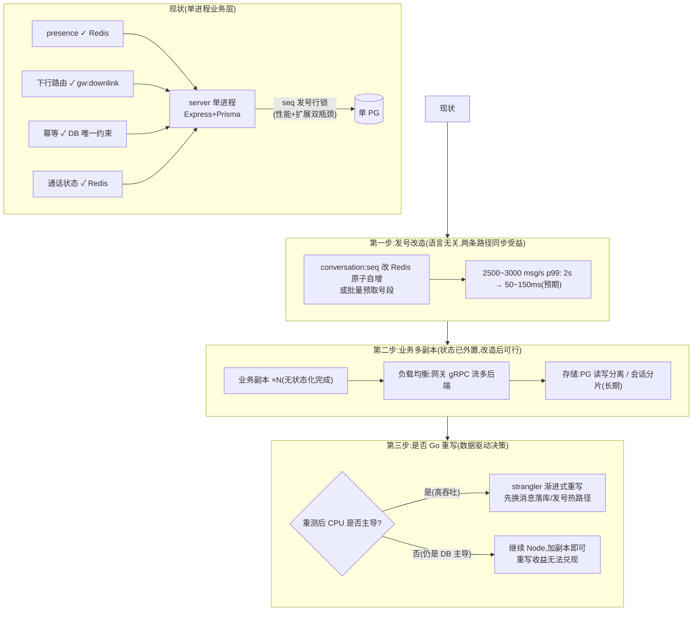

# 26-9-16-grpc · 业务层分布式化与 Go 重写深度分析

> 分支 `feat/perf-monitoring`。承接 gRPC 流改造复测报告的两个遗留问题:
> ① 连接层已无状态可扩缩容,但**业务层还是单进程**;② "即使不考虑扩缩容,单进程 Go 的性能也比 Node 强吧?"
> 本文用实测数据与源码事实,分析:业务层离分布式还差什么、"单进程 Go 更强"在什么条件下成立、
> 用 Go 重写业务层是不是正确决策。**所有结论锚定 26-9-14/26-9-16/26-9-16-grpc 三期实测数据。**

---

## 0. 结论摘要

1. **判断一成立**:业务层确实是单进程(Express + Prisma 单实例),会话 seq 发号依赖 DB 行锁(`server/src/services/message.ts:41-46`),是业务层最大的单点——它**既是 2500+ msg/s 的 2 秒 p99 瓶颈,也是多副本扩展的串行化障碍**,一处代码双重阻碍。
2. **判断二部分成立**:单进程 Go 的 CPU 吞吐确实比 Node 高(估算 2~4×,§3),但**本项目业务层是 I/O 密集而非 CPU 密集**——实测 eventloop p99 全程 11~17ms、GC 5ms,CPU 从未是瓶颈;消息路径耗时构成里 DB 查询仅 3ms、行锁等待与 Prisma 层开销占 90%。**Go 重写能赢的部分(CPU/内存)恰好不是瓶颈,瓶颈(DB 行锁)恰好是 Go 重写也绕不开的**。
3. **业务层分布式化的要素清单盘点**(§4):presence/下行路由/幂等/通话状态已全部外置(Redis/DB),**就绪度约 70%**;真正的障碍只有两个:① seq 发号行锁(性能+扩展双重瓶颈);② 数据存储未分片。这两项**与语言无关,用 Node 同样能改**。
4. **"重写"与"分布式"是两个正交决策**(§5):分布式化的关键路径是发号改造 + 存储分片 + 多副本部署,Node 上完全可行;Go 重写的价值在于 CPU/内存效率、单二进制部署与 gRPC 原生生态,会让分布式化**更顺手但不是前提**。
5. **决策建议**(§6):先做语言无关的发号改造(Redis 原子自增,两条实时路径同步受益),改造后重测——**如果那时 CPU 才开始主导(预期 p99 从 2s 降到几十 ms 后,CPU 密集部分占比上升),再按数据决定是否重写**;重写采用 strangler 渐进式(先用 Go 替换消息落库/发号热路径),不搞大爆炸。
6. **量化预期(诚实)**:发号改造后 2500~3000 msg/s 的 p99 预计降到 50~150ms(剩余为 PG 写入与扇出);此时 Go 重写热路径的增量收益约 1~2ms/消息(Prisma 边界消除),**在中低负载无感,在万级 msg/s 才可测**。

---

## 1. 现状盘点:业务层到底有多"单进程"

| 状态/能力 | 存放位置 | 跨进程一致性 | 证据 |
|---|---|---|---|
| presence(在线状态) | Redis(TTL) | ✅ 天然跨进程 | `gateway/internal/presence` + `server/src/realtime/presence.ts` |
| 下行路由(消息扇出) | Redis pub/sub `gw:downlink` | ✅ 任意副本 publish,网关按本地连接代投 | `server/src/realtime/handleUplink.ts` / `gateway/internal/backplane/backplane.go:24` |
| 幂等去重 | DB 唯一约束 `(conversation_id, sender_id, client_msg_id)` | ✅ 跨副本天然一致 | `message.ts` INSERT + 唯一索引 |
| 通话状态机 | Redis(key + TTL) | ✅ | `server/src/services/callSession.ts:33-44` |
| 会话 seq 发号 | **DB 行锁**(`UPDATE conversations SET next_seq=next_seq+1 RETURNING`) | ❌ 单行串行化,跨副本争抢同一行锁 | `message.ts:41-46` |
| 消息持久化 | 单 PG 实例 | ❌ 未分片/未读写分离 | `docker/docker-compose.dev.yml` |
| 业务进程 | 单实例 | ❌ 未多副本部署(无状态化已接近就绪) | — |

**结论:业务层"离分布式只差一步半"。** 已有 70% 的状态外置,唯一真正的硬障碍是 seq 发号——它同时是:
- **性能瓶颈**:2500+ msg/s 时 2s p99 平台(实测);
- **扩展障碍**:同一会话的所有写必须在 DB 单行上串行,业务副本再多也不会降低这一行的竞争——**不改造发号,业务层分布式是假的(扩了也白扩)**。

---

## 2. 消息路径耗时解剖:Go 重写能省什么、不能省什么

以纯 Node 基线 S1(1000 msg/s,零错误)的服务内直方图为标本:

| 组成 | p50 | p99 | 语言相关? | Go 重写能否省? |
|---|---|---|---|---|
| DB 单查询(INSERT 等,`db_query_duration_seconds`) | 2.92ms | 5.8ms | ❌ 存储层 | 否(同样要查 PG) |
| 事务内行锁等待(seq 发号) | ~20ms(推算) | 与负载同涨,2500 msg/s 时 ~2s | ❌ 存储层 | **否——重写后照样等锁** |
| Prisma 客户端开销(JS↔Rust 序列化边界/连接池管理) | ~3~5ms(推算) | ~5~10ms | ✅ Node 特有 | **是(原生 SQL/轻 ORM 可省大半)** |
| zod 校验 + JSON 编解码 + 业务逻辑 + Redis publish | ~2~3ms(推算) | 个位数 ms | ⚠️ 部分 | 少部分(JSON 双方都快,校验 Go 编译期更薄) |
| 事件循环调度/GC | 0~17ms(eventloop p99 实测) | 11~17ms | ✅ Node 运行时 | 是(goroutine 调度更平) |

**关键结论:单条消息路径中,语言相关的可省部分合计约 5~8ms;语言无关的 DB 等待在负载上来后占到 2000ms。** Go 重写业务层在性能上的最大可得收益,就是把 5~8ms 的"Node 税"压缩到 1~2ms——**这笔收益在中低负载(RTT 几十 ms)下几乎不可感知,只有在发号瓶颈解决、RTT 回到几十 ms 之后才占可测比例**。

证据链(实测,非推算):eventloop p99 三期全程 11~17ms、Node GC 停顿 p99≤5ms、gRPC 过载平台 p99 与基线差 17ms——**运行时从来不是瓶颈,瓶颈始终是那行锁**。

---

## 3. "单进程 Go 也比 Node 强"——在什么条件下成立

这个判断需要拆成三条,分别成立或不成立:

| 命题 | 判定 | 依据 |
|---|---|---|
| CPU 密集计算(纯算/序列化/压缩):Go 更快 | ✅ 成立 | Go AOT + goroutine 全线程利用,业界共识 2~4×;Node 单线程 eventloop 只能用到 1 核(除非 worker_threads) |
| I/O 密集(DB 等待为主):Go 更快 | ❌ 不成立 | 瓶颈在存储层等待,两侧都是"等";Node 的 async 并发模型在这个场景不输 goroutine(实测 eventloop 无压力) |
| 本项目消息路径:Go 更快 | ⚠️ 边际成立 | 可省 Prisma 边界 + 校验 + 调度约 4~6ms/消息(§2),但**被 DB 行锁等待淹没,整体 RTT 无感** |
| 内存占用:Go 更省 | ✅ 成立 | V8 堆 + Prisma 对象膨胀 vs Go 结构体;业务层 Node RSS 183~505MB(负载相关),Go 同功能预计 50~150MB |
| 部署与分布式生态:Go 更顺手 | ✅ 成立 | 单二进制、gRPC 原生、goroutine 并发模型与网关同构——但不是分布式的前提 |

**所以用户判断"单进程 Go 也比 Node 强"在 CPU 密集维度是对的,但本项目业务层恰好不是 CPU 密集。** 这也解释了为什么三期压测里"Node 换 Go 连接层"没有变快:连接层本来就是 I/O 密集(等 DB 的转发器),而业务层的 CPU 密集部分在 ≤3000 msg/s 下还不足以构成瓶颈。

一个诚实的量化方法:如果发号改造后消息路径 CPU 部分占比升到 30% 以上(即 DB 等待被消灭后),Go 重写热路径的收益才会从"无感"变成"可测"。**在发号改造完成并重测之前,任何"重写会更快的幅度"都只是估算。**

---

## 4. 业务层分布式化:要做什么、与语言的关系

要点:
1. **分布式化的三件事都与语言无关**:发号改造(Redis)、无状态化副本(已完成 70%)、存储分片(长期项)。Node 可以全部完成。
2. **语言选择的时机在第三步**:只有当发号改造后、CPU 成为新瓶颈时,"Go 重写"才是一个性能决策;在那之前它只是一个工程偏好决策(部署/生态/团队技能)。
3. **如果决定重写,strangler 模式优于大爆炸**:先抽出消息落库/发号(约 200~400 行核心逻辑)做成 Go 微服务或逐步替换,业务其余部分留在 Node,网关的 gRPC 流天然支持按帧类型/会话路由到不同后端。

---

## 5. Go 重写业务层的收益-成本矩阵

| 维度 | 收益 | 量化(估算,标注为估算) |
|---|---|---|
| CPU 效率 | CPU 密集部分 2~4× | 消息路径 CPU 部分 3~5ms → 1~2ms(估算);总 RTT 影响取决于 CPU 占比 |
| 内存 | V8+Prisma → Go 结构体 | 业务层 RSS 183~505MB → 50~150MB(估算) |
| Prisma 边界 | 消除 JS↔Rust 序列化 | 每查询省 0.5~1ms(估算) |
| 部署 | 单二进制、与网关同构 | 运维成本下降(定性) |
| 分布式生态 | gRPC/服务发现/遥测原生 | 定性 |
| **成本** | | |
| 重写规模 | 业务层 10,494 行 TS(不含生成物) | 预计 8~14 人日(核心路径 2~4 人日) |
| 风险 | 功能冻结期、行为漂移、测试回归 | 现有 209 个测试用例需平移或重写 |
| 时机风险 | 在 DB 瓶颈未解决时重写 | **性能收益被遮蔽,重写"看起来白干"** |

---

## 6. 结论与行动建议(按顺序执行)

1. **立即做(与语言无关,收益最大)**:会话 seq 发号改 Redis 原子自增(或批量号段预取),消灭 2s 行锁平台——这是三期压测共同指向的第一瓶颈,且是业务层分布式化的前提。预期 2500~3000 msg/s p99 从 ~2s 降到 50~150ms,**纯 Node 与 gRPC 流两条路径同步受益**。
2. **改完重测,数据决策**:用既有工具链(26-9-16-grpc 参数)跑吞吐扫描。若 p99 落回几十 ms 且错误率归零→ 业务层 CPU 占比上升,此时再评估 Go 重写热路径的增量收益是否值得 8~14 人日。
3. **业务多副本**:发号改造后,业务层无状态化就绪度 95%(presence/下行/幂等/通话状态全外置),直接部署 N 副本 + 网关 gRPC 流多后端即可横向扩展——**这一步用 Node 即可完成,不必等重写**。
4. **Go 重写定位**:把它当作"CPU 密集化的应对"与"工程生态统一"决策,而非"分布式的前提"或"当前性能瓶颈的解药"。若要启动,采用 strangler 模式从消息落库/发号热路径开始,以三期压测数据做 A/B 验收(客户端协议零改动,harness 直接复用)。
5. **明确不建议**:在发号改造完成之前,以"性能更好"为由启动业务层重写——数据不支持,且重写完成后的对比会因为 DB 瓶颈未除而显得"毫无收益",重演本次"Go 网关不更快"的认知落差。

---

## 附录:数据来源与相关文档

- 三期实测:`../26-9-14/`(纯 Node 基线)、`../26-9-16/`(gateway HTTP 模式)、本目录(gRPC 流模式)。
- 源码锚点:发号行锁 `server/src/services/message.ts:41-46`;基线拒绝机制 `server/src/utils/socket.ts:198-200`;通话状态外置 `server/src/services/callSession.ts:33-44`;下行广播 `gateway/internal/backplane/backplane.go:24`。
- 关联方案:`../26-9-16/26-9-16-连接层业务层通信架构演进方案-RPC改造.md`(§9 风险 1 已预告 DB 行锁)。
