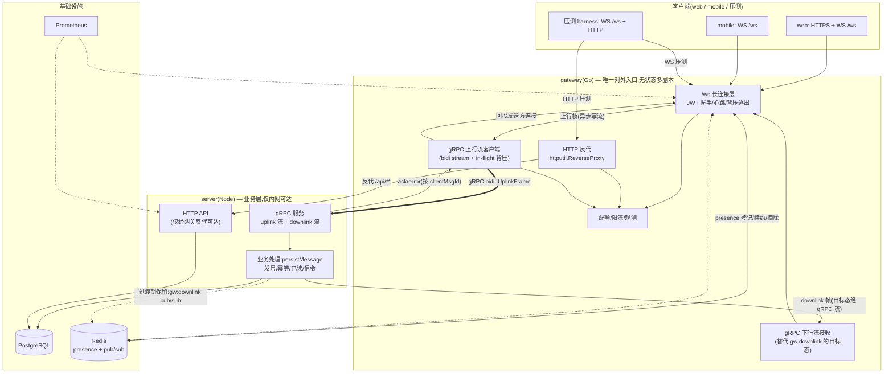
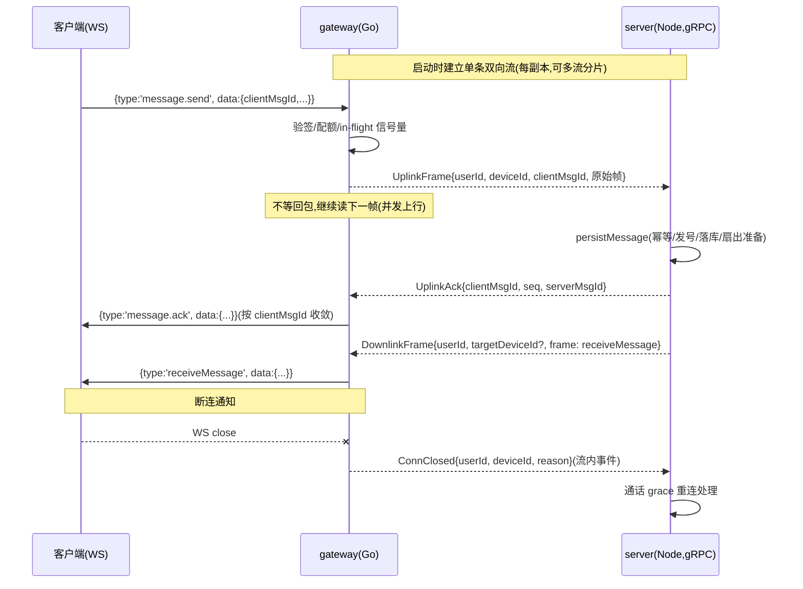

# 26-9-16 · 连接层与业务层通信架构演进方案（HTTP-per-message → gRPC 流 + 网关统一入口）

> 分支 `feat/perf-monitoring`。本文档承接 `26-9-16-Go网关压测对比报告.md`：接入 Go gateway 后性能不达预期的
> **根因已定位**——不是"连接层解耦"的架构方向错了，而是**两层之间的进程间通信方式选错了**（HTTP-per-message）。
> 本文认真分析：① 为什么解耦是对的、全 Go 重写也解决不了；② "RPC" 是否就是答案，以及为什么必须是**流式 RPC** 而不是
> per-message unary RPC；③ 目标架构（gRPC 双向流 + 网关作为唯一对外接口）的完整设计、定量预期、路线图与回滚。
>
> 所有判断均锚定 26-9-16 实测数据与仓库源码（file:line 见附录 A）。

---

## 0. 结论摘要

1. **架构判断验证**：连接层与业务层解耦是正确方向（业界 IM 标准形态）；"全部用 Go 重写也无法解决"同样正确——问题在**进程间通信方式**，与语言无关。
2. **根因**：gateway 把每条业务消息用一次独立 HTTP POST 转发给 Node（`upstream.go:33` 的 `Forward`），且每连接**串行等待**回包（`conn.go:79-85` readLoop 同步 dispatch）。实测代价：≈1000 msg/s 起 dial 耗尽（TIME_WAIT 打满 16K 端口，10,341 次 upstream_error）、2500 msg/s 时客户端 RTT p99=2802ms 而单次上行往返仅 98ms——**排队全在网关串行等待里，不在通信本身**。
3. **方案**：RPC 方向正确，但**必须是流式**——gRPC 双向流（bidi streaming），单连接复用 + 异步并发上行 + in-flight 背压，ack 乱序回投按 clientMsgId 收敛。若只换成 gRPC unary（每消息一 RPC），dial 耗尽消失但串行排队依然存在，只能解决一半问题。
4. **第二阶段**：网关作为唯一对外入口，HTTP 流量由 Go 反代转发（`httputil.ReverseProxy`），业务层内网化；下行扇出从 Redis pub/sub 演进为 gRPC 下行流（分阶段，先不动下行）。
5. **定量预期（对照 26-9-16）**：S1 错误率 12.8% → 0；tp_r25 RTT p99 2802ms → 目标 <500ms；1000 msg/s 的 upstream_error 归零；同时如实预期——上行并发恢复后 server 的 DB 行锁竞争会回到基线水平（这是把"客户端排队"换成"服务端排队"的权衡，需配合 DB/限流兜底）。

---

## 1. 问题定位：26-9-16 实测的三条证据链

| # | 现象（26-9-16 数据） | 根因锚点 |
|---|---|---|
| E1 | S1（1000 msg/s）错误率 12.8%；gateway 日志 10,341 条 `dial tcp 127.0.0.1:3007: connect: can't assign requested address`；压测中 TIME_WAIT 达 14,922/16,384 | `upstream.go:26` 用 Go 默认 `http.Client`（`MaxIdleConnsPerHost=2`），HTTP-per-message 每秒上千次建连耗尽临时端口 |
| E2 | tp_r25（2500 msg/s）客户端 RTT p99=2802ms，而 gateway 上行服务内 p99 仅 98.3ms、下行投递 p99=5ms、Node 服务内 198.9ms | `conn.go:79-85` readLoop 每条消息**同步** `dispatch`→`Forward` 等回包才读下一帧——每连接串行化，发送间隔（40ms）低于上行耗时（p95 82ms）时队列单调增长 |
| E3 | S3（3000 msg/s）gateway 路径下 Node 服务内 p99=198.9ms，远好于基线 2483ms，但客户端 RTT p99=5.1s、14% 消息 3 次重发后仍失败 | 串行上行把到达 Node 的并发摊平（"保护"了 DB 行锁），代价是网关侧深队列 + 重发风暴（重发撞在途插入又引发 5,396 条 unique constraint 500） |

**结论**：通信方式的三个缺陷——① 短连接风暴（E1）；② 每连接串行等待（E2）；③ 重试与在途竞态放大（E3）。三者都源于"每消息一次 HTTP 请求-响应"这个通信模型。

---

## 2. 架构判断验证（用户的三个判断，逐一核对）

### 2.1 "连接层与业务层解耦是正确的架构设计" —— ✅ 正确

- 连接层（长连接生命周期、心跳保活、背压逐出、协议编解码）与业务层（落库、发号、幂等、已读、信令）是**两种完全不同的负载形态**：前者是"海量空闲长连接 + 低 CPU + 高 fd/内存"，后者是"低连接 + 高 CPU/DB 竞争"。混在一个进程里必然互相伤害——26-9-14 基线已证明：socket.io 模式 10K 连接时 server RSS 331.8MB、连接风暴直接冲击 Node 事件循环。
- 解耦后 gateway 可独立水平扩展（无状态副本 + Redis presence 登记副本位置，`presence.New(rdb, ...)` 写 `presence:meta`，`main.go:53`），业务进程不再承受连接 I/O。**这个方向本身就是本次改造的核心收益，不能因为通信实现不佳而否定**。
- 业界印证：Discord、Slack、腾讯 IM 类系统全部是"边缘长连接网关（多副本）→ 内部 RPC → 业务服务"的形态，无一例外。

### 2.2 "即使全部用 Go 重写也无法解决" —— ✅ 正确（且值得展开）

- 语言的性能差异（Node 事件循环 vs Go goroutine）在本项目中已被证明不是瓶颈：26-9-16 两侧 eventloop p99 全程 11~17ms、GC 停顿 ≤5ms（报告 §3.1）。**全 Go 重写业务层能换来的是业务逻辑本身的 CPU 加速，与连接层架构正交**。
- 关键推论：只要 gateway 与业务层是两个进程，就必须选择一种进程间通信；HTTP-per-message 的缺陷在"两个 Go 进程"之间同样存在（dial 耗尽、串行等待一个都不会少）。所以**正确的问题不是"换不换语言"，而是"换什么通信方式"**。

### 2.3 "核心方案是把两层间通信改成更好的方案（RPC）" —— ✅ 方向正确，但需要精确化

"RPC" 有两种截然不同的形态，必须区分（这是本方案最重要的技术判断）：

| | gRPC unary（每消息一次 RPC） | gRPC 双向流（bidi streaming） |
|---|---|---|
| 连接模型 | 每请求借连接池/新建连接 | 一条长连接复用 |
| dial 耗尽（E1） | 解决（HTTP/2 多路复用） | 解决 |
| 串行等待（E2） | **不解决**——readLoop 仍然同步等 unary 返回 | 解决：上行帧写入流即返回，ack 异步回来按 clientMsgId 收敛 |
| 背压 | 只能靠超时/重试 | 流控（HTTP/2 flow control）+ 应用层 in-flight 上限 |
| 批处理 | 无 | 天然支持（帧可聚合） |

用 E2 的数据说明：tp_r25 单次上行往返 p99 仅 98ms，但客户端 RTT p99=2802ms——**瓶颈不是"一次通信有多慢"，而是"串行等待让通信排队"**。若只换 unary RPC（假设往返降到 30ms），40ms 发送间隔下的每连接队列依然增长，RTT 依然会到秒级。**只有把上行从"请求-响应"改成"流式写入 + 异步确认"才能消灭排队**。

### 2.4 "网关作为唯一对外接口，所有流量（HTTP、WS）都由 Go 转发" —— ✅ 正确，作为第二阶段

收益（详见 §6）：客户端单入口、鉴权/限流/观测统一、业务层完全内网化（安全面收窄）、server 无需对外暴露端口。这是解耦架构的自然终点。但建议分两步走（先换通信方式、再收口 HTTP），每步独立可验证、可回滚。

---

## 3. 方案选型深度分析（不只和 HTTP 比，和所有候选比）

| 方案 | 单次开销 | 连接模型 | 背压 | 解决 E1 | 解决 E2 | 工程成本 | 判定 |
|---|---|---|---|---|---|---|---|
| A. HTTP-per-message（现状） | TCP 建连 + HTTP 头 + JSON | 短连接为主 | 无 | ✗ | ✗ | — | 已证伪 |
| B. HTTP-per-message + 调优 Transport | TCP 建连(部分) + HTTP 头 + JSON | 连接池(扩 idle 上限) | 无 | 部分 | ✗ | 低（一行配置） | **过渡止血可用**，不能终态 |
| C. gRPC unary | HTTP/2 流 + protobuf | 单长连接多路复用 | 有限 | ✓ | ✗ | 中 | 半吊子，不推荐作为终态 |
| D. **gRPC 双向流** | 流帧 + protobuf | 单长连接双向流 | 完整（流控+in-flight 上限） | ✓ | ✓ | 中 | **推荐** |
| E. Redis Streams / NATS / Kafka | 队列中间件一跳 | 持久连接 | 消费侧 | ✓ | ✓ | 中高 | 吞吐高但 ack 需回执通道（correlation ID），RTT 更高，对 IM 即时性不如 D |
| F. Unix Domain Socket（叠加 D） | 无网络栈 | 本机 | 同 D | ✓ | ✓ | 低（改地址） | 同机部署时**叠加优化**，跨机不适用 |
| G. 合并进程（gateway 内嵌业务） | 函数调用 | — | — | ✓ | ✓ | 低 | **反解耦**，回到单体，否决 |

**选定 D（gRPC 双向流），可叠加 F（同机 UDS）**。理由：

1. **仓库已有完整 protobuf 基建**：`buf.gen.yaml` 已生成 Go 契约到 `gateway/internal/contracts/gen`（gateway `go.mod:10` 已有 `google.golang.org/protobuf v1.34.2`），`proto/ourchat/{message,call,presence,read}` 已有业务帧契约。新增内部 RPC 契约只需加 service 定义 + 补 grpc 插件，成本增量小。
2. **生态成熟**：流控、超时、熔断、负载均衡、多语言（Node 侧 `@grpc/grpc-js`）、观测（grpc 中间件）全部现成；且 gRPC 本身带 health check，天然解决网关↔业务的存活探测。
3. **E 的适用场景是"可接受秒级延迟的异步任务"**（推送、离线队列、跨服务事件），不是 IM 消息的请求-响应路径；两者可并存（RPC 走同步路径，队列走异步路径），但核心路径必须是 D。
4. B 作为止血手段值得先做（一行配置消除 dial 耗尽），但**不能因此推迟 D**——B 只解决 E1，E2/E3 依旧。

---

## 4. 目标架构设计

### 4.1 整体拓扑（目标态）



### 4.2 消息时序（gRPC 双向流路径）



### 4.3 流拓扑决策：per-instance 单流 vs per-connection 流

| 拓扑 | 流数量 | 优点 | 缺点 |
|---|---|---|---|
| per-connection（每 WS 连接一条 gRPC 流） | O(连接数)，10K 连接=10K 流 | 断连=流关闭，语义直观 | server 侧 10K 流的内存/goroutine 开销；连接抖动与流生命周期强耦合 |
| **per-instance 多流池（推荐）** | O(副本数×N)，如 4~8 条/副本 | 流数恒定，帧头带 userId 路由；断连用 `ConnClosed` 帧表达 | 需自行做帧路由与分片（按 userId 哈希，保证同一用户上下行都走同一条流——**不要求全局顺序，仅要求同用户 ack 可关联**） |

选择 per-instance 多流池 + userId 哈希分片：同用户的帧天然落到同一条流，`ConnClosed`/`UplinkAck` 与上行帧同流，无需跨流关联；流数少，server 侧 grpc 内存可控。

### 4.4 关键机制设计

1. **并发上行 + 保序**：readLoop 只做"读帧→非阻塞派发"，派发到 per-connection 或全局的 goroutine 池（当前 `conn.go:88` `dispatch` 同步阻塞是 E2 的直接原因）。**消息顺序由服务端 seq 发号保证**（`persistMessage` 内 bump `next_seq`），上行到达顺序不影响落库顺序——IM 语义里客户端看到的顺序以 seq 为准，上行乱序无害。
2. **in-flight 背压**：每条流（或每个连接）设 in-flight 上限（如 256），信号量满时按策略处理：优先等（微秒级）→ 满则回 `message.error`（可重试）或按配额逐出——对齐 socket.io 的"快速失败"语义，避免重蹈"无限排队"覆辙。
3. **同 clientMsgId 串行化**：26-9-16 已观察到重发与在途插入竞态（5,396 条 unique constraint）。设计上：网关对同 clientMsgId 的在途请求**串行等待**（per-key 队列，重发帧在首帧确认前不重复上行）；服务端 persistMessage 仍补唯一约束兜底（视为 deduped）。
4. **断连通知走流**：`ConnClosed` 帧替代现有 `POST /internal/gateway/disconnect`（`internal.ts:189`），fire-and-forget 语义不变。
5. **心跳/read.report/call:\***：全部作为 UplinkFrame 类型透传，网关不做业务解析（与现状一致）。
6. **下行通道演进**：
   - **过渡期（P0-P2）**：保留 Redis `gw:downlink`（`backplane.go:24`）——扇出已证明快（span p99 2ms），且 server 无需感知网关拓扑，改动面最小。
   - **目标态（P3）**：server 从 presence 的 replica 映射（`presence:meta` 已有 `ReplicaID`，`config.go:52`）定向把 downlink 写进 gRPC 下行流，去掉 Redis pub/sub 一跳。收益：单一通信面 + 少一跳 + 下行帧无需 JSON 转义两次；代价：server 需要副本路由表（presence 已有）。
7. **错误帧修复**：`errorFrame`（`conn.go:149`）补 clientMsgId——26-9-16 已证明丢 clientMsgId 导致客户端无法收敛 pending，只能等超时。

---

## 5. 契约草案（proto，放在 proto/ourchat/edge/）

```protobuf
// proto/ourchat/edge/realtime.proto —— gateway(Go) ↔ server(Node) 内部通信契约
syntax = "proto3";
package ourchat.edge;

service Realtime {
  // 双向流:上行帧/ack/断连通知 + 下行帧(目标态)共用
  rpc Stream(stream EdgeFrame) returns (stream EdgeFrame);
}

message EdgeFrame {
  oneof kind {
    UplinkFrame  uplink  = 1; // gateway → server:业务上行(原样透传客户端帧)
    UplinkAck    ack     = 2; // server → gateway:message.ack/error 回投
    ConnClosed   closed  = 3; // gateway → server:断连通知(替代 /internal/gateway/disconnect)
    DownlinkFrame downlink = 4; // server → gateway:下行帧(目标态,替代 gw:downlink)
  }
}

message UplinkFrame {
  int64  user_id   = 1;
  string device_id = 2;
  string client_msg_id = 3; // 幂等键(服务端已有唯一约束)
  bytes  raw_frame = 4;    // 客户端原始信封 {type,data} 的 JSON(过渡期)或直接结构化(目标态)
}

message UplinkAck {
  string client_msg_id = 1;
  bool   ok            = 2;
  int64  seq           = 3;
  int64  server_msg_id = 4;
  string error         = 5; // ok=false 时的业务错误信息(必须带 clientMsgId 可收敛)
}

message ConnClosed {
  int64  user_id   = 1;
  string device_id = 2;
}

message DownlinkFrame {
  int64  user_id          = 1;
  string target_device_id = 2; // 空=全设备;指定设备=属主路由(对齐 hub.RouteToUser)
  string except_device_id = 3; // read.sync 排除本端
  bytes  raw_frame        = 4; // 客户端最终收到的 WS 帧
}
```

工程注意：`buf.gen.yaml` 当前只生成 message 类型（ts-proto `onlyTypes=true`；go 插件无 service 生成）——需补 `buf.build/grpc/go`（gateway 侧）与 ts-proto 的 service 生成（server 侧 `@grpc/grpc-js`，去掉 onlyTypes 的独立调用），改动仅限工具链配置。

---

## 6. 第二阶段：网关作为唯一对外接口

### 6.1 现状三入口 → 目标单入口

| 现状（三入口） | 目标（单入口） |
|---|---|
| HTTP API → server :3007 直连 | HTTP API → gateway 反代 → server 内网端口 |
| WS → gateway :8090 | 不变（gateway 原生承载） |
| web 开发态 → vite :5173 代理 | 生产形态由网关统一 TLS/路由 |

### 6.2 HTTP 接管方案：Go 反向代理（而非 grpc-gateway 转码）

- **推荐 `net/http/httputil.ReverseProxy` 直反代**：业务 HTTP API 语义不变（REST/JSON 保留），Go 反代开销微秒级，支持流式响应（对 `/user/messages` 这类大响应体必须开 flush，否则缓冲会引入新瓶颈——26-9-16 已见该端点 2.4 万条全量返回 3.9s）。grpc-gateway 转码意味着把全部 REST API 重写为 proto 契约，收益仅类型生成，成本巨大，**不推荐本期做**。
- 网关侧统一挂：鉴权中间件（JWT）、限流（对齐 server 的 `AUTH_RATE_LIMIT_*`）、CORS、访问日志、指标。业务层只留内部端口（如 127.0.0.1:3007 或容器内网），`GATEWAY_INTERNAL_TOKEN` 体系可逐步收敛为 gRPC 的 mTLS/内部网络隔离。
- 边界：文件上传（S3 直传签名）不经过网关 body 缓冲——签名 URL 方案不受影响；`/metrics` 各层独立保留。

### 6.3 收益 / 风险

| 收益 | 风险与对策 |
|---|---|
| 客户端单地址、TLS/鉴权/限流/观测一处收敛 | 单点入口：多副本 + 前置 LB；网关健康检查已有 `/healthz` |
| 业务层完全内网化，攻击面收窄 | 大响应体：流式反代 + 上游响应超时策略 |
| 灰度/切流一处控制（按路由分流） | 双模式过渡期：`GATEWAY_UPSTREAM=grpc|http` 开关 + `REALTIME_MODE=socketio` 保留回滚（`server.ts:53`） |

---

## 7. 定量预期与验收标准（对照 26-9-16 实测）

| 指标 | 26-9-16 实测（HTTP-per-message） | 改造后目标 | 依据 |
|---|---|---|---|
| S1（1000 msg/s）错误率 | 12.8% | **0%** | E1 消除（单连接复用，无 dial/TIME_WAIT） |
| upstream_error（≈1000 msg/s） | 10,341 次 | **0** | 同上 |
| tp_r25（2500 msg/s）RTT p99 | 2802ms | **<500ms** | E2 消除（并发上行 + 异步 ack）；上行往返预计 20~50ms（protobuf + HTTP/2 流，无建连） |
| tp_r30（3000 msg/s）错误率 | 15.7% | **<5% 且以 message.error 快速失败为主**（不排队） | 背压语义对齐 socket.io |
| S2/S4/S5（≤600 msg/s）RTT p99 | 180/307/108ms | **≈基线**（171/276/61ms）或更优 | 去掉 HTTP 头/JSON 编解码 ×2 开销 |
| 客户端协议兼容性 | — | **零改动**（信封/ack/心跳/重连不变，harness 与 web 直接复用） | 改造全在内部链路 |
| **诚实预期（必须写）** | gateway 串行"保护"了 Node（S3 服务内 198.9ms） | 并发上行恢复后 server DB 行锁竞争**回到基线水平**（≈2.4s 服务内 p99 @3000 msg/s） | 排队成本从客户端移到服务端的必然权衡；对策：DB 发号改造/限流拒绝，见 §9 |

验收方式：改造完成后复用 26-9-16 全套场景（参数不变、harness 不变）跑 A/B，对照上表。**这是本次方案自带的可验证性——客户端协议未动，历史数据可直接作对照基座。**

---

## 8. 实施路线图（每阶段独立可验证、可回滚）

| 阶段 | 内容 | 验证 | 风险控制 |
|---|---|---|---|
| **P0 止血**（0.5d） | `upstream.go` 的 `http.Client` 换调优 Transport（MaxIdleConnsPerHost≥128 等） | S1 重跑错误率归零 | 一行配置，可随时撤销 |
| **P1 契约与流通道**（2~3d） | proto 契约（§5）+ buf 插件补 grpc 生成 + server 侧 `@grpc/grpc-js` 服务 + gateway 侧流客户端；`GATEWAY_UPSTREAM=grpc|http` 双模式 | grpc 模式跑通 S0 冒烟，指标齐备 | 双模式并存，默认仍 http |
| **P2 并发上行 + 背压**（2d） | readLoop 异步派发 + in-flight 上限 + 同 clientMsgId 串行化 + errorFrame 补 clientMsgId | tp_r25 复测：RTT p99 <500ms、无排队 | 信号量阈值可调（env） |
| **P3 网关统一入口**（2~3d） | HTTP 反代接管 `/api/**` + 鉴权/限流/观测迁移 + server 内网化；下行通道切 gRPC 流（可选同阶段或延后） | HTTP 层 7 接口复测与 26-9-16 一致；全场景回归 | 按路由灰度切流，server 直连保留到 P3 验收后 |
| **P4 容量复测**（1d） | 全套场景 A/B + 2~5 万连接爬坡 + 多副本 gateway | 对照 §7 验收表 | 压测环境同 26-9-16 runbook |

依赖关系：P1 依赖 P0 之后进行（P0 先行止血不影响 P1 开发）；P2 依赖 P1；P3 可与 P2 并行但上线顺序在 P2 验收后。

---

## 9. 风险与对策（含诚实预期的应对）

1. **DB 行锁竞争回归**（P2 后最可能出现的"新瓶颈"）：26-9-16 已证明纯 Node 基线在 ≈2000 msg/s 因会话发号行锁崩溃式失败（服务内 p99 2.4s）。并发上行恢复后 gateway 路径将暴露同一瓶颈。对策：① 发号改 Redis 原子自增/批量预取（会话维度 seq 不需要 DB 事务内 bump）；② 服务端限流：超过处理能力直接回 `message.error`（快速失败，与 socket.io 行为一致），配合网关 in-flight 背压双层控制。
2. **gRPC 流单点**：流断（server 重启）时 gateway 需自动重连流并把在途 pending 统一按 `message.error`/重试处理——实现流层 keepalive + 指数退避重连（复用 WS 侧既有模式）。
3. **契约漂移**：proto 单源 + buf 生成两侧类型，杜绝手写双端结构体（仓库已有 `buf.gen.yaml` 基建与 `make proto-check` CI 闸）。
4. **Node 侧 gRPC 性能**：`@grpc/grpc-js` 纯 JS 实现，高吞吐下编码开销需实测（必要时换 grpc native / 或 server 侧只做薄路由层）。P1 阶段用压测数据决策。
5. **双模式期复杂度**：http/grpc 双上游并存增加维护面——P2 验收后即下线 http 分支（保留 REALTIME_MODE=socketio 作为更上一层的整体回滚）。

---

## 10. 实施状态（26-9-16-grpc 复测后更新）

方案已按 P0→P3 全部落地并通过同口径复测（详见 `../26-9-16-grpc/26-9-16-grpc-gRPC流改造复测对比报告.md`）：

| 阶段 | 状态 | 复测结果摘要 |
|---|---|---|
| P0 止血（HTTP Transport 调优） | ✅ 已落地（回滚分支保留） | HTTP 模式 dial 耗尽消除（回滚兼容） |
| P1 gRPC 双向流通道 | ✅ 已落地（`GATEWAY_UPSTREAM=grpc`，proto `ourchat/edge/v1/realtime.proto`，网关 4 流 userId 哈希分片，server `realtime/edgeGrpc.ts` :3008） | S1 错误率 12.8%→0%，RTT p99 209→63ms（基线 57ms） |
| P2 并发上行 + 背压 | ✅ 已落地（readLoop 非阻塞派发 + in-flight 64 + 同 clientMsgId 去重 + errorFrame 补 clientMsgId） | 2500+ msg/s 失败模式从「排队」切换为「快速拒绝」，与 Node 基线同构 |
| P3 网关统一入口 | ✅ 已落地（`GATEWAY_PROXY_API=true` 反代 /api、/user、/oauth、/health；web vite 代理指 8090） | 反代零损耗（login 19.7 vs 直连 19.4 rps），WS+HTTP 同端口 |
| P3 下行切 gRPC 流 | ⏳ 未做（过渡期保留 Redis gw:downlink） | 扇出数据与 HTTP 模式一致，切流后预期再减一跳 |
| P4 容量复测 | ✅ 已完成（`26-9-16-grpc/` 全量数据） | 详见复测报告；下一瓶颈为 DB 发号行锁（§9 风险 1 兑现） |

**遗留事项**（下期工作）：① 会话 seq 发号改 Redis 原子自增/批量预取 + 服务端限流（解决 2000+ msg/s 的 DB 行锁瓶颈）；② 下行通道切 gRPC 流；③ 多副本 gateway + 服务发现；④ 独立环境复测（消除 colima 同机争抢）。

---

## 11. 附录

### A. 源码锚点（file:line）

| 位置 | 事实 |
|---|---|
| `gateway/internal/upstream/upstream.go:26-27` | `http.Client{Timeout: 10s}` 默认 Transport（MaxIdleConnsPerHost=2）——E1 根因 |
| `gateway/internal/upstream/upstream.go:33-57` | `Forward` 每消息一次 POST /internal/gateway/uplink |
| `gateway/internal/hub/conn.go:79-85` | readLoop 同步 `dispatch`——E2 根因 |
| `gateway/internal/hub/conn.go:88-122` | `dispatch` 同步等 `upstream.Forward` 回包后 enqueue 回投 |
| `gateway/internal/hub/conn.go:149-152` | `errorFrame` 不含 clientMsgId——客户端无法收敛 pending |
| `gateway/internal/backplane/backplane.go:24` | 下行订阅频道 `gw:downlink`（过渡期保留/目标态替换） |
| `gateway/cmd/gateway/main.go:54` | `upstream.New(cfg.UpstreamBaseURL, cfg.InternalToken)` 装配点（P1 改造点） |
| `server/src/routes/internal.ts:47-186` | `/internal/gateway/uplink` 端点（P1 后保留为回滚分支） |
| `server/src/routes/internal.ts:189-200` | `/internal/gateway/disconnect` 断连通知（P1 改流内 `ConnClosed`） |
| `server/src/server.ts:53` | `REALTIME_MODE=socketio` 整体回滚开关（保留） |
| `gateway/go.mod:10` | 已有 `google.golang.org/protobuf v1.34.2`（契约基建就绪） |
| `buf.gen.yaml:16-27` | 当前仅生成 message 类型，需补 grpc 插件（§5 工程注意） |
| `gateway/internal/config/config.go:52` | `ReplicaID` 写入 presence:meta——目标态下行定向路由的寻址基础 |
| 已落地(P0-P3): | |
| `proto/ourchat/edge/v1/realtime.proto` | gRPC 流契约(UplinkFrame/UplinkAck/ConnClosed/DownlinkFrame) |
| `gateway/internal/upstream/grpc.go` | gRPC 流客户端(4 流分片/异步确认/退避重建/tokenAuth) |
| `gateway/internal/upstream/upstream.go` | `Upstream` 接口 + `ConcurrentSafe()` + HTTP 实现 Transport 调优 |
| `gateway/internal/hub/conn.go` | 并发上行(dispatchConcurrent/in-flight 64/同键去重/errorFrame 带 clientMsgId) |
| `gateway/internal/proxy/proxy.go` | /api、/user、/oauth、/health 反代(流式 flush) |
| `server/src/realtime/handleUplink.ts` | 业务处理唯一实现(HTTP 端点与 gRPC 服务共用) |
| `server/src/realtime/edgeGrpc.ts` | gRPC 流服务(metadata 令牌鉴权,:3008) |
| `web/vite.config.ts` | dev 代理全部指向 gateway:8090(唯一入口) |

### B. 与本报告配套的数据

- 现状实测：`26-9-16-Go网关压测对比报告.md` + `性能对比报告.html` + `data/`（26-9-16 全量数据）。
- 对照基座：`../26-9-14/`（纯 Node 基线）。
- 复测 runbook：沿用 26-9-16 报告附录 B（工具链零改动，客户端协议未变）。
