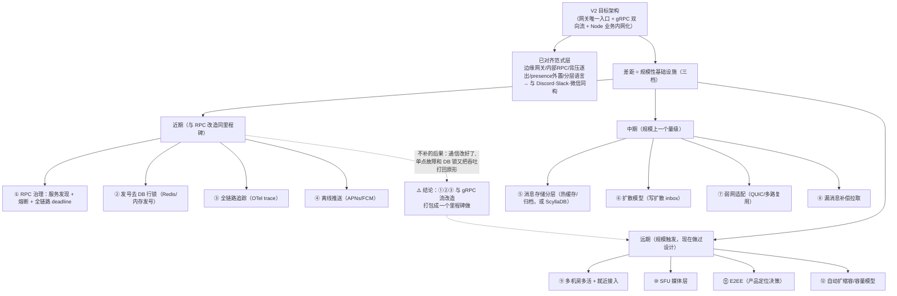

# 26-9-16 · 架构分析：V2 目标架构 vs 业界大型 IM 架构的差距

> 分支 `feat/perf-monitoring`。本文档把"V2 目标架构与业界大型 IM 的差距"分析落盘，作为下一步技术决策的输入。
> 上下文：`docs/架构/系统架构图V2.md`（目标态：gRPC 双向流 + 网关唯一入口）、
> `26-9-16-连接层业务层通信架构演进方案-RPC改造.md`（怎么做）、
> `26-9-16-Go网关压测对比报告.md`（为什么，实测数据）。
> 业界参照：`docs/架构/IM高并发选型-该不该全用Go-业界调研与分层分析.md`（微信/Discord/Slack/WhatsApp/Telegram/Signal 真实选型）。

---

## 0. 结论摘要

1. **架构范式上 V2 已经"毕业"**：边缘长连接网关 + 内部 RPC + 业务层分离这套骨架，与 Discord（Elixir 网关 + Python/Rust 业务）、Slack（Java 网关 + 边缘 Envoy/Flannel）、微信（C++ 接入层 + Svrkit RPC）是**同构**的，差别只在实现规模。
2. **剩下的差距基本都在"规模性基础设施"，且分三档**：近期待补（会先于架构本身卡住的）、中期应补（规模上一个量级后）、远期（现在做是过度设计）。
3. **最危险的三个差距**：RPC 治理缺一半（无服务发现/熔断/全链路 deadline）、发号仍是 DB 行锁、全链路追踪缺失——它们不是"规模到了才需要"，而是 **gRPC 流改造完成后立刻暴露的下一批瓶颈**，应与改造打包成一个里程碑。

---

## 1. 已对齐的（架构范式层，与业界一致）

| 范式 | 业界做法 | V2 现状 |
|---|---|---|
| 边缘长连接网关 + 业务分离 | Discord=Elixir 网关、Slack=Java 网关、微信=C++ 接入层 | gateway(Go) 多副本 + server(Node) 内网化 ✓ |
| 内部 RPC 通信 | 微信 Svrkit（自研 RPC）、Slack 内部服务网格、Discord 进程消息 | V2 的 gRPC 双向流 ✓（方向一致，治理细节待补，见 §2-1） |
| 连接层逐出/背压 | Slack 网关有状态内存 + 慢消费者逐出 | send buffer 打满逐出 + in-flight 背压 ✓ |
| presence 外置 | 业界普遍 Redis/内存 presence | Redis presence + 副本表（presence:meta 存 ReplicaID）✓ |
| 分层语言选型 | 按层选语言（业界无一全栈单语言） | gateway=Go / server=Node / agent=Node ✓ |

---

## 2. 真正的差距（按优先级分三档）

### 2.1 近期待补（与 RPC 改造同周期，不补会先于架构卡住）

| # | 差距 | 业界怎么做 | 我们现状 | 为什么是下一个瓶颈 |
|---|---|---|---|---|
| 1 | **RPC 治理缺一半** | 微信 Svrkit 有完整 overload control；业界普遍服务网格 + 熔断 + 全链路超时 | V2 只有流 + in-flight 背压；无服务发现、无熔断、无全链路 deadline | gateway/server 多副本后，单地址直连与"对端打挂怎么办"马上成为问题 |
| 2 | **发号仍是 DB 行锁** | 微信/QQ 用内存/Redis 原子发号，DB 只做持久化 | 会话 seq 在落库事务内 bump（26-9-14 实测 ≈2000 msg/s 崩在此处：服务内 p99 2.4s） | RPC 改造让并发上行恢复后，DB 行锁竞争将回归基线水平（《RPC 改造方案》§9 已预警），必须同步解决 |
| 3 | **全链路追踪缺失** | OpenTelemetry 标配，一条消息跨服务可串起 trace | 只有 Prometheus 指标 + 直方图（26-9-16 靠它们归因够用，但排障靠猜） | 链路变成"客户端→网关→gRPC→业务→DB"四跳后，没有 trace 无法定位"慢在哪一跳" |
| 4 | **离线推送体系** | 微信/WhatsApp 全部有 APNs/FCM 厂商推送 + 离线信令 | 无推送；离线消息靠下次登录拉历史 | 移动端接入 /ws 之前是短板，接上即硬需求 |

### 2.2 中期应补（规模上一个量级后）

| # | 差距 | 业界做法 | 我们现状 |
|---|---|---|---|
| 5 | **消息存储分层** | 微信：热消息内存/接入层缓存、离线落库、历史归档分介质；Discord：ScyllaDB 宽列存储专为聊天负载设计 | 单一 PostgreSQL，读写同源；`/user/messages` 无 limit 全量返回（26-9-16 实测 2.4 万条 3.9s） |
| 6 | **扩散模型（写扩散 vs 读扩散）** | 微信写扩散（每人一个收件箱，拉取 O(1)）；QQ/Discord 读扩散或混合 | 无 inbox 概念，按会话查全表 |
| 7 | **弱网与移动网络适配** | 微信 TCP 私有协议 + QUIC + 多路复用 + 弱网重传 | 仅 WS over TCP；重连只有指数退避（无 QUIC、无多径、无连接迁移） |
| 8 | **连接级顺序与补偿** | 微信一致性哈希路由到固定逻辑层保证用户级顺序 | 会话 seq + 客户端重发幂等基本够用；断线期间的"漏消息补偿拉取"尚无自动机制 |

### 2.3 远期（规模触发的基建，现在做是过度设计）

| # | 差距 | 业界做法 | 说明 |
|---|---|---|---|
| 9 | **多机房/多活 + 就近接入** | 微信/WhatsApp 全球多机房 + Anycast + 跨机房专线 | 单机房单集群；用户规模没到，做了只有成本 |
| 10 | **媒体层 SFU** | 大厂自研 SFU/级联媒体服务器 | P2P + coturn 中继够当前产品形态；大群通话/会议需 SFU |
| 11 | **端到端加密（E2EE）** | WhatsApp/Signal 双棘轮 E2EE，服务端不可读 | 服务端明文可读；这是产品定位决策，非性能架构 |
| 12 | **容量与弹性** | K8s HPA、压测常态化、容量模型 | 手动部署 + `GATEWAY_MAX_CONNS=50000` 硬上限；已有监测设施但无自动扩缩容 |

---

## 3. 差距分层图

---

## 4. 总体判断与行动建议

1. **别被"差距清单"吓到**：范式层已经对齐，12 项差距里 8 项是"规模到了才需要"（§2.2、§2.3），当前补是过度设计。
2. **打包里程碑**：§2.1 的 ① RPC 治理、② 发号改造、③ 全链路追踪 应与《RPC 改造方案》的 P1-P2 合并为一个里程碑——否则会出现"通信改好了，但单点故障和 DB 锁又把吞吐打回原形"的局面。④ 离线推送随移动端接入 /ws 排期。
3. **用数据说话**：每补一项差距，按 `docs/监测设施/README.md` 的 skill 提示词复测对应场景（如发号改造后重跑 tp_r20~r30 验证拐点右移），归档 `测试报告/<日期>/`。

---

## 附：引用来源

- 业界选型调研（微信/Discord/Slack/WhatsApp/Telegram/Signal 真实技术栈）：`docs/架构/IM高并发选型-该不该全用Go-业界调研与分层分析.md`
- V2 目标架构：`docs/架构/系统架构图V2.md`
- RPC 改造方案（含 DB 行锁预警 §9）：`26-9-16-连接层业务层通信架构演进方案-RPC改造.md`
- 实测数据：`26-9-16-Go网关压测对比报告.md`（dial 耗尽/串行排队/DB 行锁拐点）+ `../26-9-14/`（纯 Node 基线）
