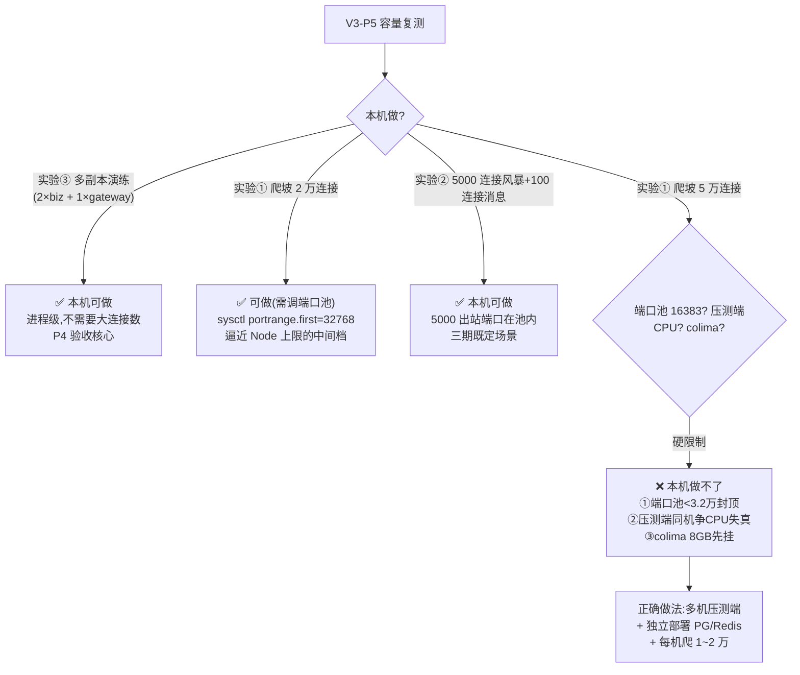

# V3-P5 容量复测 · 本机可行性分析（为什么需要独立多机环境）

> 背景:`系统架构图V3.md` §6 的 V3-P5 要求「2~5 万连接爬坡 + 风暴混合场景 + 独立多机环境」,
> 验收对照三期报告 §8 四个实验。本文回答:**本机到底能不能做、被什么卡住、哪些可以本机先做**。
> 所有结论均附本机实测证据(命令输出/压测数据),不含推测。

---

## 0. 一句话结论

**本机做不了 5 万连接爬坡——不是"机器性能不够"的单点问题,而是三层硬限制叠加**:
① macOS 临时端口池仅 16383 个(5 万连接物理上建不起来);② 压测端与被测同机争 CPU(1 万爬坡建连 p50 已 120ms,5 万时压测端自己先崩、数据失真);③ colima 中间件 8GB/4CPU 在混合负载下先挂(3000 msg/s 已失联 2 次)。
但 P5 的**多副本演练、2 万爬坡、5000 连接混合场景本机可做**,建议先做这些。

---

## 1. V3-P5 的定义与本机环境实测参数

### 1.1 P5 验收内容(对照三期报告 §8 四个实验)

| 实验 | 内容 | 目的 |
|---|---|---|
| ① 连接爬坡 | 1 万→5 万连接,记录建连成功率/业务 RTT/内存 | 击穿 Node 连接上限(推测 3~5 万劣化) |
| ② 风暴+业务混合 | 5000 连接心跳风暴 + 100 连接持续发消息 | 验证连接 I/O 不挤占业务 RTT |
| ③ 业务层横向扩展 | 多副本业务层 + 单一 gateway | 架构级收益验证(非性能指标) |
| ④ 独立多机 | 压测端/被测端分离,复测全量场景 | 消除同机干扰(三期 §8 原话:"当前同机 colima 在 3000 msg/s 即失联,掩盖了两侧差异") |

### 1.2 本机实测参数(2026-09-17 采集)

| 项 | 实测值 | 来源 |
|---|---|---|
| 内存 / CPU 核 | 48GB / 10 核(Apple Silicon) | `hw.memsize` |
| colima VM | **4 CPU / 8GB**,承载 PG/Redis/MinIO/Prometheus | `colima list` |
| macOS 临时端口池 | `49152~65535` = **16383 个** | `sysctl net.inet.ip.portrange` |
| 文件描述符上限 | 1048575(已放开,非瓶颈) | `ulimit -n` |
| 1 万连接爬坡实测 | gateway RSS 332.5MB / 业务层 276.3MB / **建连 p50 120~158ms** | `s6_ramp_gateway.json` |
| 过载失联史 | 3000 msg/s 把 colima PG/Redis 压失联 **2 次**(本次)+ 三期 3 次 | 压测日志 |

---

## 2. 三个硬限制逐项分析

### 2.1 限制一:端口池 16383 < 5 万(物理建不起来)

```
$ sysctl net.inet.ip.portrange.first net.inet.ip.portrange.last
net.inet.ip.portrange.first: 49152
net.inet.ip.portrange.last:  65535      ← 可用临时端口 = 16383 个
```

压测端 5 万条 WS 出站连接,每条连接需要一个临时端口(四元组 `srcIp:srcPort:dstIp:dstPort` 唯一)。
本机压测端只有一个源 IP,则最大出站连接数 ≈ 临时端口数:

- 默认配置:16383 个 → 连 2 万都勉强;
- 调 `net.inet.ip.portrange.first=32768` 后:约 32767 个 → **3.2 万封顶**;
- 要 5 万:必须**多源 IP(本机加别名 IP)或多台压测机**。

另注意:gateway 自身出站(gRPC 流、Redis、PG)也占临时端口,实际可用更少。

### 2.2 限制二:压测端与被测同机争 CPU,测量失真

本机 1 万爬坡的建连耗时:

| 档位 | 建连 p50 | 建连 p99 |
|---|---|---|
| 2000→4000 | 120~128ms | 237~257ms |
| 6000→10000 | 138~158ms | 270~319ms |

回环建连正常应 <10ms。p50 已达 120ms+,说明**压测端 Node 进程(1 万 ws 客户端 + 注册/登录)的 CPU 已吃紧**,
连接耗时里大部分是压测端自己的事件循环排队,不是被测系统的能力。

- 5 万客户端时压测端先崩:5 万 ws 客户端 ≈ 1~2.5GB 内存 + 心跳定时器风暴,Node 单进程事件循环必然饱和;
- 即使压测端扛住,测到的也是「压测端与被测抢 CPU 后的混合值」,无法归因;
- 这正是三期 §8.④ 要求独立多机的原因:同机数据对 1 万档尚有参考价值,对 5 万档**无参考价值**。

### 2.3 限制三:colima 中间件 8GB/4CPU,混合负载先挂

- P5 的"风暴混合场景"包含消息负载;本机实测 **3000 msg/s 就把 colima 内 PG/Redis 压失联**(本期 2 次 + 三期 3 次);
- 5 万连接即使不主动发消息,presence 心跳(25s/次)= 2000 次登记/s 进 Redis——Redis 可扛,但一旦叠加消息流量,PG 立即过载;
- colima 8GB 里 PG 的 shared_buffers/连接池与宿主机其余负载(业务层、gateway、压测端)互相挤占,无法给出干净的中间件能力基线。

---

## 3. 结论:本机"能做什么 / 不能做什么"



---

## 4. 建议执行顺序(本机先做的部分)

| 顺序 | 事项 | 对应 | 价值 |
|---|---|---|---|
| ① | **多副本演练**:2×biz + 1×gateway,同库同 Redis,双跑压测全场景 | 实验③ / V3-P4 | 验证"无状态 ×N"承诺——这是 P4 的验收闭环,优先级高于 P5 |
| ② | 2 万连接纯爬坡 | 实验① 中间档 | 比 1 万更逼近 Node 3~5 万劣化点,数据可积累 |
| ③ | 5000 连接心跳风暴 + 100 连接消息混合 | 实验② | 验证连接 I/O 与业务 RTT 隔离(Go 业务层的结构性优势点) |
| ④ | 5 万爬坡 + 全量复测 | 实验①/④ | 需多机压测端 + 独立中间件,暂缓 |

> 注:做①之前必须先落地「定向下行 + gRPC health」(见 `26-9-17-gobiz-后续优化项分析.md`),
> 否则多副本下的下行 pub/sub 全副本广播与健康检查缺失会干扰演练结论。

---

## 5. 附:本机做 2 万爬坡的操作要点(后续执行时用)

1. `sudo sysctl -w net.inet.ip.portrange.first=32768`(压测端出站端口扩池);
2. 压测端 harness 用**多进程**(如 4×5000 连接)规避单进程事件循环饱和;
3. 爬坡期间关闭本地其它负载(IDEA/浏览器),colima 只跑中间件;
4. 数据仍按 `docs/监测设施/README.md` 流程归档,场景标记 `s6_ramp_20k`。
