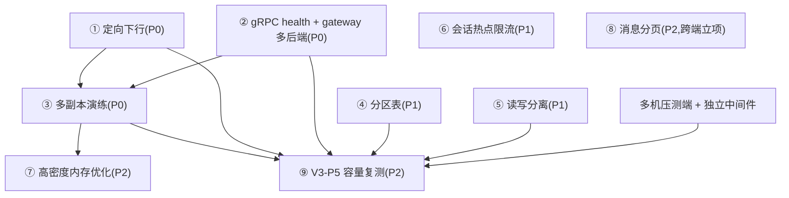
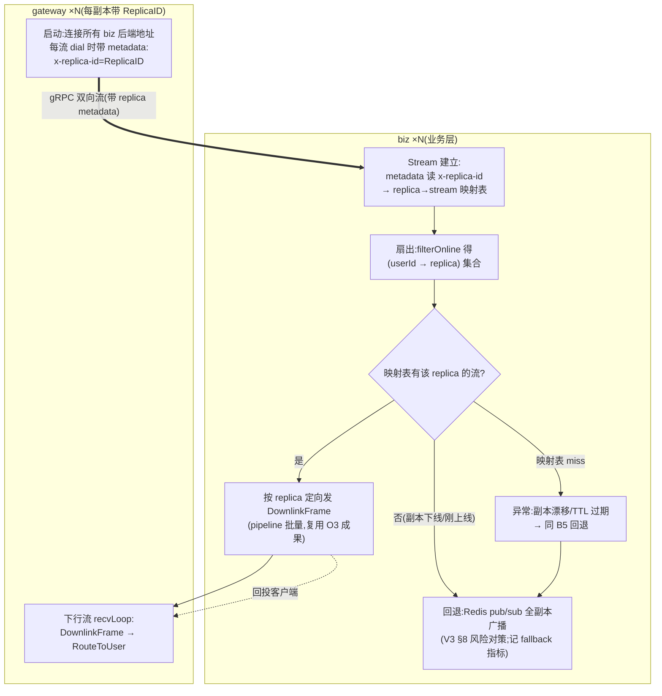

# 后续优化项分析（V3 目标态剩余工作）

> 背景:业务层 Go 重写已验收(见同目录《26-9-16-gobiz-业务层Go重写验收报告.md》),
> 对照 `docs/架构/系统架构图V3.md` 的差距清单见该报告 §12。本文对每项剩余工作做**方案级分析**:
> 现状证据 → 改造方案 → 工作量粗估 → 风险 → 验收标准,并给出依赖关系与执行路线。
> 分析结论先行的原则:**先做"多副本正确性/可达性"这条线(定向下行 + health + 多副本演练),再做 DB 容量线与保护线;跨端大改动(消息分页)单独立项**。

---

## 0. 总览与优先级

| # | 优化项 | 类别 | 优先级 | 工作量(人天,粗估) | 依赖 | 本机可做 |
|---|---|---|---|---|---|---|
| 1 | **定向下行**(gRPC 下行流按 replica 定向) | 分布式可达性 | **P0** | 3~4 | 无(方案见 §2) | ✅ |
| 2 | gRPC health + gateway 多后端地址 | 分布式可达性 | **P0** | 1~2 | 无 | ✅ |
| 3 | 多副本部署演练(2×biz + 1×gateway) | 验收 | **P0** | 2~3 | 1+2 | ✅ |
| 4 | messages 分区表(哈希 64 分区) | DB 容量 | P1 | 4~6 | 无 | ✅(单实例验证) |
| 5 | 读写分离(只读副本 + 读接口路由) | DB 容量 | P1 | 3~5 | 需 PG 副本 | ⚠️(内存紧张) |
| 6 | 会话热点限流 | 保护 | P1 | 1~2 | 无 | ✅ |
| 7 | 高连接密度内存优化 | 容量 | P2 | 3~5 | 与 3 联动 | ✅ |
| 8 | messages 历史全量分页 | 跨端大改动 | P2 | 8~12(含客户端) | 客户端配合 | ⚠️ 跨端 |
| 9 | V3-P5 容量复测(2~5 万爬坡+风暴混合) | 验收 | P2 | 5+ | 1+2+3+多机环境 | ❌ 见可行性分析 |

**依赖关系:**

---

## 1. 优化项 #1 · 定向下行(方案详述,最高优先级)

### 1.1 目标与现状

- **目标**(V3 §4.3):business 按 presence.replica 直接把 DownlinkFrame 发给持有连接的网关副本,替代 Redis `gw:downlink` 全副本广播。
- **现状证据**:
  - biz 下行仍走 Redis pub/sub(`biz/internal/service/downlink.go` 的 `DownlinkChannel = "gw:downlink"`);
  - proto 已定义 `DownlinkFrame`(server→gateway,语义与 pub/sub 载荷一致),**但全链路无人使用**;
  - gateway 接收侧已就绪:`NewGrpc(onDownlink)` → `hub.RouteToUser`(`gateway/cmd/gateway/main.go:68`、`internal/upstream/grpc.go:228-230`);
  - presence 已登记 replica id:`presence:{userId}:meta` HASH `deviceId → "{replica}:{socketId}"`(`gateway/internal/presence/presence.go:38`),biz 的 `DeviceEntry.Replica` 字段已解析;
  - **缺口 1**:gateway 连接 biz 时未上报自身 replica id → biz 不知道"哪条流属于哪个副本";
  - **缺口 2**:gateway `EDGE_GRPC_ADDR` 是**单地址**(`gateway/internal/config/config.go`),多副本需地址列表 + 客户端 LB。

### 1.2 改造方案

**步骤分解**:

| 步骤 | 内容 | 改动面 |
|---|---|---|
| a. 流身份上报 | gateway `NewGrpc` 用 `grpc.WithPerRPCCredentials`/dial option 给 Stream 附 `x-replica-id` metadata(**不动 proto**,元数据即够) | gateway 1 个文件 |
| b. 流注册表 | biz realtime:Stream 建立时 `metadata.FromIncomingContext` 读 replica → 维护 `replica→stream` 映射(replica 空则标记"无标识流"降级处理) | biz 2 个文件 |
| c. 定向扇出 | 替换 `FanoutDownlink`:按 presence 的 `DeviceEntry.Replica` 分组,逐 replica 走流下行;**流缺失/发送失败回退 pub/sub** | biz 2 个文件 |
| d. 多后端地址 | gateway config `EDGE_GRPC_ADDR` 支持逗号分隔多地址,每地址一组流 | gateway 1 个文件 |
| e. 观测 | 指标:定向下行命中率、pub/sub 回退计数;对齐契约(指标名加 `server_downlink_direct_total`/`server_downlink_fallback_total`) | 两侧 |

### 1.3 一致性论证(多副本安全前提复核)

- 发号:Redis INCR 全局单调 ✅;幂等:DB 唯一约束 ✅;忙线:Lua 原子 ✅(O0 三件套已就绪);
- presence 读是弱一致的(TTL 60s):replica 漂移窗口内回退 pub/sub 即可兜底(V3 §8 已有对策);
- 单聊 2 成员跨副本、群聊 N 成员跨副本,均为"查 replica → 定向"同一路径,无新增竞态。

### 1.4 工作量 / 风险 / 验收

- 工作量:3~4 人天(步骤 a~d 各半~1 天,e 半天,联调 1 天)。
- 风险:①metadata 大小写(HTTP/2 header 小写化,统一 `x-replica-id`);②回退路径与 pub/sub 并存期间双投(过渡期**只走 pub/sub,验收通过后开关切换**,避免双通道双投);③多后端地址时流分片数配置放大(4 流/副本 × N 副本)。
- 验收:2×biz 双跑 + 单 gateway,全场景回归;`gw:downlink` 订阅可摘除后扇出延迟不劣化(span 保持 ~2ms);副本下线演练:该副本用户消息经回退路径正常送达。

---

## 2. 优化项 #2 · gRPC health + gateway 多后端地址

| 维度 | 内容 |
|---|---|
| 现状 | biz gRPC 服务无 health 协议;gateway `EDGE_GRPC_ADDR` 单地址,副本扩缩容时需改配置重启 |
| 方案 | biz 注册标准 `grpc.health.v1.Health`(Serving/NotServing);gateway 建流前 health 探活 + 现有退避重连复用;地址列表化(见 §1 步骤 d) |
| 工作量 | 1~2 人天 |
| 验收 | 副本滚动重启:gateway 流自动迁移,无消息丢失(断连窗口内消息经 pub/sub 回退/重连补投) |

---

## 3. 优化项 #3 · 多副本部署演练(2×biz + 1×gateway)

| 维度 | 内容 |
|---|---|
| 内容 | 同库同 Redis 起 2 个 biz 副本(3007/3009 + gRPC 3008/30081),gateway 配双地址;复用三期全场景(11 主场景 + 专项)压测 |
| 重点观察 | ①双副本下行对账(每成员恰好收到一次,不重复不遗漏);②INCR/幂等并发正确性(harness 已有乱序重发);③单副本被杀时在线用户消息可达性 |
| 工作量 | 2~3 人天(含脚本:双副本起停、故障注入) |
| 验收 | 全场景零错误 + 下行无重复;Kill 演练:p99 恢复 <3s |

> 注:演练前完成 §1/§2;演练数据归档 `docs/监测设施/测试报告/<日期>/`,并更新主报告 §12。

---

## 4. 优化项 #4 · messages 分区表(哈希 64 分区)

| 维度 | 内容 |
|---|---|
| 现状 | messages 单表(迁移 `0001_initial` 无分区);三期实测单表 122 万行已现写入/索引压力 |
| 方案 | PG 声明式分区:`CREATE TABLE messages (...) PARTITION BY HASH (conversation_id_text_hash)` 64 片;迁移窗口:新表+回填+改名切换(分区键选定后不可变,V3 §8 风险对策);**注意** conversation_id 是 varchar,需先加 `conv_hash = hashtextextended(conversation_id,0) % 64` 生成列作分区键,查询侧改走该列 |
| 本机验证 | colima 单实例可验证 DDL/查询计划/回填耗时;**真实收益需独立 PG**(本机 8GB 内存做不了分区分流观测) |
| 工作量 | 4~6 人天(DDL/迁移脚本/查询改造/验证) |
| 验收 | 分区前后压测对比:tp_r30 档 PG CPU 与写入放大下降;`\d+ messages` 确认 64 分区 |

---

## 5. 优化项 #5 · 读写分离

| 维度 | 内容 |
|---|---|
| 现状 | store 单写库连接池;`/user/messages` 全量读(大会话 p99 5.9s)挤占写路径 |
| 方案 | ①基础设施:PG 只读副本(colima 内起第二个 PG + 流复制,8GB 内存紧张,**建议与独立多机环境一并落地**);②代码:config 加 `PG_READONLY_URL`,store 双连接池,读接口(query 类方法)走只读池,写/事务走写池;③路由清单:userConversations/messages/lastMessages/sync/mentions/friend 读接口 |
| 工作量 | 3~5 人天(副本搭建 + 路由改造 + 回归) |
| 验收 | 读接口功能回归 + 压测:写路径 p99 在混合负载下不再被读放大 |

---

## 6. 优化项 #6 · 会话热点限流

| 维度 | 内容 |
|---|---|
| 现状 | 仅认证限流(按 IP);无按会话的消息率保护,V3 §4.3「单会话消息率超限时按会话限流」未做 |
| 方案 | Redis `INCR conv:rate:{convId}` 1s 窗口计数,超阈值(如 500 msg/s/会话)返回 `message.error`(带 clientMsgId,客户端收敛 pending,与既有错误语义一致);阈值可配,网关级流量不受影响;单聊群聊同路径 |
| 语义注意 | 拒绝帧要带明确 error 文案(客户端不重发风暴);与客户端 5s 重发机制的关系要在验收中实测(拒绝后客户端退避,不得放大) |
| 工作量 | 1~2 人天 |
| 验收 | 单会话打爆实验:会话内发送方被限流,其余会话/在线成员不受影响 |

---

## 7. 优化项 #7 · 高连接密度内存优化

| 维度 | 内容 |
|---|---|
| 现状 | 1 万连接 biz RSS 276~287MB > Node 175MB(+58~64%);主因每连接 2 个流 goroutine(栈+缓冲) |
| 方案(按性价比排序) | ①gRPC 参数调优:单流 `MaxRecvMsgSize`/初始窗口/HTTP2 流控窗口调小,降低 per-stream buffer(低风险,先做);②buffer 池化(帧字节复用 `sync.Pool`);③goroutine 池化(收益大但改造深,破坏 gRPC 标准模型,**仅当 10 万连接成为真实需求时立项**) |
| 工作量 | 3~5 人天(①+②;③另估) |
| 验收 | 1 万连接爬坡 RSS 对比基线下降 ≥30%;2 万连接爬坡(配合可行性文档的操作要点)不劣化 |

---

## 8. 优化项 #8 · messages 历史全量分页(跨端立项)

| 维度 | 内容 |
|---|---|
| 现状 | `/user/messages` 全量返回(与 Node 同语义),大会话 p99 5.9s;数据量持续增长 |
| 方案 | 游标分页(beforeSeq + limit),与 sync 机制区分(分页=历史回看,sync=增量);**协议变更**:web wsClient/移动端拉取逻辑改动——**打破"客户端零改动"承诺,需单独立项、双端灰度** |
| 工作量 | 8~12 人天(服务端 2~3 + web 3~4 + iOS 2~3 + 联调) |
| 验收 | 大会话首屏延迟 <200ms;客户端旧版本兼容(降级全量) |

---

## 9. 优化项 #9 · V3-P5 容量复测

见同目录《26-9-17-gobiz-V3P5容量复测本机可行性分析.md》——需多机压测端 + 独立中间件,依赖 §1/§2/§3 完成。

---

## 10. 执行路线(建议分三批)

| 批次 | 内容 | 出口条件 |
|---|---|---|
| **批 1(本周可启动)** | §1 定向下行 → §2 health/多后端 → §3 多副本演练 | 多副本全场景零错误,主报告 §12 第 1/2/5/6 项闭环 |
| **批 2(DB 容量线)** | §4 分区表(本机验证)→ §5 读写分离(等独立 PG)→ §6 热点限流(可与批 1 并行) | 分区 DDL 就绪;限流上线 |
| **批 3(容量/跨端)** | §7 内存优化 → §8 分页立项 → §9 多机容量复测 | 5 万爬坡数据落盘,V3 目标态验收 |

> 每批完成后按惯例归档数据与更新验收报告,回滚开关(`GATEWAY_UPSTREAM` / `REALTIME_MODE`)全程保留。
