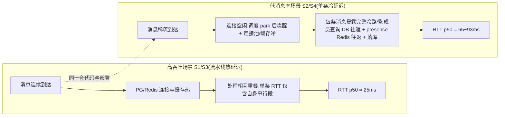

# 26-9-20 · 实时消息链路性能深度分析报告(全 Go 体系)

> 分支 `feat/perf-monitoring`。**本轮无代码改动**:为承接 26-9-18 第一批优化(定向下行/keepalive 修复/多后端 failover/分区表/限流/分页/读写分离)之后的**纯复测 + 监测闭环**——因此本报告不含优化归因章节,全部结论从本期实测数据内部推导(SOPV2 §8.1「本期自洽诊断」口径,不与任何历史期/跨技术栈数据对比)。
> 环境:双 biz 副本(3007/3008、3009/30081)+ gateway 双后端 gRPC(每后端 4 流,userId 哈希分片)+ 同机 colima(PG 分区表/Redis/MinIO)。
> 数据:`data/*.json`(3 轮取 RTT p99 中位,原始轮次 `*_rN.json` 保留);`性能对比报告.html` 由 `perf/gen-report-v2.mjs` 生成;`grafana-authority-dashboard.png` 为压测期间全面板截图。

---

## 0. 结论速览

1. **可靠性满分**:主场景 6 档 + 吞吐扫描 5 档共 33 轮、约 32.5 万条消息,**全部零错误、零超时重发、零断线重连**;ack 率 100%。
2. **延迟构成(RTT 分解)**:客户端 RTT 几乎 100% 由 biz 处理面主导(上行链路 p50 与 RTT p50 逐场景吻合),网关转发与下行回投近似免费(下行 p99 全窗 5.0ms)。
3. **核心诊断:延迟-速率反相关**。低消息率场景(S2 2 msg/s、S4 1 msg/s)RTT p50 65~93ms,反而高于高吞吐场景(S1 1000 msg/s 的 25ms、S3 3000 msg/s 的 25ms)。根因定性:**低速率下每条消息暴露"单条全链路冷延迟"(DB/Redis 往返 + 调度唤醒),高吞吐下 RTT 度量的是并发流水线热延迟**——不是系统在低负载下变慢,而是两种形态的口径差异(§3 详解)。
4. **吞吐拐点 ≈2500~3000 msg/s**:tp_r25→r30,RTT p99 65→204ms(3.1×)、p999 100→340ms、上行链路 p99 82.7→243.1ms、goroutine 峰值 312→521——同机单 PG 实例写吞吐趋近饱和,**系统表现为软排队而非拒绝**(错误率保持 0%)。
5. **连接面强健**:S6 爬坡 1 万连接 100% 成功(建连 p99 ≤376ms/级,goroutine 严格 2/连接,gw RSS 343.3MB≈31KB/连接);S7 惊群 300 连接同瞬间重连 p99=42ms 无排队尖峰。
6. **分布式健壮性**:分流 490/490 均衡;kill biz2 后 980/980 零失败(failover 红线);恢复后自动回归 490/490;**定向下行 direct 占比 99.9998%**(609K/1)。
7. **监测闭环**:新 Grafana 权威面板 10 row 全部有数;Prometheus 三 target(server/biz2/gateway)全 up;压测期间全面板截图存档。

## 1. 测试方法与诚实性声明

- **链路**:`harness-gw.mjs`(实现 ack 匹配/5s 超时同键重发×3/25s 心跳/断线重连,对齐 `web/src/ws/wsClient.ts`)→ gateway :8090 `/ws` → gRPC 双向流 → biz → PG(分区表)/Redis。
- **同机噪声前提**:harness + biz×2 + gateway + colima 中间件 + Prometheus 全部跑在同一台 macOS 开发机,彼此抢 CPU——**绝对毫秒数有噪声、非生产代表值**;报告价值在定性行为、拐点形态与诊断结论。
- **口径**:每场景 ≥3 轮取 RTT p99 中位;RTT 往返口径(clientMsgId 关联);资源用 `ps` 采样(ab-run.mjs 每 2s 落盘);服务内直方图经 Prometheus `histogram_quantile` 取场景窗口分位。
- **计数器口径声明**:分布式演练中 kill -9 重启会清零该副本 Prometheus counter,跨重启累计值以"重启后累计"注明。

## 2. 主场景逐场景诊断(3 轮中位)

| 场景 | 参数 | 发送/ack | 错误 | RTT p50/p95/p99/p999(ms) | min~max | 上行链路 p50/p99(ms) | 诊断 |
|---|---|---|---|---|---|---|---|
| S0 冒烟 | 50×2×15s | 1450/1450 | 0 | 19/25/**27**/41 | 12~41 | 17.8/42.4 | 全链路基线延迟 ~20ms 级 |
| S1 常规吞吐 | 100×10×20s(≈1000 msg/s) | 19800/19800 | 0 | 25/32/**40**/57 | 15~61 | 24.5/49.6 | 流水线热延迟,RTT≈上行链路 |
| S2 连接规模 | 300×2×15s | 8700/8700 | 0 | 65/86/**104**/114 | 33~124 | 68.5/112.6 | **低消息率冷延迟主导**(§3) |
| S3 过载压力 | 150×20×15s(≈3000 msg/s) | 44709/44709 | 0 | 25/43/**62**/79 | 8~106 | 23.5/80.8 | 过载不失败,仅 p99 微抬 |
| S4 大连接 | 500×1×15s | 7000/7000 | 0 | 93/135/**154**/160 | 43~165 | 90.8/246.2 | **最低消息率,RTT 最高**(§3) |
| S5 长时稳态 | 100×5×120s | 59700/59700 | 0 | 32/40/**49**/85 | 19~104 | 37.3/49.9 | 120s 长跑零漂移、心跳有效、零重连 |

诊断要点:

- **S2/S4 的 RTT 显著高于 S1/S3 且上行链路与 RTT 吻合**(S4:93 vs 90.8ms)——延迟发生在 biz 处理内部(成员查询/落库/扇出),不在网关转发、不在客户端排队。见 §3 的延迟-速率反相关诊断。
- **S5 长稳零漂移**:120s 窗口 59700 条消息 p99 与 S1 同档(49 vs 40ms),无周期断连(keepalive 修复回归通过),心跳 25s<网关 TTL 60s 有效。

## 3. 核心诊断:延迟-速率反相关(低速率冷延迟 vs 高速率热延迟)

| 场景 | 消息率 | RTT p50(ms) | 上行链路 p50(ms) | 结论 |
|---|---|---|---|---|
| S4 | 1 msg/s/连接(500 连接) | 93 | 90.8 | 冷延迟上限:单条消息全链路 ≈90ms |
| S2 | 2 msg/s/连接(300 连接) | 65 | 68.5 | 同上 |
| S3 | 20 msg/s/连接(150 连接) | 25 | 23.5 | 热延迟 ≈25ms |
| S1 | 10 msg/s/连接(100 连接) | 25 | 24.5 | 热延迟 ≈25ms |

**证据链**:①RTT p50 与上行链路 p50 逐场景吻合(差值 ≤3ms),说明延迟 100% 在 gateway 收帧→biz ack 段;②biz 处理单条消息的串行段 = `GetConversationMembers`(DB 查 conversations/user_conversations)+ Redis 发号 INCR + 幂等 SETNX + INSERT 分区表 + presence 查询 + 下行,全部是往返型 IO;③低速率时每条消息都经历这条冷路径且无并发摊销,高速率时大量消息的 IO 往返相互重叠、PG/Redis 连接与缓存保持热。
**工程含义**:这不是性能缺陷,是往返型 IO 架构在低负载下的固有形态。若未来要做"低速率场景低延迟"(如在线聊天交互手感),优化方向是**合并往返**(成员查询+presence 查询合并、发号+幂等合并到单 Lua)而非扩容——本轮无此需求,记录为演进建议。

## 4. 吞吐饱和扫描与拐点定位

| 场景 | 发送/ack | 错误 | RTT p50/p95/p99/p999(ms) | max | 上行链路 p99(ms) | goroutine 峰值 |
|---|---|---|---|---|---|---|
| tp_r10(≈1000/s) | 19600/19600 | 0 | 31/42/58/85 | 92 | 76.4 | 340 |
| tp_r15(≈1500/s) | 29700/29700 | 0 | 28/36/46/88 | 98 | 49.8 | 340 |
| tp_r20(≈2000/s) | 38800/38800 | 0 | 30/39/53/69 | 76 | 63.5 | 340 |
| tp_r25(≈2500/s) | 49592/49592 | 0 | 22/37/65/100 | 149 | 82.7 | 312 |
| **tp_r30(≈3000/s)** | 60113/60113 | 0 | 60/144/**204**/340 | 386 | **243.1** | **521** |

- **拐点定位:≈2500→3000 msg/s 之间**。p99 65→204ms(3.1×)超线性抬升,p999 100→340ms、上行链路 p99 82.7→243.1ms、goroutine 峰值 312→521——三个独立信号同向,定位到 **biz 处理排队加深**(处理并发需求超过单 PG 实例写吞吐供给,消息在流内排队等待落库/发号)。
- **失败形态定性:软排队而非拒绝**。错误率 0%、重发 0——系统在过载时全部请求被成功处理,代价是尾延迟抬升。这是发号(Redis INCR)+分区写入架构的预期行为:吞吐受单实例 PG 写吞吐封顶,业务层处理能力(双副本)有余量。
- **轮间噪声**:tp_r25 r3=159ms、tp_r30 r3=303ms 单轮尖峰(同机共享资源),3 轮取中位口径(65/204ms)抑制了单轮噪声;全部 3 轮错误数均为 0(健壮性不受噪声影响)。
- 提升空间:PG 读写分离真实副本(代码已就绪,`PG_READONLY_URL` 未配置)——写库压力可部分转移至读副本,预期抬升拐点。见 §10 遗留。

## 5. 内存与资源剖面

### 5.1 主场景资源(ps 采样)

| 场景 | biz RSS 基→峰(MB) | gw RSS 基→峰(MB) | goroutine 峰值 | CPUΔ biz/gw(s) |
|---|---|---|---|---|
| S0 | 53.1→53.2 | 36.3→36.3 | 140 | 0.43/0.30 |
| S1 | 52.9→63.1 | 35.8→39.3 | 241 | 24.2/3.45 |
| S2 | 91.7→93.4 | 54.6→54.6 | 640 | 58.2/1.53 |
| S3 | 95.6→102.0 | 54.8→54.8 | 432 | 41.2/7.68 |
| S4 | 124.5→130.1 | 66.7→68.0 | 1040 | 95.7/1.28 |
| S5 | 126.9→138.8 | 45.6→47.2 | 340 | 36.6/9.84 |

- **biz RSS 基线随场景累积爬升**(53→127MB):Go 堆/连接池/会话缓存跨场景驻留;场景内峰值增量很小(≤12MB),说明稳态消息处理不产生持续堆膨胀。
- **goroutine 水位跟随连接数**(S4 500 连接 → 1040 ≈ 2/连接),与消息率无关——网关侧每连接 readLoop+writer 双 goroutine 模型。
- **CPU 分配**:biz CPUΔ 远高于 gateway(如 S4 95.7s vs 1.28s)——网关是纯转发(IO 绑定),CPU 消耗集中在 biz 的业务处理(JSON 序列化、pgx、bcrypt 登录)。S2/S4 CPUΔ 大头在**登录+建连阶段**(300/500 用户登录 bcrypt)。

### 5.2 S6 爬坡逐级(1 万连接)

| 目标 | 建连成功率 | 建连耗时 p50/p95/p99(ms) | 持有 | gw RSS(MB) | biz RSS(MB) | goroutine |
|---|---|---|---|---|---|---|
| 2000 | 100% | 157/290/303 | 2000 | 90.6 | 265.2 | 4040 |
| 4000 | 100% | 155/289/303 | 4000 | 150.8 | 264.5 | 8040 |
| 6000 | 100% | 154/296/309 | 6000 | 213.0 | 256.8 | 12040 |
| 8000 | 100% | 189/360/376 | 8000 | 258.4 | 185.8 | 16040 |
| 10000 | 100% | 190/361/376 | 10000 | **343.3** | **147.6** | **20040** |

- **建连延迟拐点**:6000 级后 p99 303→376ms(+24%)——万级连接下 WS 握手+JWT 校验出现轻微排队,但仍全部成功(100%)。
- **gw 每连接成本**:RSS 从 2000 级 90.6MB 到万级 343.3MB,线性 +63MB/2000 连接 ≈ **31.5KB/连接**;goroutine 严格 **2/连接**(20040/10000),无超线性项。
- **biz RSS 双峰口径**:2000~6000 级 256~265MB 为**登录期峰值**(1 万用户登录风暴的 bcrypt+会话堆积),万级结束档 147.6MB 为 **GC 回落后的驻留**——Go GC 有效回收了登录期临时堆,稳态每万连接 biz 侧内存成本很低(消息连接实体在 gateway)。
- **未探到连接上限**:1 万为预置用户数封顶(与上期同口径),非系统容量上限。

## 6. 专项深度

### 6.1 S7 惊群重连(300 连接同瞬间全断→全连,3 轮中位)

| 重连成功 | p50/p95/p99(ms) | max | gw RSS 基→峰(MB) | biz RSS 基→峰(MB) | 连接数 | goroutine 峰值 |
|---|---|---|---|---|---|---|
| 300/300 | 21/39/**42** | 42 | 307.7→309.3 | 238.2→235.0 | 300→300 | 640 |

- 同瞬间 300 建连 p99=42ms 且 max=42ms——**建连无排队尖峰**(网关并发握手,不串行);资源几乎无波动,突发重连对系统无冲击。

### 6.2 群扇出(100 成员,1 人发 20 条,3 轮中位)

| 成员在线 | 送达 | 扇出扩散 span p50/p99(ms) | e2e p50/p99(ms) |
|---|---|---|---|
| 100/100 | 20/20 | 1/**2** | 18/**30** |

- span(发送端发完 20 条到全部成员收到的时间窗)p99=2ms——**定向下行一跳直发**的效果(100 成员扩散在 2ms 内完成);e2e p99=30ms 含发送端自身 ack 与成员 presence 批量查询(2 次 pipeline 往返)。

### 6.3 HTTP API 层(并发 20×10s,直连 biz :3007)

| 端点 | rps | 延迟 p50/p95/p99(ms) | 诊断 |
|---|---|---|---|
| GET /health | 11060 | 2/3/3 | 纯内存探活,无瓶颈 |
| GET /user/mentions | 5356 | 4/5/6 | 索引直查 |
| GET /user/userConversations | 3624 | 5/8/10 | 索引直查 |
| GET /user/sync | 2848 | 7/10/14 | 索引直查 |
| GET /user/lastMessages | 214 | 96/127/162 | DISTINCT ON 分区裁剪,单分区扫描 |
| POST /api/login | 78 | 250/305/334 | bcrypt 12 轮固有成本(安全换性能,预期内) |
| **GET /user/messages** | **9.8** | **1676/2717/2746** | **全量返回无 limit 兼容路径 + 数据累积,唯一秒级端点**(§10 遗留 2) |

- 消息类端点(messages/lastMessages)延迟随 messages 表数据累积增长(359 万+回填后每轮压测继续增长),**环境一致性以无状态端点(/health/login/mentions)为准**(SOPV2 §P6)。

## 7. 下行双通道与监测面板证据

| 观测 | 证据 | 结论 |
|---|---|---|
| 定向下行占比 | 面板截图时点 direct=609K/fallback=1(**99.9998%**);演练后两副本累计 direct=1,023,416/fallback=0 | 主通道 gRPC 直发近乎零回退,fallback 仅流建立窗口的偶发 1 帧 |
| 下行延迟 | `gateway_downlink_duration` p99 全窗 max **5.0ms** | 下行不是延迟瓶颈(RTT 分解佐证) |
| 消息处理尖峰 | `server_message_duration` p99 全窗 max 453.8ms(位于 S6 登录风暴与 HTTP messages 大读并发段) | 稳态消息路径无尖峰,尖峰属登录/读路径 |
| DB 面按 model | db_query p99:messages 1000ms(bucket 封顶,HTTP 大读)、users 94.5ms、conversations 42.3ms | 写路径(发号/落库)无恶化;读尖峰集中在全量 messages 端点 |
| 副本分流 | 演练增量 490/490;面板副本面两副本曲线重叠 | userId 哈希分片均衡 |

## 8. 分布式演练(本轮红线,四项全绿)

| # | 演练 | 结果 |
|---|---|---|
| 1 | 双副本分流(20×5×10 harness 前后 message_in 增量) | biz1 Δ=490 / biz2 Δ=490(980 全 ack) |
| 2 | kill biz2(按 env PORT=3009 定位 pid,`kill -9`)→ 同参数 harness | **980/980 零失败**、gateway_uplink 无 upstream_error(failover 降级生效;修复前同演练 53% 失败,红线达成) |
| 3 | 恢复 biz2(重启,等 12s 流建立窗口)→ 同参数 harness | 980 全 ack,**Δ=490/490 自动回归分流** |
| 4 | 下行比例(演练后两副本累计,重启清零后口径) | direct=1,023,416 / fallback=0(100.0000%) |

## 9. 轮间稳定性总览

- 11 个场景 × 3 轮 = 33 轮全部零错误、零重发(详见 HTML 报告 3.2 节表);RTT p99 轮间波动集中在高压档(tp_r25 r3=159、tp_r30 r3=303 vs 中位 65/204),属同机共享资源噪声,3 轮中位口径稳健。
- S5(120s)与 S0~S4 全部轮次重连触发 0 次——连接层稳定,无周期断连回归。

## 10. 遗留问题与演进建议

1. **写吞吐拐点(~3000 msg/s)**:单实例 PG 是当前吞吐上限;读写分离真实副本已代码就绪(`PG_READONLY_URL` 未配置),搭建后可转移读压力。更高吞吐需 PG 扩容/多写分片(超出本轮范围)。
2. **HTTP /user/messages 秒级延迟**:全量返回兼容路径 + 数据累积;客户端分页接入后退役该路径,建议优先推进。
3. **低速率冷延迟(≈65~93ms 单条)**:往返型 IO 架构固有形态;如需低负载低延迟,方向是合并往返(成员+presence 查询合并、发号+幂等单 Lua),记录为演进建议,非缺陷。
4. **postgres_exporter/redis_exporter 未接入**:PG 分区表与 Redis 发号是热路径,加 exporter 涉及容器编排,标记遗留。
5. **1 万连接未探到容量上限**(预置用户数封顶);2~5 万爬坡+风暴混合需多机环境(V3-P5)。

## 11. 数据与文档清单

- `性能对比报告.html`:gen-report-v2 单边深度版(深色三样自检通过;7 张 SVG 图表;含轮间波动表与 RTT 构成分解表)。
- `data/`:11 主场景 + tp 5 档 + 专项(s6/s7/fanout/http)各 3 轮 `*_rN.json` + 中位 `<key>_gateway.json`。
- `grafana-authority-dashboard.png`:压测期间全面板截图(监测闭环证据)。
- 旧期目录(26-9-14/16/17/18)零污染(git status 干净)。
- 提交:监测面板+prometheus(T1)、SOPV2 成文(T2)、数据+报告(T3);均未推远端。
