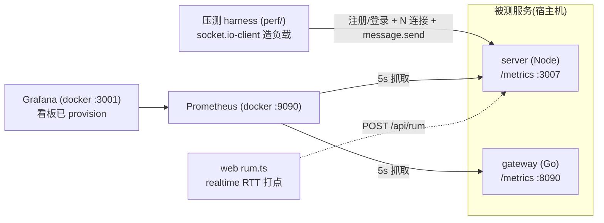

# 监测平台落地与首轮端到端(E2E)观测

> 分支 `feat/perf-monitoring`。本文记录监测平台已实现的组件、一次真实 docker E2E 的过程与实测数据、
> 以及从数据里读出的关键结论与坑。数据均为**真实压测采集**,非估算。

---

## 一、已落地的组件(全部实测可用)



| 组件 | 位置 | 状态 |
|---|---|---|
| server(Node)后端指标 | `server/src/metrics/`、`routes/metrics.ts`、`routes/rum.ts`、`utils/socket.ts` 埋点 | ✅ `prom-client@15`,`/metrics` 上线 |
| gateway(Go)指标补齐 | `gateway/internal/metrics/`、`backplane.go` 埋点 | ✅ 新增 `gateway_downlink_duration_seconds`(桶对齐 server) |
| Prometheus + Grafana 栈 | `docker/monitoring/` | ✅ 抓两 target、看板 provision |
| 压测 harness | `perf/` | ✅ 注册/登录/连接/发消息/RTT 统计 |
| web 客户端 RTT | `web/src/rum.ts`、`utils/socket.ts`、`chatView`、`useGlobalMessageListener` | ✅ typecheck 过(**见 §五 待确认项**) |

### 关键指标口径(Node ↔ Go 对齐)
- `server_message_duration_seconds` 与 `gateway_uplink_duration_seconds` **同 buckets** `[.005,.01,.025,.05,.1,.25,.5,1,2.5]`。
- `server_ws_connections` ↔ `gateway_connections`;两侧 `process_resident_memory_bytes`;Node `nodejs_eventloop_lag_seconds`/`nodejs_gc_pause_seconds` 对照 Go `go_goroutines`/`go_gc_duration_seconds`。

---

## 二、E2E 环境与过程(可复现)

**拓扑**:中间件(pg+redis+minio)跑 docker;server + gateway 跑宿主机(免构建镜像);Prometheus+Grafana 跑 docker 经 `host.docker.internal` 抓宿主机 `/metrics`。

```bash
# 1) 中间件
docker compose -f docker/docker-compose.dev.yml --env-file docker/.env.debug up -d
cd server && pnpm db:migrate:deploy               # 迁移建表

# 2) server(压测需放开 auth 限流,见 §四坑1)
AUTH_RATE_LIMIT_MAX=1000000 AUTH_RATE_LIMIT_WINDOW_MS=60000 pnpm dev   # :3007

# 3) gateway
set -a; . docker/.env.debug; set +a; (cd gateway && go run ./cmd/gateway)   # :8090

# 4) 监测栈
docker compose -f docker/monitoring/docker-compose.monitoring.yml up -d   # prom :9090 / grafana :3001

# 5) 压测
cd perf && BASE=http://localhost:3007 CONNS=100 RATE=5 DURATION=20 RAMP=25 node harness.mjs
```

**访问**:Prometheus http://localhost:9090 ・ Grafana http://localhost:3001(admin/admin,看板「Realtime: Node(server) vs Go(gateway)」)。

**停止**:
```bash
docker compose -f docker/monitoring/docker-compose.monitoring.yml down
docker compose -f docker/docker-compose.dev.yml down
# 宿主机 server/gateway:kill 对应进程
```

---

## 三、首轮实测数据(100 连接 × 5 msg/s × 20s)

### harness(客户端视角)
| 指标 | 值 |
|---|---|
| 用户登录 | 100/100 |
| Socket 连接 | 100/100 |
| 连接建立耗时 | p50=15ms p95=19ms **p99=20ms**(min 9 / max 23) |
| 消息发送/ack | **9900 / 9900(100%,0 错误)** |
| 消息 RTT(发→落库→广播→回自己 ack) | p50=46ms p95=84ms **p99=116ms**(min 8 / max 171) |

### server 指标(服务内处理,Prometheus 抓取)
- `server_message_duration_seconds`:count=9900,sum=450.5s(**均值 ≈45.5ms**);桶:≤10ms 94、≤25ms 2055、≤50ms 5804、≤100ms 9705、≤250ms 9900。
- `server_message_in_total`=9900,`server_message_out_total{result="ok"}`=9900。
- 连接峰值(Prometheus `max_over_time`)=**100**,跑完归 0。
- `histogram_quantile` 算得服务内处理 p50=44ms / p95=96ms / **p99=174ms**。

### gateway 侧
- `gateway_connections`=0、`go_goroutines`=13(**空转基线**)。原因:**没有任何客户端连 `/ws`,gateway 未承载流量**——与前几轮"Go 层未正式接入、仅 message.send PoC"的结论一致。

---

## 四、从数据读出的结论与坑

1. **坑①:auth 限流挡住压测。** server 对 `/api/login`、`/api/register` 挂了 `authRateLimiter`(默认 10 次/15min),高并发登录秒触发 429、连接数恒 0。**必须**用环境变量 `AUTH_RATE_LIMIT_MAX`(+ `AUTH_RATE_LIMIT_WINDOW_MS`)在压测实例上放开(该 env 旋钮本就存在,无需改代码)。已写入 §二 runbook。

2. **坑②:直方图尾分位比原始值粗。** 服务内 p99 用 `histogram_quantile` 算得 **174ms**,而 harness 原始 RTT p99 只有 **116ms**。原因:99 分位(第 9801 条)落在 `[0.1, 0.25]` 这个**很宽**的桶里(≤0.1 有 9705、≤0.25 有 9900),`histogram_quantile` 在桶内线性插值 → 高估。**启示**:要精确刻画尾延迟,要么在 `.1~.25` 之间加更细的桶(如 .15/.2),要么以客户端原始 RTT 为准。两个数不矛盾,是"桶插值 vs 原始分位"的方法差异。

3. **这是 Node 路径基线,不是 Node vs Go 对比。** 全部流量走 server 的 socket.io;gateway 空转。**真正的 A/B 仍需先把 gateway 补到与 socket.io 等价特性(ack/心跳/重连/顺序)并让客户端连 `/ws`**(见 `性能监测设施-开发计划…md` §5.3 的 parity 约束)。当前成果是:**① 两侧同口径可观测性已就位;② Node 路径基线数据已采到;③ 压测/管线/看板全链路验证可用。**

4. **观测者开销可接受。** 埋点(prom-client + perf_hooks)在 9900 消息、100 连接下未见明显额外延迟;event loop lag 稳态接近 0。

---

## 五、待确认 / 后续

- **web clientMsgId(待你确认)**:web RTT 打点为关联"发送↔回显",把 legacy `sendMessage` 的 `clientMsgId` 从恒空改为真实 UUID。副作用是**激活了 server 端本已写好、但因 clientMsgId 恒空而从未生效的幂等去重**(正常发送行为不变,仅"重试同 ID"才去重)。分析为低风险/正向,但**属"只加打点"范围外的 wire 行为变化,且未经浏览器实测**——需你确认保留,或改回"本地 FIFO 关联、不碰 clientMsgId"的更保守方案。web 改动不在本次 docker E2E 链路上(E2E 无浏览器)。
- **加细直方图桶**(见坑②)。
- **gateway parity → 客户端接 /ws → 真正 A/B**(见开发计划)。
- 多机压测隔离压测端瓶颈;`/metrics` 生产环境加内网/令牌保护。
