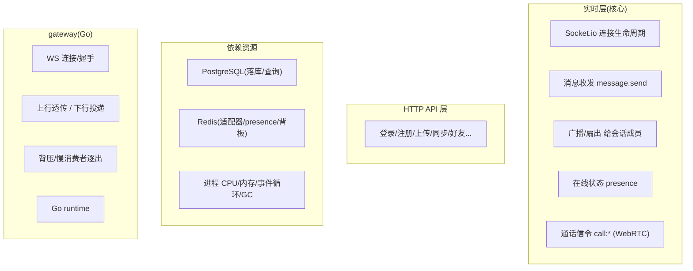

# 监测指标覆盖审计(IM + 实时 + 通话)

> 目的:系统性检查"我们这个项目该监测什么、现在缺什么、补了什么、还差什么"。
> 方法:用业界两套标准框架交叉检查——
> **RED**(面向请求类服务:Rate 速率 / Errors 错误 / Duration 时延)、
> **USE**(面向资源:Utilization 利用率 / Saturation 饱和度 / Errors 错误)。

---

## 术语表
| 名词 | 大白话 |
|---|---|
| **RED 方法** | 对"处理请求的服务"至少要有三样:请求速率、错误率、时延分布。缺一就有盲区。 |
| **USE 方法** | 对"资源"(CPU/内存/连接池/队列)至少要有:用了多少、有没有被压满、有没有出错。 |
| **基数(cardinality)** | 一个指标因标签组合产生的时间序列数量。标签取值太多(如把完整 URL 当标签)会把 Prometheus 撑爆。 |
| **SLI** | Service Level Indicator,衡量服务质量的关键指标(如消息 p99 时延)。 |

---

## 一、盘点对象:这个项目有哪些"该被监测"的面

---

## 二、覆盖矩阵(补齐前 → 补齐后)

图例:✅ 已覆盖 ・ 🆕 本次新增 ・ ⬜ 仍未覆盖(见 §四)

### 实时层(server)
| 面 | Rate | Errors | Duration | 资源/饱和 |
|---|---|---|---|---|
| 连接生命周期 | ✅ 连接 gauge | 🆕 断连原因 `server_ws_disconnects_total{reason}` | — | ✅ 活跃连接数 |
| 消息 message.send | ✅ `server_message_in_total` | ✅ `server_message_out_total{result}` | ✅ `server_message_duration_seconds` | — |
| 广播/扇出 | ✅(随消息) | — | ⬜ 广播耗时 | 🆕 扇出规模 `server_broadcast_recipients` |
| presence 在线 | — | — | — | 🆕 `server_online_users` gauge |
| 通话信令 call:* | 🆕 `server_call_events_total{event}` | ⬜ 通话失败细分 | — | 🆕 `server_active_calls` gauge |
| RUM(前端体验) | ✅ `server_rum_web_vitals`(LCP/INP/...) | — | ✅(同左) | — |

### HTTP API 层(server)
| RED | 补齐前 | 补齐后 |
|---|---|---|
| Rate / Errors / Duration | ⬜ **完全空白**(这是最大缺口:登录、上传、同步等 HTTP 接口零监控) | 🆕 `http_request_duration_seconds{method,route,status}`(一条 histogram 同时给出速率/错误/时延,route 用路由模式防高基数) |

### 依赖资源(server)
| 资源 | 补齐前 | 补齐后 |
|---|---|---|
| PostgreSQL | ⬜ 空白(高负载瓶颈却看不见) | 🆕 `db_query_duration_seconds{model,operation}`(Prisma extension 计时) |
| Redis | ⬜ 空白 | ⬜(见 §四,暂缺) |
| 进程 CPU/内存 | ✅ `process_*`(默认) | ✅ |
| 事件循环 | ✅ `nodejs_eventloop_lag_*` | ✅ |
| GC | ✅ `nodejs_gc_pause_seconds` | ✅ |

### gateway(Go)
| 面 | 覆盖 |
|---|---|
| 连接/握手 | ✅ `gateway_connections`、`gateway_handshakes_total{result}` |
| 上行/下行 | ✅ `gateway_uplink_total`/`gateway_downlink_total{result}` + `*_duration_seconds` |
| 背压 | ✅ `gateway_evicted_total`(慢消费者逐出) |
| Go runtime | ✅ `go_goroutines`、`go_gc_duration_seconds`、`process_resident_memory_bytes` |

> gateway 侧覆盖本就较完整(它是专门写的连接层),本次不再扩;若要更细可加"发送缓冲队列深度"gauge(见 §四)。

---

## 三、本次补齐的 6 类指标(高价值、按项目需求选)

| 指标 | 类型 | 为什么对这个项目重要 |
|---|---|---|
| `http_request_duration_seconds{method,route,status}` | Histogram | 补上整个 HTTP API 层的 RED——登录/上传/同步的速率、错误、时延一次到位,是最大盲区 |
| `db_query_duration_seconds{model,operation}` | Histogram | 3000 msg/s 压测时降级,DB 是头号嫌疑;没有它就只能瞎猜瓶颈 |
| `server_online_users` | Gauge | IM 的核心业务量,容量规划/扩容判断的基准 |
| `server_broadcast_recipients` | Histogram | 群消息扇出规模直接决定单条消息的真实成本,是"为什么大群慢"的答案 |
| `server_call_events_total{event}` + `server_active_calls` | Counter+Gauge | 项目有 WebRTC 音视频,通话发起/接通/挂断与并发通话数此前完全没监控 |
| `server_ws_disconnects_total{reason}` | Counter | 掉线激增(ping timeout/transport close)是网络/背压问题的早期信号 |

---

## 四、仍未覆盖(诚实清单 + 为何暂缓)
- **Redis 客户端指标**(命令时延、连接池):ioredis 无内建 prom 导出,需自行包裹或上 exporter;优先级低于 DB(DB 是压测已证实的瓶颈),暂缓。
- **广播耗时**(不只规模):只加了扇出人数,未加"广播完成耗时"histogram;可后续补。
- **通话失败细分**(如 ICE 失败、TURN 中继占比、通话时长分布):需深入 WebRTC 信令语义,属专门的音视频可观测性,单独立项。
- **gateway 发送缓冲队列深度 gauge**:目前只有"逐出计数"这个结果指标,缺"实时队列水位"这个过程指标;gateway 侧已够用,暂缓。
- **分布式链路追踪(OpenTelemetry)**:能把一条消息 web→server/gateway→DB 串成一条 trace 定位每一跳耗时;当前用指标已足够做 A/B,trace 待"要精确定位延迟在哪一跳"时再上,避免过度设计。
- **agent-server 指标**:本次聚焦 IM 主链路(our-chat),agent-server 有独立的队列/RAG 指标需求,属其自身仓库范畴,不在本次。
- **按消息类型细分**(text/image/file 各自时延):当前 message_duration 不带 type 标签(防基数),如需按类型分析再评估加低基数标签。

---

## 五、基数与安全注意
- `http_request_duration` 的 `route` 用**路由模式**(如 `/api/login`)而非原始 URL(如 `/user/abc123`),否则每个用户 id 都是一条序列 → 基数爆炸。
- 所有 `/metrics` 端点**生产必须内网/加令牌**,不能对公网暴露(含内部拓扑信息)。
- 标签只放**低基数**维度(method/status/model/event/reason),绝不放 userId/message content 等高基数值。
