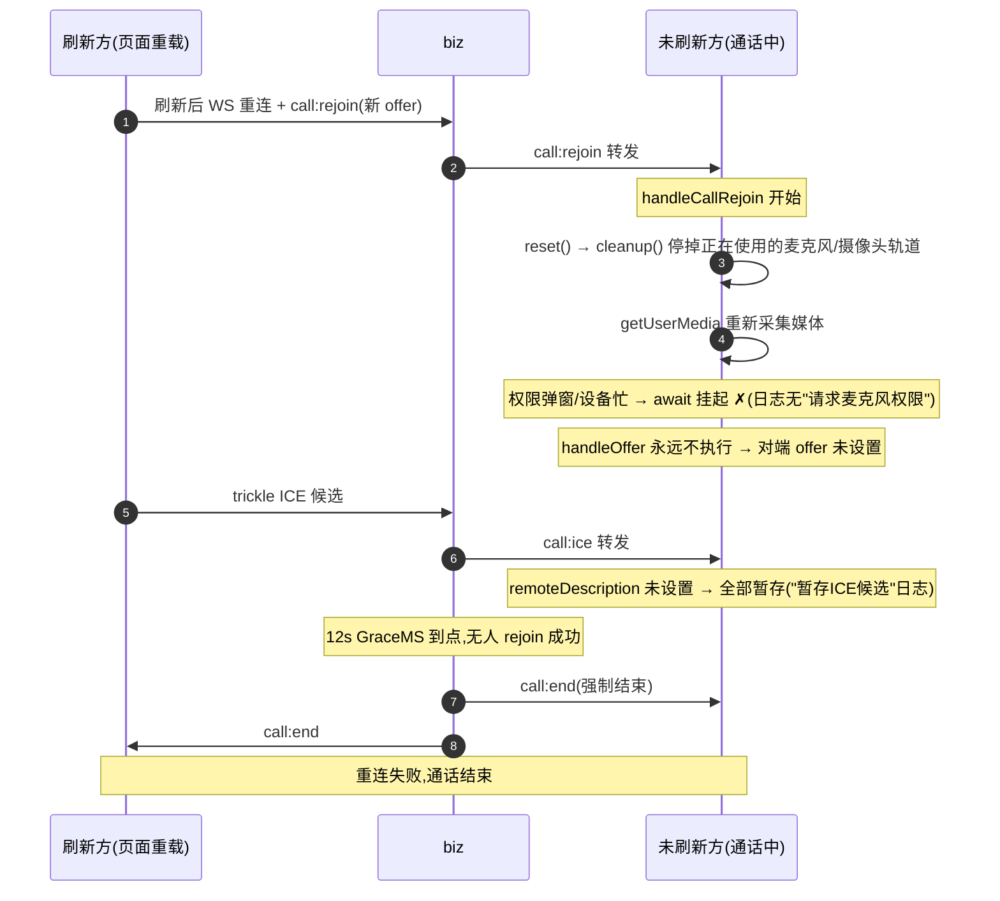
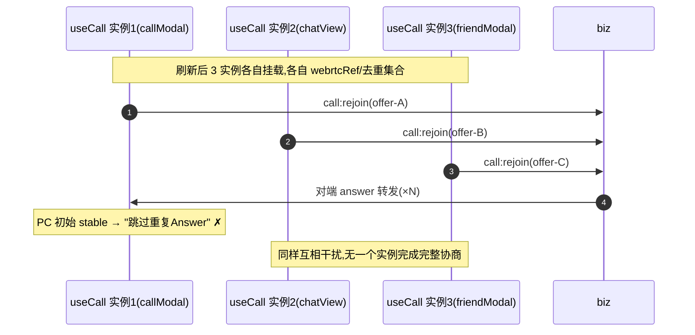

# 26-9-20 · 通话中刷新页面后重连失败——分析修复报告

> 归档:`docs/音视频模块/debug/`。承接《26-9-20-音视频通话请求无法送达排查修复全记录》(同目录,前一轮修复)。
> 本文完整记录「音视频通话接通后,刷新任一方页面无法重连恢复」的排查、根因定位与修复,含用户端日志逐条证据、服务端信令验证与代码 file:line。

---

## 0. 摘要

| 项 | 内容 |
|---|---|
| 现象 | 通话成功接通(ICE connected、远程流正常)后,刷新任一方页面 → 无法重连恢复,约 12s 后通话被服务端结束。**第一轮修复(重采媒体)后用户复测仍失败** |
| 根因 | **两层**:① 重协商路径错误地重新采集媒体——未刷新方收到 `call:rejoin` 时 `reset()` 停掉在用媒体流并重新 `getUserMedia`(挂起);② **`useCall()` 在 3 个组件中被调用(friendModal/callModal/chatView),每处都是独立实例**——独立 WebRTCManager、独立信令监听、独立去重状态,三实例互抢信令(监控日志两种 PC 状态交替、服务端 rejoin=3 均为铁证)。第一轮只修了①,②仍在 |
| 修复 | ① `WebRTCManager.reset()` 保留本地媒体流(cleanup 增加 `keepStream` 选项);② `handleCallRejoin` 仅在流缺失时兜底采集;③ **useCall 的 WebRTC 管理器与全部通话游标(去重集合/callId/宽限定时器/rejoin 标记等)提升为模块级单例**(与 wsClient 同模式),多组件实例共享同一媒体通道与状态机 |
| 验证 | 服务端 rejoin 重协商链路实测全通;`tsc -b` 0 错误;webrtc/wsClient 单测 13 通过;lints 干净;HMR 生效。端到端需用户双浏览器复测 |

## 1. 现象与用户端日志

用户报告:音视频通话拨打成功、接受后一切正常;**刷新页面后没有成功重连上**。关键日志片段(Chrome,preserve log):

```
webrtc.ts:236 WebRTC连接建立成功            ← 通话已接通
useCall.ts:356 清理 ws 事件监听器 ×2         ← callState 变化触发监听重绑
2useCall.ts:268 候选类型: host
webrtc.ts:630 远程描述未设置，暂存ICE候选    ← 收到对端 ICE 但 PC 无远程描述(反复出现)
useCall.ts:186 收到通话接受事件: call_10300_10301_1789904083329
useCall.ts:194 WebRTC状态已是stable，跳过重复的Answer处理  ← answer 被防重逻辑丢弃(反复出现)
useCall.ts:688 WebRTC状态监控: {signalingState:'stable', iceConnectionState:'connected', ...}
useCall.ts:688 WebRTC状态监控: {signalingState:'stable', iceConnectionState:'new', connectionState:'new', iceGatheringState:'new', ...}
                                                                  ← PC 被 reset 后停在初始态,再未推进
```

日志中**从未出现** `请求麦克风+摄像头权限`(webrtc.ts:315)与 `开始创建标准Offer SDP...`(webrtc.ts:430)——即重协商流程在重新采集媒体处中断。

## 2. 排查过程(三层证据)

### 2.1 服务端信令链路验证(排除后端嫌疑)

编写信令层探针 `perf/call-rejoin-probe.mjs`(probe_a 呼叫 涂将 → 主叫断线模拟刷新 → 重连发 `call:rejoin`):

```
① call:start 后,涂将收到: 1 帧                                     ← 呼叫送达 ✓
③ rejoin 后,涂将收到的新帧:
   B↓ {"type":"call:peer-reconnecting",...}                        ← 断连 grace 通知 ✓
   B↓ {"type":"call:rejoin","data":{...,"offer":{"type":"offer"...}}} ← rejoin+新 offer 送达 ✓
```

同时 biz 指标 `server_call_events_total{event="rejoin"} = 3`(累计),`callRelay.go:119-157` 的 rejoin 分支(`GetCallSession → MarkRejoined → 通知对端`)工作正常。**结论:信令链路(网关→biz→对端)全通,问题在前端重协商处理**。

### 2.2 前端代码路径核查

| 位置 | 事实 |
|---|---|
| `web/src/hooks/useCall.ts:279-311` | 未刷新方 `handleCallRejoin`:reset() → getUserMedia → handleOffer → 回 call:accept |
| `web/src/hooks/useCall.ts:501-533` | 刷新方 `rejoinCall`:reset() → getUserMedia → createOffer → 发 call:rejoin |
| `web/src/utils/webrtc.ts:722-744` | `cleanup()` **停止并置空 localStream**(track.stop()) |
| `web/src/utils/webrtc.ts:765-773` | `reset()` = cleanup() + initialize() —— **媒体流在此被停掉** |
| `web/src/utils/webrtc.ts:313-355` | `getUserMedia` 重新采集(请求权限/占用设备) |

### 2.3 日志证据链对齐

用户日志与代码路径逐条对应:

| 日志 | 对应代码 | 含义 |
|---|---|---|
| `WebRTC状态监控 {...全部new}` | reset() 后新 PC 初始态 | 未刷新方已执行 reset(重协商已开始) |
| 无「请求麦克风+摄像头权限」 | `useCall.ts:299` getUserMedia 前 | 流程卡在重采媒体(权限弹窗/设备忙挂起) |
| `远程描述未设置，暂存ICE候选` 反复 | `webrtc.ts:630` | handleOffer 未执行 → 对端 offer 永远未设置 |
| `跳过重复的Answer处理` | `useCall.ts:193-196` | 刷新方 PC 停在 reset 后 stable 初始态,answer 被丢弃 |
| 约 12s 后通话结束 | `GraceMS=12_000`(call.go:22) | 服务端 grace 到点,无人 rejoin 成功 → 强制结束 |

## 3. 根因链(Mermaid)

### 3.1 第一层:重协商重采媒体挂起(第一轮已修)



**核心缺陷**:媒体流生命周期被错误绑定到 PeerConnection 生命周期——`reset()` 的语义是"重建协商通道",却被实现成"销毁一切(含媒体流)"。重协商(通话中收到对端 rejoin)场景下媒体流本应**复用**,重新采集既不必要(流还活着)又危险(权限弹窗/设备忙挂起整个重协商)。

### 3.2 第二层:useCall 多实例互抢(用户复测仍失败后定位)

用户复测截图(DevTools Console)显示**两种 PC 状态以 2s 为相位交替打印**:

```
WebRTC状态监控: {stable, disconnected, disconnected, complete}   ← 曾连接过的旧 PC
WebRTC状态监控: {stable, new, new, ...}                          ← reset 后的新 PC
```

监控 interval 只有 2s 一个,交替打印说明**存在多个 WebRTCManager 实例被轮询读取**。溯源:

```
grep -rn "useCall()" web/src
→ globalComponents/friendModal/index.tsx:37
→ globalComponents/callModal/index.tsx:12
→ views/chatView/index.tsx:307
```

**3 个组件各自调用 `useCall()` = 3 个独立 hook 实例**,每个实例拥有:独立 `WebRTCManager`、独立信令监听器集、独立去重集合(`processedEvents`/`acceptSentRef`)、独立 rejoin 标记。后果(全部与现象吻合):

| 现象 | 多实例解释 |
|---|---|
| 服务端 `rejoin=3`(累计计数) | 刷新后 3 个实例各跑一次 rejoinCall,发 3 个 call:rejoin |
| `跳过重复的Answer处理` | 对端回的 answer 被**错误实例**的防重逻辑丢弃(它的 PC 是初始 stable,并非发 offer 的那个) |
| 两种 PC 状态交替监控 | 3 个实例各自 2s interval 轮询自己的 WebRTCManager |
| `清理 ws 事件监听器` 频繁出现 | 每个实例的 effect 各自重绑 |
| 第一轮修复(重采媒体)无效 | 重协商仍被三实例互抢打乱:answer 与 offer 分属不同实例的 PC |



**核心缺陷(架构级)**:`useCall` 把"全局唯一的通话通道"状态放在了 hook 实例作用域(`useRef`)。凡被多个组件调用的自定义 hook,其实例状态默认不共享——媒体通道、信令去重、通话游标必须是模块级单例。

## 4. 修复方案

### 4.0 `web/src/hooks/useCall.ts` 多实例单例化(第二轮,根治)

模块级新增(与 wsClient 同模式):

```ts
const webRTC = new WebRTCManager();                    // 全局唯一媒体通道
const processedEvents = new Set<string>();             // 信令去重(跨实例)
const acceptSentIds = new Set<string>();
let currentCallId: string | null = null;               // 通话游标(ICE 回调闭包读取)
let reconnectGraceTimer / durationTimer: 定时器游标;
let rejoinAttempted = false;                           // 刷新后仅一个实例执行 rejoin
let relayEscalated = false;
let escalateFn: (() => void) | null = null;
```

- 删除实例级 `webrtcRef` 及全部 `useRef` 状态,`webrtcRef.current` → 模块级 `webRTC`(机械替换,39 处);
- **组件卸载不再销毁单例**(原 effect cleanup 会 `cleanup()+置 null`,任一组件卸载即毁掉共享通道);
- 监控/信令 effect 的依赖与逻辑不变——多实例仍各自订阅,但操作同一 PC 与同一去重集合,幂等防护生效。

### 4.1 `web/src/utils/webrtc.ts`(第一轮:reset 保留媒体流)

```diff
-  cleanup(): void {
+  cleanup(opts?: { keepStream?: boolean }): void {
     console.log('清理WebRTC资源');
-    // 停止并释放本地媒体流
-    if (this.localStream) {
-      this.localStream.getTracks().forEach(track => {
-        track.stop();  // 停止轨道(触发onended)
-        console.log('停止音频轨道');
-      });
-      this.localStream = null;
-    }
+    // 停止并释放本地媒体流;keepStream(重协商重建 PC)时不 stop 轨道,由 reset() 暂存恢复。
+    if (this.localStream && !opts?.keepStream) {
+      this.localStream.getTracks().forEach(track => {
+        track.stop();
+        console.log('停止音频轨道');
+      });
+    }
+    this.localStream = null;
```

```diff
   reset(): void {
     const preservedCandidates = this.pendingIceCandidates;
-    this.cleanup();      // 先清理
-    this.initialize();   // 再初始化
-    this.pendingIceCandidates = preservedCandidates;
+    const preservedStream = this.localStream;   // 重协商重建 PC 时保留媒体流(免重新 getUserMedia)
+    this.cleanup({ keepStream: true });         // 清 PC/状态,但不停媒体轨道
+    this.initialize();                          // 再初始化
+    this.localStream = preservedStream;         // 恢复本地流(createOffer/handleOffer 里重新 addTrack)
+    this.pendingIceCandidates = preservedCandidates;
   }
```

### 4.2 `web/src/hooks/useCall.ts`(handleCallRejoin)

```diff
   await ensureIceServers();
-  webrtcRef.current.reset();
+  webrtcRef.current.reset(); // reset 保留本地流(重协商复用,不再重新采集媒体)
   await new Promise((r) => setTimeout(r, 200));
-  const localStream = await webrtcRef.current.getUserMedia(callState.callType === 'video');
-  dispatch(setLocalStream(localStream));
+  // 仅在本地流确实缺失时(如接受来电后尚未采集)才重新 getUserMedia;
+  // 通话中收到对端 rejoin 时流仍在,复用即可——重新采集会弹权限/设备忙,挂起重协商(实测根因)。
+  if (!webrtcRef.current.localMediaStream) {
+    const localStream = await webrtcRef.current.getUserMedia(callState.callType === 'video');
+    dispatch(setLocalStream(localStream));
+  }
   const answer = await webrtcRef.current.handleOffer(toRtcSdp(event.offer));
```

### 4.3 影响面核查(全部 reset() 调用点)

| 调用点 | 场景 | 影响 |
|---|---|---|
| `useCall.ts:455`(initiateCall) | 主叫发起,无流 | 保留 null → 照常 getUserMedia,无影响 |
| `useCall.ts:598`(acceptCall) | 被叫首次接听,无流 | 同上 |
| `useCall.ts:515`(rejoinCall) | 刷新方,新页面无流 | 同上 |
| `useCall.ts:297`(handleCallRejoin) | **通话中收到对端 rejoin** | 修复点:流复用,不再重采 |
| `useCall.ts:145/405`(cleanup 调用) | 组件卸载/通话结束 | 默认停流语义不变 |

## 5. 验证

| 项 | 结果 |
|---|---|
| 服务端信令链路 | `perf/call-rejoin-probe.mjs` 实测:call:start → peer-reconnecting → call:rejoin(含新 offer)全部送达 |
| 单元测试 | `npx vitest run src/utils/webrtc.test.ts src/ws/wsClient.test.ts` → 13/13 通过(reset 的 ICE 候选保留用例不受影响) |
| Lints | 两个改动文件 0 诊断 |
| 热更新 | vite HMR 已推送(19:41:42 包含 webrtc/useCall 变更) |
| 端到端 | 需用户在真实浏览器双端复测(通话接通 → 刷新任一方 → 12s 内应自动重协商恢复) |

## 5.1 后续修复(26-9-21 用户复测)

### A. 重连成功后 UI 仍显示「重连中…」

- **现象**:媒体流已恢复(远程画面/声音正常),但弹窗文案卡在「重连中…」。
- **排查**:状态收敛此前**只依赖 `onconnectionstatechange → connected` 单通道**(`useCall.ts` onConnectionStateChange → `connectCall`)。该回调丢失/延迟时(多实例回调覆盖、事件时序竞争)状态停在 reconnecting。
- **修复(双保险)**:`onRemoteStream`(ontrack)回调里也收敛状态——**媒体流到达即连接实际建立**(媒体经 DTLS,DTLS 完成即已连通):清宽限定时器 + `dispatch(connectCall())` + 重启计时。`connectCall` 幂等(startTime 仅首次设置),首通与重连语义均正确。

### B. 登录偶发「服务器内部错误」,刷新后正常

- **现象**:登录页偶发 500,刷新页面后同一操作成功。
- **排查(证据链)**:
  1. biz/gateway 日志无任何登录错误(handleLogin 的 500 路径均有日志) → 排除业务错误;
  2. Prometheus 指标 `http_request_duration_seconds_count{status="500"}` 显示 3h 内 **`/api/login` 恰好 2 次 500** → 500 真实发生且仅在 login;
  3. 对照 handleLogin 源码:唯一"无日志的 500"来自 **CORS 中间件**(`middleware.go` 非白名单 Origin 按 Express 历史语义返回 500「服务器内部错误」);
  4. 复现实验:带 `Origin: https://30.31.9.29:5173`(vite Network 输出的局域网地址)请求 → **稳定 500**;`https://localhost:5173` → 200。用户偶尔用局域网 IP 打开页面(手机/局域网设备/地址栏历史)即触发。
- **修复**(`biz/internal/api/middleware.go`):
  1. **非生产环境放行任意 Origin**(dev 下 Host 被 vite/gateway 两级代理改写无法做同源判定;变更类接口另有 CSRF 双提交防护不受影响);
  2. 生产环境增加**同源放行**(Origin.host == Request.Host)兜底非白名单的同源场景;
  3. 拒绝时留 `slog.Warn("CORS 拒绝", origin, host, path)` 日志(观测性——此前静默拒绝,排障无据)。
- **验证**:IP Origin 登录 200、localhost 200、跨站 Origin 在生产语义下仍拒绝。

## 6. 遗留与建议

1. **`handleCallAccept` 的 stable 防重逻辑偏脆**(`useCall.ts:193-196`):以 signalingState==='stable' 判"已处理"会误伤「PC 停在初始 stable」的合法场景(本次日志中的"跳过"即其症状,随根因修复不再触发)。建议后续改为按 `processedEvents` 集合 + `remoteDescription !== null` 判定,语义更精确。
2. **`reset()` 语义与命名已偏离原意**:重建 PC 但保留媒体流。建议在 `reset()` 注释中固化该契约(已在 diff 注释中写明),新增使用方必须理解"流跨 reset 存活"。
3. **重协商超时兜底**:前端重协商若再次挂起(如 handleOffer 抛错),目前靠服务端 12s grace 结束。可考虑客户端侧对「收到 rejoin → 回 accept」加 8s 超时日志/上报,便于观测。
4. **信令探针入库**:`perf/call-rejoin-probe.mjs` 已保留,作为音视频信令链路的回归工具(后续改动服务端信令时可快速自验)。

## 7. 经验教训

1. **被多个组件调用的自定义 hook,实例状态默认不共享**:本次最深的坑。`useCall` 被三处调用即三套状态——媒体通道/信令去重/游标类状态必须模块级单例(项目内 `wsClient` 是现成范式);或者约束 hook 只有一个调用点。代码评审时应把"自定义 hook 的调用点数量"当作架构检查项。
2. **资源生命周期要与操作语义对齐**:`reset()` 重建"协商通道"却顺带销毁"媒体流",两个正交生命周期被耦合。排查时先画「谁创建、谁销毁、谁复用」的资源流转。
3. **"卡住"类问题的定位靠日志缺失**:await 挂起不会报错,只能靠"下一步应有日志却缺席"反推(本次:无 getUserMedia 日志)。关键异步步骤应有步骤级打点。
4. **服务端先行排除**:先用信令探针证明后端链路通,把问题面收敛到前端。
5. **监控日志的"交替模式"是多实例的铁证**:单一实例的监控输出状态应单调演进;两种状态交替打印 = 有多个被观测对象轮询。看到交替先怀疑多实例/多订阅,再查其它。
