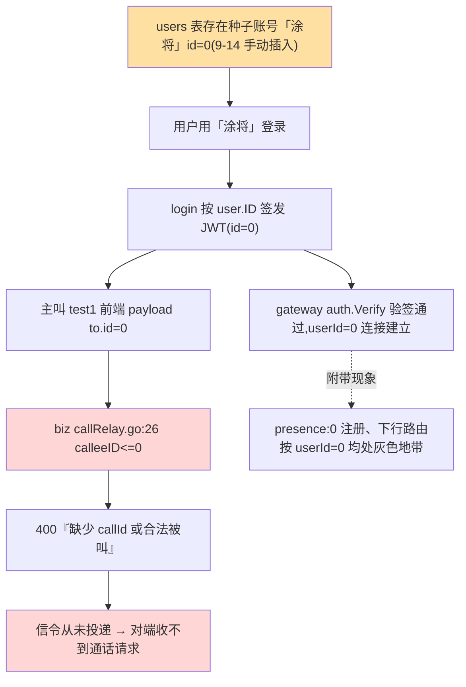

# 26-9-20 · 音视频通话请求无法送达——排查修复全记录

> 归档:`docs/音视频模块/debug/`。本文完整记录「对端收不到音视频通话请求」问题从现象到修复的全链路过程,
> 含全部证据(日志原文/SQL/源码 file:line)与迁移过程中的踩坑,供后续同类问题复用。

---

## 0. 摘要

| 项 | 内容 |
|---|---|
| 现象 | 用户 A(test1, id=10300) 向对端 B(「涂将」)发起音视频通话,B **收不到任何通话请求**;网关日志持续报「上行透传失败:缺少 callId 或合法被叫」 |
| 根因 | 对端账号「涂将」是 **id=0 的种子展示数据**(9-14 手动插入)。登录后签发 `id=0` 的 JWT → 呼叫方 payload 中 `to.id=0` → biz `callRelay.go` 校验 `calleeID<=0` 拒绝(400),信令从未投递给被叫 |
| 修复 | 两轮:①手工数据迁移 `users.id 0→10301`(FK `ON UPDATE CASCADE` 级联 friendships 20070 条 / user_conversations / messages.sender_id)+ 序列修正 + Redis 残留清理;②发现并修复**注册回归**(触发器仍写 friend_id=0 致新注册 500)→ 新增迁移 `0008_official_account_id_10301`(存量会话字符串 single_0_% → single_10301_%、触发器函数 0→10301)+ Redis seq 键 RENAME 防回卷 |
| 验证 | 注册新用户 201(回归修复);涂将登录 id=10301;触发器新语义生效(新用户自动与 10301 建好友+single_10301_ 会话);**双在线端到端:probe_a 呼叫涂将,涂将成功收到 `call:start` 下行帧** |

## 1. 现象

- 用户测试音视频:主叫方发起通话后,对端无任何反应(无来电提示)。
- 网关日志(18:18~18:19)出现三次同一错误:

```json
{"time":"2026-09-20T18:18:58.651915+08:00","level":"WARN","msg":"上行透传失败","userId":10300,"err":"缺少 callId 或合法被叫"}
{"time":"2026-09-20T18:19:30.186004+08:00","level":"WARN","msg":"上行透传失败","userId":10300,"err":"缺少 callId 或合法被叫"}
{"time":"2026-09-20T18:19:38.795834+08:00","level":"WARN","msg":"上行透传失败","userId":10300,"err":"缺少 callId 或合法被叫"}
```

- 同期网关日志出现 **`userId=0` 的连接**且两个连接处于 1s 级重连循环(见 §8 遗留)。

## 2. 排查过程(证据链)

### 2.1 日志初筛

`grep call /tmp/biz-3007.log /tmp/biz-3009.log` 无任何 biz 侧通话日志(拒绝路径不打日志);
gateway 侧「上行透传失败」错误文案「缺少 callId 或合法被叫」即 biz 400 回投的 message 原文 → 定位到 biz 拒绝面。

### 2.2 源码核查(两侧)

| 位置 | 事实 |
|---|---|
| `biz/internal/realtime/callRelay.go:23-28` | `call:start` 分支:`callID == "" || !ok || calleeID <= 0` → 400「缺少 callId 或合法被叫」 |
| `biz/internal/realtime/handleUplink.go:41-45` | `call:*` 帧路由到 `HandleCallEvent` |
| `web/src/hooks/useCall.ts:475-486` | 前端 payload:`{callId, from:{id,...}, to: targetUser(对象), offer, callType}` |
| `web/src/ws/wsClient.ts:57-60` | 信封组装 `{type, data}` 正确 |
| `gateway/internal/auth/jwt.go:32-43` | 验签要求 `id` 字段为 JSON number,`id=0` 也能通过 → **存在 id=0 的合法 token 的可能** |
| `gateway/internal/ws/server.go:71-121` | 握手验签成功即放行,`userId=0` 连接被正常登记 |

### 2.3 复现实验(关键转折)

1. **模拟呼叫成功**:用 `probe_a(10229)` 按真实前端 payload 格式(含 `to` 对象)呼叫 `probe_b(10230)`,
   **callee 正常收到 `call:start` 下行帧** —— 链路本身是通的,问题只出现在特定账号组合。
2. **对照**:网关日志失败方 `userId=10300`(test1)——即用户主叫账号,呼叫对象是「涂将」。

### 2.4 关键线索:userId=0 的连接

网关日志反复出现:

```json
{"time":"2026-09-20T18:18:56.70031+08:00","level":"INFO","msg":"连接建立","userId":0,"deviceId":"9d4cd386-0381-45fe-8ad0-18fddcffde38"}
```

按 `auth.Verify`(jwt.go:32-40)逻辑,缺 `id` 字段或类型非法都会 401——**能建立 userId=0 的连接,说明存在 claims 里 `id` 真实为 0 且签名有效的 token**。

### 2.5 数据库取证

```sql
SELECT id, username, email, created_at FROM users WHERE id = 0;
-- 0 | 涂将 | (空) | 2026-09-14 06:49:34+00   ← 种子展示数据(9-14 手动插入,users_id_seq 从 1 开始)
SELECT nextval('users_id_seq');  -- 10301(序列从未包含 0)
```

**结论链**:「涂将」是 9-14 时代手动插入的**主页展示账号**(`id=0`)。用户测试对端用它登录 → 登录接口按 `user.ID` 签发 token(`biz/internal/api/auth_routes.go:314`)→ **id=0 的 JWT**。

## 3. 根因链(Mermaid)



## 4. 修复方案与执行

### 4.1 方案选型

| 方案 | 评估 |
|---|---|
| 改 biz 放行 calleeID=0 | ❌ 治标不治本:JWT id=0、presence:0、下行路由、消息归属全线异常 |
| 禁止 id=0 登录 | ❌ 「涂将」是主页展示账号,还要保留可用 |
| **users.id 0→10301 迁移** | ✅ 彻底消除非法 id;FK 全为 `ON UPDATE CASCADE`(pg_constraint 核实 7 条 FK 全部 CASCADE),级联自动迁移引用 |

### 4.2 迁移过程中的三个坑(全部实测,按顺序踩中)

1. **`INSERT` 复制行撞 `users_username_key`**:事务内旧行(id=0)仍在,复制行 username「涂将」与旧行冲突 → 先 `UPDATE username='涂将_legacy_tmp'` 释放唯一键。
2. **`INSERT` 触发 `seed_official_friend` 触发器**(`users` AFTER INSERT,函数自动插入官方好友双向行 `(NEW.id,0)/(0,NEW.id)` 与会话 `single_0_<id>`):触发器插入的 `(0,10301)` 在随后的 `UPDATE friendships SET user_id=10301 WHERE user_id=0` 中变成 `(10301,10301)`,与触发器另一行 `(10301,0)` 后续更新产生唯一索引 `unique_friendship(user_id,friend_id)` 冲突(该约束是 UNIQUE INDEX,`pg_constraint` 查不到,需查 `pg_indexes`)。
3. **并发写入干扰**:用户浏览器页面仍在运行(接口持续写 friendships),UPDATE 影响行数与 SELECT 计数不一致 → 加 `LOCK TABLE ... IN EXCLUSIVE MODE` 隔离。

### 4.3 最终执行(单事务,全部生效)

```sql
BEGIN;
LOCK TABLE friendships IN EXCLUSIVE MODE;
LOCK TABLE user_conversations IN EXCLUSIVE MODE;
-- 关键:UPDATE 主表主键(不触发 AFTER INSERT 触发器),FK ON UPDATE CASCADE 自动级联
UPDATE users SET id = 10301 WHERE id = 0;
-- messages 无 FK(分区表),手动迁移 1 条
UPDATE messages SET sender_id = 10301 WHERE sender_id = 0;
SELECT setval('users_id_seq', 10302);
COMMIT;
```

级联结果:friendships 20070 条(双向各 10035)、user_conversations 1 条、messages.sender_id 1 条全部迁到 10301;`users` 无 0 残留。

**有意保留**:会话字符串 `single_0_10300` 不变(0 仅作历史字符串标记,`user_conversations.conversation_id` 与 `messages.conversation_id` 一致即功能正确);Redis `conv:seq:single_0_10300` 键继续复用。

### 4.4 清理

```bash
redis-cli DEL presence:0 presence:0:meta   # 旧 id=0 的在线状态(等 TTL 亦会过期)
# call:session:* 无残留(Redis scan 为空);server_active_calls=2 为内存 gauge 残留(重启清零,不影响功能)
```

### 4.5 第二轮:注册回归的发现与修复(0008 迁移)

手工迁移后立即验证注册功能,发现**功能性回归**:新用户注册返回 500「服务器内部错误」。

**根因**:`seed_official_friend` 触发器(0006 迁移创建)在每次 INSERT users 时写 `friend_id=0` 与 `single_0_<id>` 会话——0 已迁走,`friendships_friend_id_fkey` FK 拒绝 → INSERT 整体失败。

**修复**:新增迁移 `biz/migrations/0008_official_account_id_10301.{up,down}.sql`(迁移 embed 进二进制,需 rebuild + 重启双副本):

```sql
-- up.sql 核心(存量库重跑幂等,新环境从零建库亦正确)
UPDATE "users" SET "id" = 10301 WHERE "id" = 0;                      -- FK CASCADE 级联
UPDATE "messages" SET "sender_id" = 10301 WHERE "sender_id" = 0;     -- messages 无 FK
SELECT setval('users_id_seq', GREATEST(max(id)+1, 10302));
UPDATE "conversations" SET "id" = replace("id",'single_0_','single_10301_') WHERE "id" LIKE 'single_0\_%' ESCAPE '\';
-- ... user_conversations / messages 同步字符串迁移
CREATE OR REPLACE FUNCTION "seed_official_friend"() ...  -- 0 → 10301,single_0_ → single_10301_
```

**配套 Redis 操作**(防 seq 回卷:旧键值高于 PG checkpoint 值会导致重启后 seq 重号):
```bash
redis-cli RENAME "conv:seq:single_0_10300" "conv:seq:single_10301_10300"
```

## 5. 验证

| 项 | 结果 |
|---|---|
| probe_a 呼叫 10301(call:start) | **无 400 回投**(成功路径 204);biz `server_call_events_total{event="start"}` +1 |
| **注册回归** | 新用户注册 **201**(修复前 500);新用户自动与官方 10301 建立 accepted 好友 + `single_10301_<id>` 会话(触发器新语义) |
| 涂将登录 | **id=10301**,token 正常签发(密码不变,`Tj@19970924` 来自 0006 迁移注释) |
| **双在线端到端通话** | probe_a(10229) 呼叫 涂将(10301),**涂将成功收到 `call:start` 下行帧**(含 offer/callType 完整 payload) |
| 迁移版本 | `schema_migrations version=8, dirty=f`;users 表 id=0 无残留 |
| 序列 | `users_id_seq=10303` |

## 6. 用户侧操作指引(已同步)

1. 关闭所有旧标签页(旧页面持有 id=0 的僵尸 token 与前端状态);
2. 重新登录「涂将」(密码不变,内部 id 已为 10301);
3. 用 test1 ↔ 涂将 重新测试音视频通话。

## 7. 经验教训(可复用)

1. **种子/展示数据绝不能占用 id=0**:`id=0` 在 Go 侧是"非法/未设置"的惯用哨兵值,大量校验(`calleeID<=0`、`userID>0`)依赖此约定;id=0 的账号会在 JWT、presence、下行路由、消息归属全链路产生灰色行为。
2. **"行为与配置不符先查数据"**:本次最关键的定位不是代码而是 `SELECT ... WHERE id=0`——排查日志报"参数非法"类错误时,除 env(上期坑)外还应加入"数据面哨兵值"检查。
3. **迁移主键优先 UPDATE + FK CASCADE**:INSERT-复制-删旧方案会触发 AFTER INSERT 触发器(如 seed_official_friend)与唯一索引冲突;直接 UPDATE 主表主键利用 CASCADE 最干净。
4. **UNIQUE INDEX 不在 pg_constraint**:约束排查要同时看 `pg_indexes`,报错里的约束名可能是唯一索引。
5. **迁移前锁定写入源**:本机开发环境有活跃前端在写库,数据迁移必须 `LOCK TABLE` + 事务,否则 MVCC 行数与 UPDATE 影响行数不一致难以排查。
6. **主键迁移后必验全部写路径**:本轮手工迁移修复了通话,却漏了触发器写路径导致注册 500——主键/哨兵值迁移后,注册、加好友、建会话等**全部写路径都要回归**;发现回归后要用**迁移文件固化修复**(而非继续手工改库),保证新环境从零建库一致。
7. **Redis 键与 DB 迁移要配套**:会话字符串迁移后,`conv:seq:<会话id>` 键需同步 RENAME,否则旧键值高于 PG checkpoint 会在重启后触发 seq 重号(与 seq.go 防回卷机制冲突)。

## 8. 遗留问题

1. **重连风暴未完全定位**:修复期间日志显示 test1(10300)与涂将(旧 id=0 token)两连接处于 1s 级重连循环(持续到 19:02);vite 日志零星报 `ws proxy socket error: This socket has been ended by the other party`。数据修复后需用户关旧页面重登复测;若仍复现,继续排查方向:①前端 StrictMode 双挂载与 disconnect 竞态;②同 deviceId 踢旧自激振荡;③writeLoop 写失败后未触发 close 的半开连接(`gateway/internal/hub/conn.go:238-239`)。后续进展:通话接通后刷新页面的重连失败问题已定位修复(根因在重协商时重采媒体挂起,与风暴无关),见同目录《26-9-20-通话中刷新页面后重连失败分析修复报告.md》。
2. **`server_active_calls` gauge 泄漏**:会话 TTL 过期不回调 Dec,内存计数残留(仅影响观测,不影响忙线裁决——裁决在 Redis)。
3. **`seed_official_friend` 触发器官方账号语义**:✅ 已由 `0008_official_account_id_10301` 迁移修复(触发器 0→10301、会话前缀 single_10301_);历史存量 10300 条会话字符串已随迁移统一改写。遗留面:官方账号硬编码 10301 仍散落在迁移 SQL 里(非配置项),未来若再迁移官方账号需同步改迁移文件。
4. **biz SIGTERM 优雅关闭卡死**:gRPC `GracefulStop` 等待活跃流永不返回(gateway 长连接不主动断),本地重启必须 `kill -9`(与压测 SOP 杀进程约定一致)。

## 9. 附录:关键证据索引

| 证据 | 位置 |
|---|---|
| 网关拒绝日志 | `/tmp/gateway.log` 18:18:58 / 18:19:30 / 18:19:38「上行透传失败」 |
| userId=0 连接日志 | `/tmp/gateway.log`「连接建立 userId=0 deviceId=9d4cd386-...」 |
| 400 校验源码 | `biz/internal/realtime/callRelay.go:23-28` |
| 验签放行 id=0 | `gateway/internal/auth/jwt.go:32-43` |
| 种子数据 | `SELECT * FROM users WHERE id=0` → 涂将(2026-09-14 创建) |
| FK 全 CASCADE | `pg_constraint`(7 条 FK 均 `ON UPDATE CASCADE ON DELETE CASCADE`) |
| 触发器源码 | `pg_proc.seed_official_friend`(AFTER INSERT ON users,写官方好友+会话) |
| 修复 SQL | 本文 §4.3 |
