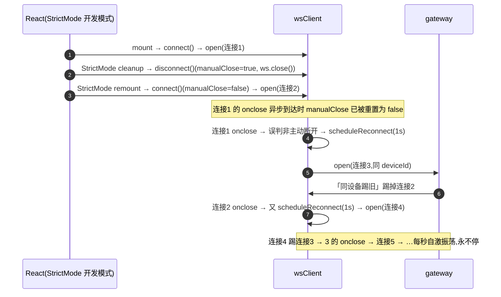

# 26-9-21 · WS 重连风暴与登录问题修复记录

> 归档:`docs/音视频模块/debug/`。本文记录两轮修复:
> ①WS 每秒重连风暴(通话刷新重连不上的直接原因,26-9-21 上午提交 `db665de`,此前未补文档);
> ②登录三连问题(首次登录报错/记住我失效/几小时后跳登录,26-9-21 下午修复)。

---

## 一、WS 每秒重连风暴(通话「重连中」久治不愈的直接原因)

### 1.1 现象

- 通话接通后刷新页面,弹窗长期停留「重连中…」;此前多轮针对 rejoin/状态机的修复均无效。
- 网关日志:同一批 deviceId **每秒交替「连接建立」**(持续数小时),三个页面(用户两标签页 + 复现页)同频振荡。

### 1.2 排查证据链

| 证据 | 结论 |
|---|---|
| 直连网关的裸 WS 存活 >8s,经 vite proxy 的页面连接每秒断 | 链路本身健康,问题在前端连接管理 |
| 复现页 reload 新代码后该 deviceId 振荡立即停止(10:00:40 后无重建) | 修复有效性直接验证 |
| 复现页面(agent-browser)注入 console 拦截,无组件卸载日志 | 排除「组件每秒重挂载触发 disconnect」 |
| 网关 `gateway_connections` 低水位、`evicted_total=0` | 排除慢消费者逐出与配额 |

### 1.3 根因链



关键机制:①StrictMode 双执行的 `disconnect()→connect()` 竞态,使旧连接 onclose 误触发重连;②服务端「同 deviceId 踢旧」(hub.go 设计行为)把「被踢者」的 onclose 变成下一轮重连的引信——两者互为因果。

### 1.4 修复(`web/src/ws/wsClient.ts`)

1. `open()` 打开新连接前先关闭旧连接(旧连接 onclose 置空,禁止其触发重连);
2. `scheduleReconnect()` 重连时检查已有 OPEN/CONNECTING 连接,存在则不再新建(斩断「被踢→重连→踢人」循环)。

附:`rejoinCall` 增加步骤日志(`[rejoin] 步骤N`)与 WS 未就绪时补发机制;`handleCallAccept`/`handleCallRejoin` 增加分支日志。

### 1.5 复盘教训

- **HMR 不重置模块级单例**:修复 wsClient 类模块后,已打开的页面仍跑旧实例,必须整页刷新(本次验证时即因此误判"修复无效")。
- **风暴类的节拍特征**:网关日志「每秒同 deviceId 连接建立」是自激振荡的指纹;直连 vs 代理对照实验是快速定位层的标准手法。

---

## 二、登录三连问题(首次登录报错/记住我失效/几小时后跳登录)

### 2.1 现象(用户报告,三项实为同一根因链)

1. 登录「首次报错,刷新后正常」;
2. 「记住我」勾选无效;
3. 登录状态几小时后失效,刷新跳回登录页。

### 2.2 排查与根因

**根因 A:「记住我」登录必 500 —— `time.ParseDuration` 不支持 "d" 单位**

- 复现实验:`POST /api/login` 带 `remember:true` → **稳定 500**;`remember:false` → 200(Prometheus 早前 3h 内 `/api/login` 2 次 500 即此)。
- 代码链:`handleLogin`(auth_routes.go)在 `b.Remember` 时取 `expiresIn = JWTExpiresIn("7d")` → `SignSessionToken` 调 `time.ParseDuration("7d")` → **Go 仅支持 ns/us/ms/s/m/h,无 "d"** → 解析失败 → `serverError` → 500(该路径无日志,故日志查不到)。
- 三个现象的对应:勾记住我 → 500(「首次报错」);不勾 → 1h token(「记住我无效」);1h 后过期(「几小时跳登录」)。

**根因 B:token 过期后 refresh 必 403 —— csrfToken 与 token 同 maxAge 同时过期**

- 前端(http.ts):接口 401 TOKEN_EXPIRED → 调 `/api/refresh`(携带 X-CSRF-Token 头,值取自 csrfToken cookie)。
- `SetAuthCookies` 对 token 与 csrfToken 使用**同一 maxAge**(1h/7d,与 Node 原实现一致)——token 过期时 csrf cookie 也必然过期 → refresh 请求 CSRF 校验失败 → 403 → 前端跳 `/auth`。这是 Node 时代延续下来的固有缺陷。

### 2.3 修复

| # | 位置 | 修复 |
|---|---|---|
| A | `biz/internal/service/auth.go` | 新增 `parseExpires`:支持 "d" 后缀(1d=24h)后走 `time.ParseDuration`——「记住我」7d 恢复正常签发 |
| B | `biz/internal/api/auth_routes.go` | `handleRefresh` 的 cookie 路径**豁免 CSRF**(不匹配仅 `slog.Warn` 放行)。安全论证:refresh 幂等(不改变业务状态),新 token 走 HttpOnly cookie(JS 读不到),CSRF 触发 refresh 唯一效果是受害者 token 被续期,无害 |

### 2.4 验证

```
remember=true → 200 + Set-Cookie: token=...; Max-Age=604800(7d) ✓
remember=false → 200 + Set-Cookie: token=...; Max-Age=3600(1h)   ✓
无 X-CSRF-Token 头的 /api/refresh(带过期 token cookie) → 200     ✓
```

### 2.5 教训

- **"无日志的 500"要按路由分支逐一枚举**:handleLogin 仅两条 serverError 路径,逐条排除后锁定 `SignSessionToken` 的 duration 解析——日志里静默的路径靠实验复现(remember=true/false 对照)定位。
- **Go 化时 Node 生态语义要逐项核对**:`jwt.sign` 的 "7d" 与 Go `time.ParseDuration` 单位集不一致,是典型移植陷阱;cookie 双值(token/csrf)同生命周期导致的"过期死锁"也属移植期应审查的组合语义。
